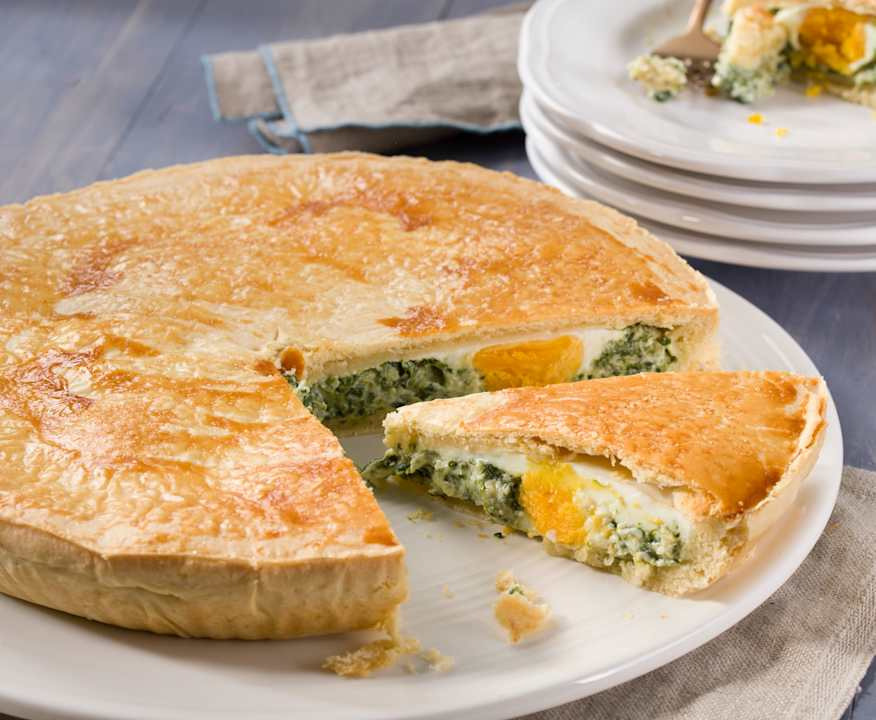

# Pascualina

*The Italo-Uruguayan Easter pie: a thin double-crust tart of wilted spinach, ricotta and onion with whole eggs nested in the filling so each slice reveals a yellow yolk against the green.*

**Serves:** 8 slices

**Prep Time:** 40 minutes

**Cook Time:** 50 minutes

## Overview
Pascualina is the Easter pie that came to the River Plate with Genoese immigrants in the nineteenth century, named for Pascua (Easter), and now eaten year-round as the Sunday picnic and beach-day staple. The build is a thin double-crust pie of olive-oil pastry filled with spinach, sautéed onion, ricotta and parmesan, with four whole raw eggs cracked into hollows in the filling before the lid goes on. As the pie bakes the eggs set in their pockets so every slice shows a clean yolk against the bright green. It is eaten warm or at room temperature, cut into wedges, sometimes with a dollop of mustard. In Genoa the original (torta pasqualina) uses thirty-three layers of paper-thin pastry to count the years of Christ; the Uruguayan version simplifies to two single sheets of olive-oil pastry. The result is the same: a clean, vegetable-forward pie that travels well and tastes better an hour after baking.

## Ingredients

### For the pastry
- 400 g plain flour, plus more for rolling
- 100 ml extra virgin olive oil
- 1 tsp fine salt
- 180 ml warm water (approx)

### For the filling
- 700 g fresh spinach (or 500 g chard, stems removed)
- 2 tbsp olive oil
- 2 large onions, finely chopped
- 3 garlic cloves, finely chopped
- 250 g ricotta
- 60 g grated parmesan
- 2 eggs (for the filling mix)
- 1/4 tsp grated nutmeg
- Salt and black pepper
- 4 whole eggs (to nest in the pie)
- 1 egg yolk + 1 tbsp milk (for glaze)

## Method

### Stage 1 - The pastry
1. Tip the flour and salt into a wide bowl. Make a well in the middle.
2. Pour in the olive oil and most of the warm water.
3. Bring together with a fork, then knead in the bowl 4-5 minutes until smooth and elastic. Add a little more water if dry; it should be soft but not sticky.
4. Wrap in clingfilm; rest 30 minutes at room temperature.

### Stage 2 - The filling
1. Wash the spinach. Wilt in batches in a dry hot pan for 1-2 minutes per batch until just collapsed.
2. Tip onto a clean tea towel; squeeze out all the water. Chop coarsely.
3. Heat the olive oil in a wide pan. Cook the onion over medium heat 10 minutes until soft and pale gold; add the garlic for the last minute.
4. Tip the onion and spinach into a bowl. Cool 5 minutes.
5. Stir in the ricotta, parmesan, 2 eggs, nutmeg, salt and pepper. Taste, adjust salt; should be well seasoned.

### Stage 3 - Assemble
1. Heat the oven to 190 C.
2. Lightly oil a 24 cm round tart tin or pie dish (3-4 cm deep).
3. Divide the pastry in two, one piece slightly larger.
4. On a floured surface, roll the larger piece to a 30 cm circle, 3 mm thick.
5. Line the tin with the pastry, leaving a 2 cm overhang.
6. Spoon the filling into the pastry case, level the top.
7. Make 4 hollows in the filling with the back of a spoon, evenly spaced.
8. Crack one whole egg into each hollow.
9. Roll the second piece of pastry to a 26 cm circle and lay over the top.
10. Trim the overhang to 1 cm; fold it up and crimp around the rim to seal.
11. Cut 4 small steam vents in the lid between the egg positions.
12. Brush with the egg-yolk-and-milk glaze.

### Stage 4 - Bake
1. Bake 45-50 minutes, until the top is deep gold and crisp.
2. Tap the centre; it should sound hollow and feel firm.
3. Cool 15 minutes in the tin before slicing; the eggs and filling need to set.

### Stage 5 - Serve
1. Cut in 8 wedges (or 12 small wedges for finger food).
2. Eat warm or at room temperature, never piping hot.

## Notes
- **Squeeze the spinach dry.** Wet spinach gives a soggy pie. Press hard in a tea towel until you can do no more.
- **The hollows for the eggs.** Make them deep enough that the egg sits clear of the filling but not so deep it touches the base.
- **Olive-oil pastry.** This is not buttery shortcrust; it should feel soft and slightly elastic, more like a flatbread dough. Use a good fruity olive oil; the flavour carries through.
- **Cool before cutting.** Cutting straight from the oven means the eggs ooze. Let it set 15 minutes.

## Variations
- **With chard.** Use 500 g chard (Swiss chard) in place of spinach; the traditional Genoese choice. Strip the stems out; they need a separate quick cook.
- **With artichokes.** Add 6 cooked artichoke hearts, chopped, to the filling. The deluxe Easter version.
- **Without whole eggs.** Skip the nested eggs; cleaner slices but loses the yellow-against-green visual.
- **With prosciutto.** Lay 4 slices of prosciutto over the filling before the lid; an Italo-Uruguayan upgrade.

## Serving
- Wedges on a board · a small bowl of dijon mustard · a tomato salad with raw onion · a glass of Albariño or a cold beer.

## Storage
- Keeps 3 days refrigerated wrapped; eat at room temperature.
- Reheats 10 minutes at 160 C to crisp the pastry back up.
- Freezes whole 1 month, baked; thaw and reheat at 160 C for 20 minutes.

