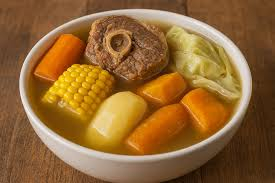

# Puchero Uruguayo

*The Uruguayan boil-up: beef shin, chorizo, marrow bone and chickpeas simmered slowly with cabbage, carrot, potato and squash, the broth strained off and served first, then the meat and vegetables on a platter.*

**Serves:** 6 people

**Prep Time:** 30 minutes (plus overnight soak)

**Cook Time:** 3 hours

## Overview
Puchero is the Spanish boil-up that crossed the Atlantic with immigrants and settled into Uruguayan home kitchens as the winter Sunday dish. The build is patient: beef shin, marrow bone, chorizo and chickpeas (soaked the night before) go into a deep pot of water with onion, leek and bay, simmered slowly until everything is tender. In the last forty minutes the vegetables join (cabbage, carrot, potato, squash, sometimes corn on the cob), each cooked just until soft. The broth is ladled off and served first as soup with rice or pasta. The meat and vegetables follow on a wooden platter, with chimichurri and a coarse salt bowl on the side. The marrow goes onto toast. The chickpeas mop up the bottom of the bowl. It is a long-table meal, three hours from start to plate, and the leftovers feed Monday lunch.

## Ingredients

### For the meat pot
- 1 kg beef shin or brisket, in 4 pieces
- 2 large marrow bones (osso buco cut)
- 4 chorizos criollos (fresh sausages)
- 250 g dried chickpeas, soaked overnight in cold water
- 2 large onions, halved
- 2 leeks, halved and rinsed
- 4 bay leaves
- 1 tbsp black peppercorns
- 1 tbsp coarse salt
- 4 litres cold water

### For the vegetables
- 6 medium potatoes, peeled, halved if large
- 4 large carrots, peeled, halved lengthways
- 1 small green or savoy cabbage, cut into 6 wedges through the core
- 600 g butternut or kabocha squash, peeled, in big chunks
- 3 corn on the cob, halved across (optional)

### To serve
- Hot cooked rice or short pasta (for the broth course)
- Chimichurri
- A bowl of coarse sea salt
- Crusty bread, toasted, for the marrow
- Mustard

## Method

### Stage 1 - Build the broth
1. Drain the soaked chickpeas, tie them loosely in a square of muslin (so you can lift them out clean).
2. Put the beef, marrow bones, chickpeas, onions, leeks, bay and peppercorns in a deep stockpot.
3. Cover with the 4 litres of cold water. Bring slowly to a simmer over medium heat.
4. Skim off the grey foam that rises in the first 15 minutes. Season with the salt.
5. Lower the heat to a gentle simmer. Cook 2 hours, lid half-on, skimming once or twice.

### Stage 2 - Add the chorizo
1. Prick the chorizos with a fork.
2. Drop into the pot. Continue simmering 30 minutes.

### Stage 3 - Cook the vegetables
1. Add the potatoes and carrots. Simmer 10 minutes.
2. Add the squash and cabbage wedges. Simmer 15 minutes.
3. Add the corn (if using). Simmer 8 minutes.
4. Test everything with a knife; vegetables should be tender but holding their shape. The meat should be soft enough to fork apart.

### Stage 4 - Serve the soup course
1. Lift the muslin bag of chickpeas out, set aside.
2. Lift the meat, sausages, bones and vegetables out onto a warm platter, cover with foil to hold warm.
3. Strain the broth through a fine sieve into a clean pan; discard the spent onion, leek and bay.
4. Bring the broth to a boil; check seasoning.
5. Serve a ladle of broth over hot rice or short pasta in deep bowls as the first course.

### Stage 5 - Serve the meat platter
1. Arrange the meat, sausage, bones and vegetables on the warm platter.
2. Tip the chickpeas out of the muslin into a serving bowl.
3. Bring to the table with chimichurri, mustard, a bowl of coarse salt and toasted bread.
4. Diners pull the marrow out of the bones onto toast, sprinkle with salt.
5. Eat the meat and vegetables with chimichurri and mustard, the chickpeas alongside.

## Notes
- **Soak the chickpeas overnight.** A 12-hour cold-water soak is essential; without it they will not cook through in 2 hours.
- **Skim early, skim well.** The first 15 minutes of foam carries off impurities; a careful skim gives a cleaner broth.
- **Muslin bag for chickpeas.** Tying the chickpeas in cloth lets you lift them out clean without sieving the whole pot.
- **Two courses, one pot.** The broth is its own dish (with rice or pasta); the meat platter follows. Do not pour broth over the meat.

## Variations
- **With pumpkin and sweetcorn.** A summer puchero swaps butternut for a chunk of orange pumpkin and adds extra corn cobs.
- **With sweet potato.** Add 2 large peeled boniato (white sweet potato) for the last 20 minutes; gives the broth a faintly sweet edge.
- **With morcilla.** Add 2 blood sausages in the last 15 minutes for a heavier asado-style puchero.
- **Hervido style.** A lighter Uruguayan version uses chicken instead of beef and skips the chickpeas; quicker (1 hour total) and brighter.

## Serving
- Broth-and-rice in deep bowls first · the meat platter as the second course · chimichurri in a jug · marrow on toast with coarse salt · a tumbler of Tannat.

## Storage
- The strained broth keeps 4 days refrigerated; freezes 3 months.
- Cooked meat and vegetables keep 3 days; reheat in the warmed broth.
- Make a second-day soup by chopping leftovers into the broth with extra pasta.

