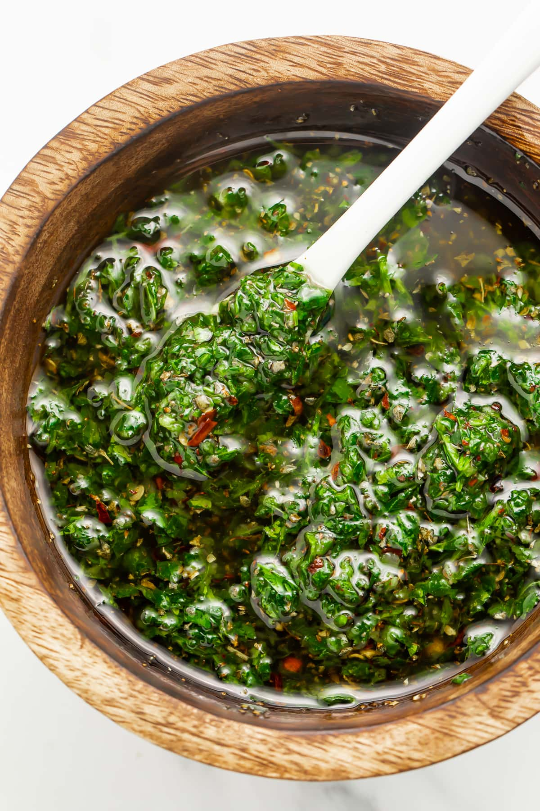

# Chimichurri Uruguayo

*Uruguay's version of the asado-table sauce: finely chopped parsley, garlic, oregano, dried chilli, olive oil and red wine vinegar, stirred together and rested overnight to deepen.*

**Serves:** 1 small jar (300 ml)

**Prep Time:** 15 minutes (plus overnight rest)

**Cook Time:** 0 minutes

## Overview
Chimichurri is the green oily-vinegar herb sauce that sits on every Uruguayan asado table and the Uruguayan version is a touch tighter and less wet than its Argentine cousin, with more oregano, less parsley and a clear hit of dried red pepper flakes. The build is purely a chop and mix: flat-leaf parsley, garlic, dried oregano, smoked paprika or dried chilli flakes, red wine vinegar, water, olive oil and salt, combined in a jar and rested overnight so the flavours marry. The sauce should be brick-spotted dark green, lightly bound rather than pureed, with garlic and oregano forward of the parsley. Spoon it onto grilled steak, choripán, provoleta or empanadas. Never use it as a marinade; chimichurri is a finisher.

## Ingredients

- 1 large bunch flat-leaf parsley (about 60 g leaves, no stems), finely chopped
- 6 garlic cloves, finely chopped or grated
- 2 tbsp dried oregano
- 1 tbsp dried red pepper flakes (ají molido, or use crushed chilli)
- 1 tsp sweet smoked paprika
- 1 tsp fine sea salt
- 1/2 tsp black pepper
- 80 ml red wine vinegar
- 60 ml warm water
- 150 ml extra virgin olive oil
- Optional: 1 small bay leaf, crushed

## Method

### Stage 1 - Chop the herbs and garlic
1. Pick the parsley leaves, discard the stems. Chop very finely with a sharp knife; do not use a food processor (it bruises and turns the sauce paste-like).
2. Peel and finely chop or grate the garlic.

### Stage 2 - Wake up the dried herbs
1. Put the dried oregano, red pepper flakes, smoked paprika, salt and black pepper into a small bowl.
2. Add the warm water and the red wine vinegar.
3. Stir; let sit 5 minutes so the dried herbs hydrate. This is the Uruguayan trick that wakes the oregano.

### Stage 3 - Combine
1. Tip the chopped parsley and garlic into a jar or bowl.
2. Pour in the hydrated dried herb mixture.
3. Add the olive oil; add the crushed bay if using.
4. Stir thoroughly with a spoon (no blender). The sauce should be loose but visibly thick with chopped solids.
5. Taste, adjust salt and vinegar.

### Stage 4 - Rest
1. Seal the jar and refrigerate overnight (at least 8 hours).
2. The flavour deepens; the oil takes on the green colour; the garlic and oregano mellow into the parsley.
3. Bring back to room temperature before serving; the olive oil thickens cold.

## Notes
- **Knife not blender.** A food processor purées the parsley and turns the sauce into pesto. Hand chopping keeps the leaves distinct and the texture loose.
- **Dried oregano matters.** Uruguayan chimichurri leans on dried oregano more than the Argentine version. Use a good Mediterranean oregano, not the dusty supermarket pot.
- **Rest is not optional.** Eight hours minimum; 24 hours is better. The sauce tastes raw and harsh straight from the bowl.
- **Vinegar and salt balance.** Taste after the rest, not before; the vinegar mellows overnight. Adjust then.

## Variations
- **With fresh oregano.** Add 1 tbsp finely chopped fresh oregano to the parsley step. Brighter, less rustic.
- **Rojo (red chimichurri).** Add 1 grated medium tomato and skip the smoked paprika. Looser, fresher, summer use.
- **With shallot.** Add 1 finely diced shallot in place of two of the garlic cloves; milder, more French.
- **Spicy.** Double the red pepper flakes and add 1 finely chopped fresh chilli; for grilled morcilla.

## Serving
- A small bowl on the asado table with a spoon · drizzle over a grilled steak or chorizo · stir into a choripán roll · use as a dip for grilled bread · brush onto provoleta straight off the parrilla.

## Storage
- Keeps 2 weeks refrigerated in a sealed jar with the olive oil covering the herbs.
- The colour darkens over time; flavour stays good.
- Do not freeze; the herbs go limp on thaw.

