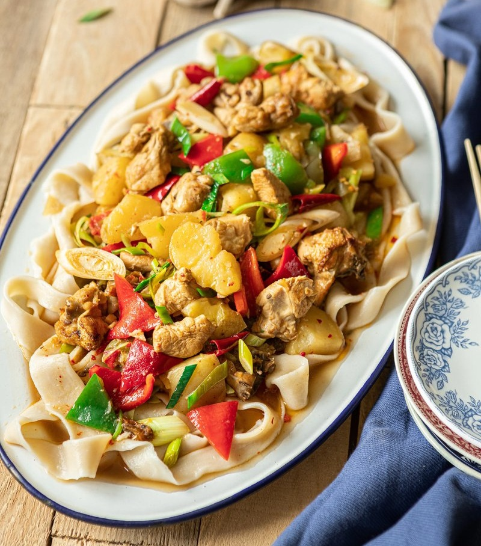

# Big Plate Chicken

*Xinjiang's celebration dish: bone-in chicken, potato, peppers and ginger simmered in a chilli-soy braise, with belt noodles draped to soak the juices.*

**Serves:** 3-4

**Prep Time:** 25 minutes

**Cook Time:** 45 minutes

## Overview
A dish that wears its multi-culture origin on its sleeve: chicken, potato and green pepper in a sweet-savoury soy-based braise (the Han Chinese influence), with star anise, Sichuan pepper, cumin and dried chilli (the Uyghur side), thickened by the starch from chunks of potato, ladled over flat hand-cut belt noodles. The sauce is the centrepiece. Browning sugar in oil before the chicken goes in builds a dark caramel that turns the whole braise a deep brick-red, and the soy underneath gives it weight; the Sichuan peppercorns add a mild numbness rather than dominating. Smell is rich, sweet, slightly spicy, with anise drifting through. Not difficult but not quick, 45 minutes once the prep is done, and the belt noodles are a small project on their own. Born in the 1980s in northern Xinjiang where a generation of Han Chinese migrants opened restaurants alongside the existing Uyghur food economy; the dish is the synthesis of those two traditions and is now the signature dish of Xinjiang cuisine, eaten across China and beyond.

## Ingredients

### Dough (belt noodles)
- 200 g plain flour
- 80 ml water
- 2 pinches salt

### Chicken braise
- 800 g bone-in chicken pieces (~½ chicken, head and feet removed, chopped into bite-sized chunks)
- 275 ml oil (vegetable or rapeseed)
- 2 spring onions (diagonally cut, whites and greens separated)
- 42 g ginger (thinly sliced)
- 2 bulbs garlic (finely chopped)
- 3 star anise
- 4 g ground Sichuan peppercorns
- ½ teaspoon chilli flakes
- ½ teaspoon sweet paprika
- 1 fresh red chilli (diagonally sliced)
- 2 mild green peppers (~75 g, seeded, cut into triangles)
- ½ mild red paprika (seeded, cut into triangles)
- 360 g potatoes (peeled and cubed 3 cm)
- 1 ½ tablespoons soy sauce
- 2 teaspoons caster sugar
- 2 teaspoons salt
- 400 ml water

## Method

### Stage 1 - Dough
1. Combine flour and salt; add water gradually while mixing. Knead until smooth.
1. Cover with a damp cloth; rest 15 minutes.

### Stage 2 - Prep the chicken
1. Chop the chicken through the bone into bite-sized pieces (cleaver or heavy knife; ask the butcher if uncomfortable).
1. Rinse the pieces to remove loose blood and bone fragments.
1. Blanch in a pot of boiling water 2-3 minutes; drain thoroughly.

### Stage 3 - Build the braise
1. Heat a heavy wok over medium-high; add the oil.
1. Add the sugar; whisk until it melts and starts to bubble.
1. Add the chicken; brown 3-4 minutes.
1. Add the spring onion whites, ginger, garlic, fresh red chilli and potato. Stir 1 minute.
1. Pour in the water; add the star anise, paprika, chilli flakes, soy sauce, salt and Sichuan pepper.
1. Bring to a boil, then reduce to medium-low. Simmer covered 15 minutes.
1. Add the green and red pepper triangles; simmer 5 more minutes.
1. Check seasoning. The chicken should be tender and the potatoes soft but not falling apart.

### Stage 4 - Belt noodles
1. Bring 2 litres of water to a rolling boil.
1. Oil your hands and the work surface.
1. Roll the rested dough into a 2-3 mm-thick rectangle. Cut into 3 cm-wide strips.
1. Press three fingers along each strip to leave a faint fingerprint texture (helps the sauce cling).
1. Optionally stretch each strip a little.
1. Drop the noodles into the boiling water; stir immediately. Cook 2-3 minutes.
1. Drain; rinse with cold water; drain again.

### Stage 5 - Serve
1. Lay the noodles in a wide shared platter.
1. Tip the chicken braise over the top, scattering the sauce and pieces.
1. Bring the platter to the table. Spoon onto plates so everyone gets noodles and braise; eat with chopsticks.

## Notes
- **Caramelise the sugar first:** the dark golden caramel in oil is the colour and depth of the dish. Sugar that just dissolves is missing the step.
- **Belt noodles, not laghman:** these are flat hand-cut strips, not hand-pulled ropes. Quicker to make and they hold the sauce well.
- **Shared from one platter:** the dish is built for the centre-of-the-table eating style. Big plate. Bring a serving spoon.

## Notes on safety
- Hot oil splatters when meat hits it; lower the chicken in gently.
- Star anise will leave a strong flavour; one or two are plenty for some palates - taste at the halfway mark.

## Storage
- Keeps 3 days refrigerated. The braise deepens overnight; reheat with a splash of water.
- Make the noodles fresh each time; refrigerated boiled noodles turn gummy.
