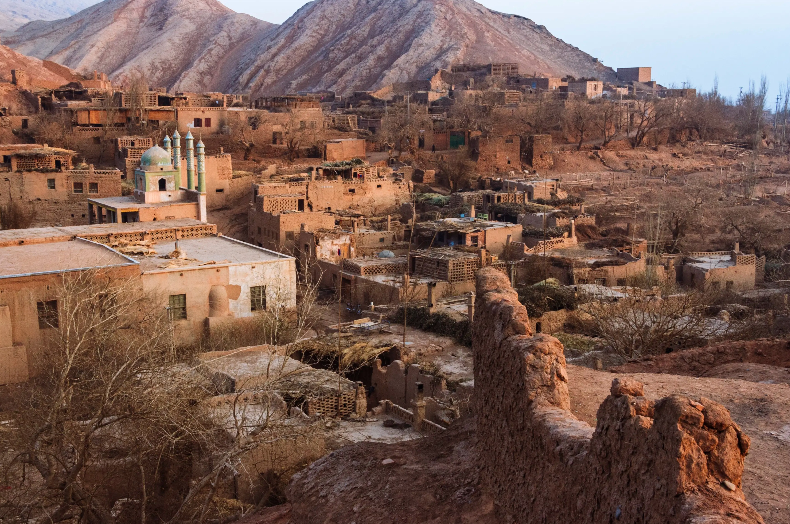

# Uyghur Cuisine

Central Asian Muslim cuisine from the Tarim Basin and beyond, distinct from Han Chinese food despite a shared political map. Lamb is the centrepiece - hand-pulled laghman noodles under wok-fried lamb-and-vegetable toppings, polo (yangrou zhuafan) pilaf in lamb fat, lamb kebabs from the tonur clay oven, big-plate chicken (da pan ji) for parties. Cumin, sweet chilli pepper, sesame and Sichuan peppercorn run through the seasoning; raisins, walnuts and dried fruits sweeten the savoury side. Sheker manta steamed sugar dumplings and twisted donuts handle the snack table.
