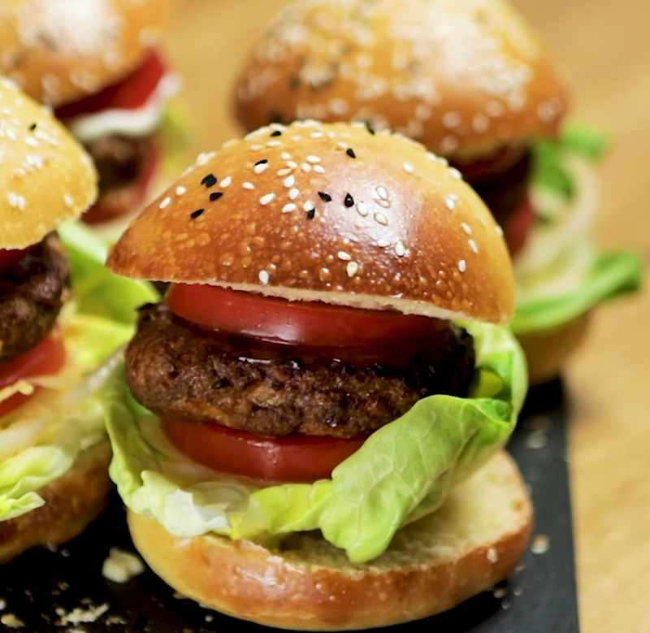

# Uyghur Kebab Burger

*Uyghur kebab in burger form: minced lamb seasoned with cumin and sweet chilli, grilled into thick rounds and stacked on a toasted bun with onion and tomato.*

**Serves:** 4 (1 burger each)

**Prep Time:** 15 minutes (plus 3-8 hours marinating)

**Cook Time:** 25 minutes

## Overview
A burger that tastes like a Kashgar street kebab rather than a Western quarter-pounder. Cumin is the dominant note (Uyghur cooking uses it the way the rest of China uses Sichuan pepper); behind it sits sweet chilli powder for warmth without burn, and the lamb fat that catches a deep gold sear on the outside. The patty stays loose and juicy because the mix is bound with a single egg and a spoon of flour rather than pressed dense like a beef burger. Smell-wise: charred fat, cumin, and the sweet onion folded into the meat. Easy enough that you can do it on a weeknight as long as the mix has had its 3-hour rest in the fridge; the resting time is what makes the difference between a flat-tasting patty and one that eats like the real tonur version. The dish is a clear modern adaptation of the classic Uyghur cumin lamb kebab, scaled down for households without access to a clay tandoor, and increasingly common in cafés across Xinjiang and the Uyghur diaspora.

## Ingredients

### Patties
- 200 g minced lamb (ideally ~20% fat)
- 1 white onion (finely chopped)
- 1 egg
- 2 teaspoons plain flour
- 2 teaspoons sunflower oil (or olive oil)
- 1 teaspoon chilli flakes
- 2 teaspoons sweet chilli pepper powder (Aleppo, Kashmiri or Hungarian sweet)
- 2 teaspoons ground cumin
- 1 teaspoon white pepper
- 1 teaspoon salt

### To build
- 4 burger buns (sesame or brioche)
- 1 white onion (sliced into thin rings)
- 1-2 ripe tomatoes (sliced)
- ½ head of lettuce (washed and torn)
- Shashlik sauce (or garlic sauce), to taste

## Method

### Stage 1 - Marinate
1. Combine all patty ingredients in a wide bowl.
1. Mix thoroughly with clean hands for 1-2 minutes until the meat is sticky and uniform.
1. Cover and refrigerate at least 3 hours; overnight is much better. The seasoning needs time to penetrate.

### Stage 2 - Shape
1. Divide the chilled mix into 4 equal portions.
1. Roll each between your palms into a ball, then flatten gently into a 2 cm-thick round patty.

### Stage 3 - Cook
1. **Oven:** preheat the grill to its highest setting for 10 minutes. Line a tray with parchment, lay the patties out, and grill on the top shelf 12 minutes per side until the edges are deeply browned (24 minutes total).
1. **BBQ:** grill 4-5 minutes per side over hot charcoal.
1. **Pan:** preheat a heavy pan over high heat 3-4 minutes; cook 4-5 minutes per side. Press gently with a spatula to encourage edge contact; don't press hard or the juices escape.

### Stage 4 - Build
1. Split the buns, lay cut-side down in a hot pan or under the grill for 1 minute to toast.
1. Bottom bun: lettuce, onion rings, tomato slice.
1. Patty on top.
1. Sauce and another tomato slice.
1. Top bun. Serve immediately.

## Notes
- **Lamb fat is the flavour:** lean mince gives a dry burger. 20% fat is the minimum; 25-30% is better.
- **Sweet chilli pepper powder:** the Uyghur seasoning uses a *sweet* dried pepper powder, not the same as ground cayenne. Aleppo, Kashmiri or Hungarian sweet paprika are good stand-ins; Spanish sweet pimentón also works.
- **Marinate or lose the flavour:** the spice mix needs hours in the fridge to bond with the meat. A patty mixed and cooked the same hour tastes flat.

## Storage
- Raw seasoned mix keeps 2 days refrigerated; shape and cook from there.
- Cooked patties keep 3 days refrigerated; reheat briefly in a hot pan rather than the microwave.
