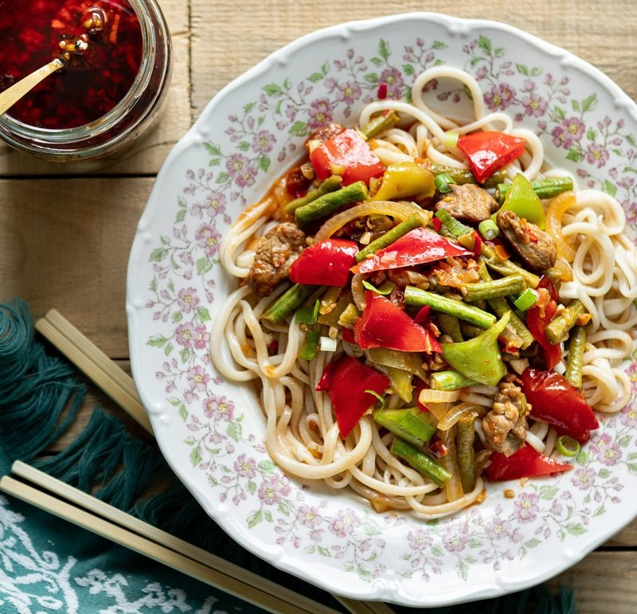

# Laghman

*The Uyghur hand-pulled noodle: a single rope of dough stretched into long springy strands, served under a wok-fried lamb, tomato and pepper sauce.*

**Serves:** 3

**Prep Time:** 45 minutes (plus 35 minutes dough rest)

**Cook Time:** 25 minutes

## Overview
Two distinct elements that meet at the bowl: long, springy hand-pulled noodles with the chew of fresh ramen, and a brothy lamb-and-tomato topping that's somewhere between a stir-fry and a stew. The topping reads bright and savoury more than spicy, fresh tomato and sundried tomato together giving sweetness and depth, peppers and yardlong beans for crunch, cumin and white pepper for warmth, with a single fresh chilli for gentle heat. Smell-wise it's lamb fat hitting hot oil, then tomato vines, then cumin. The noodles are the difficulty: pulling a coiled rope of rested dough into long even strands takes practice, and your first few attempts will tear. The reward is a noodle nothing like the dried equivalent, thicker, glossier, with proper pull. A signature dish across the entire Uyghur world, eaten from Kashgar to Almaty to Toronto, with each family making minor variations on the topping; the noodle technique itself is shared with the lamian tradition of Lanzhou further east, which laghman is etymologically related to.

## Ingredients

### Dough
- 250 g plain flour
- 110 ml cold water
- 2 g salt
- 50 ml olive oil (for lubricating the resting rope)

### Topping
- 110 g lamb (sliced into coin-sized pieces)
- 100 ml olive oil
- 1 spring onion (finely chopped)
- 25 g ginger (finely chopped)
- ½ bulb garlic (finely chopped)
- 1 fresh red chilli (finely chopped)
- 3 dried tomatoes (or sundried tomatoes, finely chopped)
- 3 fresh tomatoes (cut into small pieces)
- 1 white onion (sliced)
- 2 mild green peppers (cut into triangles)
- 1 red sweet pepper (cut into triangles)
- 13-15 yardlong beans (or 200 g green beans, cut into 3-4 cm pieces)
- 7 g salt
- 1 g ground black pepper
- 2 g ground white pepper
- 3-4 g ground cumin
- 500 ml water

## Method

### Stage 1 - Dough
1. Combine flour, water and salt; knead 5-10 minutes until smooth.
1. Cover with a damp cloth; rest 15-20 minutes.
1. Roll the dough into a long rope; coil into a spiral; oil generously.
1. Cover with foil or cling film; rest another 15-20 minutes.

### Stage 2 - Topping
1. Heat the 100 ml of olive oil in a wok over high heat until lightly smoking.
1. Add the lamb; brown 2-3 minutes.
1. Add ginger, garlic, fresh chilli, dried tomato, onion and fresh tomato. Stir-fry 2-3 minutes.
1. Add the beans, peppers, spring onion, salt, black and white pepper, and cumin. Stir-fry 3-4 minutes.
1. Pour in the water; bring to a boil, then reduce to the lowest simmer.

### Stage 3 - Stretch the noodles
1. Bring a wide pot of water to a rolling boil.
1. Lift one end of the coiled dough rope; loosen about 30 cm above the work surface.
1. Hold the rope lightly between thumb and forefinger of both hands.
1. Move your arms outward, stretching the dough thinner as it slides between your hands.
1. Continue working your way along the coil, thinning the rope to about 5 mm thickness.
1. Once stretched, lift the rope and let it bounce gently on the worktop a few times to elongate further. Some breakage is normal.

### Stage 4 - Cook and serve
1. Drop the noodles into the boiling water; stir immediately to prevent sticking.
1. Cook 2-3 minutes until just-tender.
1. Drain; rinse briefly with cold water to stop cooking; shake dry.
1. Divide the noodles between deep bowls.
1. Ladle the lamb-and-vegetable topping over.
1. Eat immediately, stirring the topping into the noodles at the table.

## Notes
- **Rest the dough properly:** rushed dough won't stretch - it'll snap. Two rest stages with oiling between is the technique that allows hand-pulling.
- **Don't rip:** the noodle thins by pulling, not pinching. Long, smooth, slow movements.
- **The "dance":** the bounce on the tabletop is more than theatre; it elongates and aerates the dough. Some breakage is expected.
- **Topping is wet, not dry:** Uyghur laghman has a brothy sauce around the noodles, not a stir-fry glaze. Water at the end is correct.

## Storage
- Noodles best fresh; reheat by refreshing briefly in boiling water.
- Topping keeps 3 days refrigerated; reheats well.
