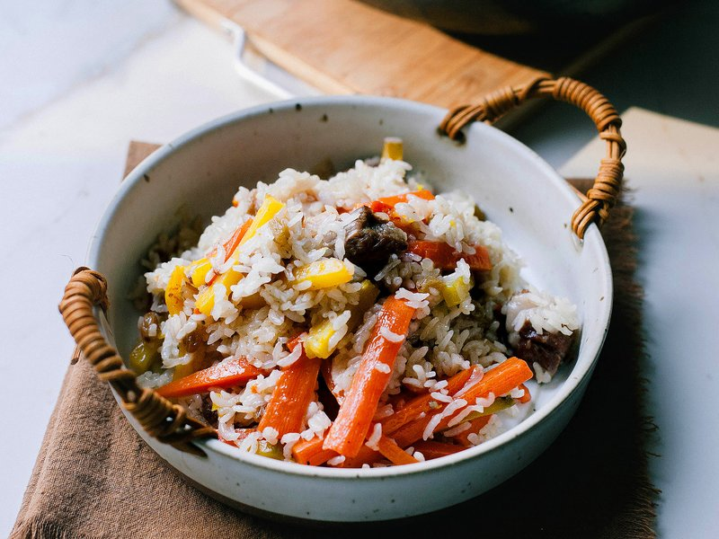

# Xinjiang Lamb Pilaf

*Xinjiang's hand-grabbed rice: lamb and its fat browned with onion and yellow carrot, sweetened with honey, then steamed under medium-grain rice.*

**Serves:** 4-6

**Prep Time:** 30 minutes

**Cook Time:** 1 hour 15 minutes

## Overview
A dish entirely about lamb fat carried through rice. Each grain ends up glossy and orange-tinted from the rendering, with sweetness from caramelised yellow carrot, honey and raisins, and a savoury back-end from tender lamb cubes. White and black pepper give a quiet warmth; cumin doesn't appear here (unlike in most Uyghur lamb cookery), and that absence is deliberate, this pilaf is sweet-savoury rather than spice-driven. The aroma when the lid comes off is unmistakable Silk Road: lamb fat, sweet onions, honey, faintly resinous from the carrot. Not difficult but it requires confidence in the no-peek phase; the rice cooks by steam trapped under the lid, and lifting it sabotages the dish. Sits at the centre of a long Silk Road pilaf lineage that runs from Persian polo through Uzbek plov to Indian biryani, and a Xinjiang Uyghur celebration dish, the polo at every wedding, every Eid, every guests-coming-tonight household. Eaten with the hands, which is what zhuafan means.

## Ingredients

### Lamb and rendering
- 450 g lamb (leg, neck, or rib), cut into 2 cm cubes
- 45 g lamb fat, in chunks (or substitute beef/pork fat)
- 1 tablespoon neutral oil
- ¼ teaspoon salt (to season the lamb)

### Rice and aromatics
- 400 g medium-grain rice (Calrose, Nishiki, or basmati)
- 1 red onion (small, thinly sliced)
- 2 yellow carrots (peeled, cut into 5 cm batons, ⅛ inch thick)
- 1 orange carrot (same prep)
- 100 g raisins (yellow or green)
- 2 tablespoons honey
- ¼ teaspoon salt (for the braise)
- ½ teaspoon ground black pepper
- ¼ teaspoon ground white pepper
- 1.3 litres hot water (from the kettle)

## Method

### Stage 1 - Prep
1. Soak the lamb cubes in cold water 20-30 minutes; drain and pat dry. Season with ¼ teaspoon salt.
1. Wash the rice: cover with water, swirl, drain. Repeat 3-4 times until the water runs nearly clear.
1. Peel and cut the carrots into thin 5 cm batons.
1. Boil a kettleful of water.

### Stage 2 - Brown
1. Heat a wok or wide heavy pan over medium heat.
1. Add the oil and the lamb fat; cook 2-3 minutes until the fat starts to render and turn translucent.
1. Add the lamb cubes, onion, black pepper and white pepper. Stir-fry 4-5 minutes until the lamb browns thoroughly.
1. Add the carrots; stir-fry 1 minute.
1. Drizzle the honey over; add the remaining ¼ teaspoon salt. Stir-fry 1 minute to combine.

### Stage 3 - Braise the lamb
1. Pour 1 litre of hot water into the wok; bring to a boil.
1. Reduce to a low simmer.
1. Cook uncovered 30-45 minutes until the lamb is tender and the carrots have softened.

### Stage 4 - Steam the rice
1. Scatter the drained rice evenly over the braise; press gently with a spatula to submerge most of it under the liquid.
1. Scatter the raisins over the top.
1. Cover with the lid; reduce heat to its lowest setting.
1. Cook 15 minutes without lifting the lid or stirring.
1. After 15 minutes, taste the rice. If not yet soft and the pan is dry, add 120 ml hot water; cover and cook 10 more minutes. Repeat if needed.
1. The pilaf is done when the rice is fluffy, the lamb is soft, and no visible liquid remains.

### Stage 5 - Mix and rest
1. Remove the lid; mix the rice and lamb gently with a spatula from the bottom up so everyone gets all of it.
1. Taste; adjust salt.
1. Cover the lid; let rest 5 minutes off the heat.
1. Serve onto plates; eat with the hands or a spoon.

## Notes
- **Fatty lamb is non-negotiable:** lean lamb gives a dry pilaf. The fat carries the flavour through the rice. Grass-fed if you can find it.
- **Don't stir during the rice phase:** stirring breaks the steam pocket. The rice cooks by trapped steam from below.
- **Medium-grain rice, not long:** medium-grain holds the structure without going gluey. Long-grain stays too separate; sticky short-grain clumps.
- **Yellow carrots are traditional:** standard orange supermarket carrots work but yellow Central Asian carrots are sweeter and add depth. If using all orange, dial the honey up half a tablespoon.
- **Lamb fat substitutes:** beef or pork fat work for the rendering stage. Vegetable oil alone gives a flatter dish.

## Storage
- Keeps 3 days refrigerated; reheat covered in a low oven with a splash of water to refresh.
- Freezes 2 months. Thaw overnight and reheat in a covered pan with a little water.
