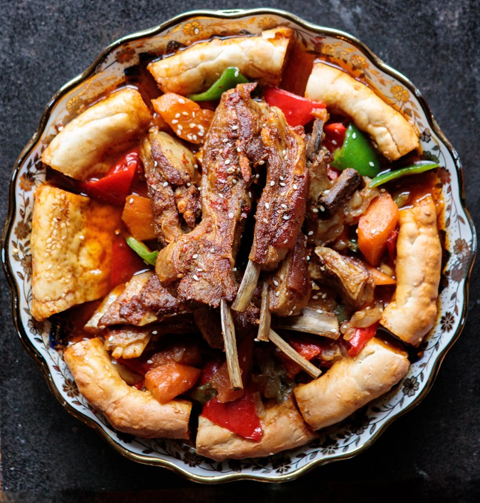

# Uyghur Lamb Ribs

*Long-braised lamb ribs in a paprika-cumin-cayenne crust, served on torn naan that's been dunked into the braising sauce to soak the juices. A celebratory Uyghur dish - simple ingredient list, long unattended braise. The naan goes from crisp to soft to flavour-loaded as the dish builds.*

**Serves:** 2 (large portions)

**Prep Time:** 15 minutes

**Cook Time:** 1 hour 35 minutes

## Overview
Lamb fat rendered slowly into a paprika-and-cumin glaze, with naan acting as both bread and sauce-sponge underneath. The flavour profile is direct and unfussy: sweet paprika for colour and warmth, cumin for the Uyghur signature note, salt to draw out moisture, and the long braise to dissolve the connective tissue in the ribs. No tomato, no soy, no aromatic broth - the dish is meat, spice, onion and fat. The naan is the surprise. Tucked around the edge of the pan in the last few minutes, it goes from crisp to soft to flavour-loaded as it soaks the orange-stained juices, and turns into the most satisfying part of the plate. Easy cooking once the ribs are in the pan - 90 minutes of unattended braise - but you need patience for the rendering at the start; rushing the brown is what produces a flat dish. A celebratory dish in Uyghur households, served on a wide platter for guests, and a clean example of how Xinjiang lamb cooking does so much with so few ingredients.

## Ingredients

- 5 pieces lamb ribs (~1 kg total)
- 100 ml olive oil
- 2 teaspoons ground cumin (freshly ground if possible)
- 1 teaspoon sweet paprika
- 1 teaspoon cayenne pepper flakes
- 1 teaspoon salt
- 1 red pointed paprika (cut into triangles)
- 1 green pointed paprika (cut into triangles)
- 1 onion (sliced)
- 200 ml water
- 1 large fresh-baked naan (Bazaar naan or similar), cut into pizza-like wedges

## Method

### Stage 1 - Brown
1. Cut the ribs into pieces if not already. Rinse to remove bone fragments; pat dry thoroughly.
1. Heat the oil in a wide, deep pan over high heat.
1. Lay the ribs in meat-side down; cover; reduce to medium-low.
1. Brown 3-4 minutes per side, all sides, until deep golden.

### Stage 2 - Season
1. Apply a thick layer of salt, paprika and half the cumin to the exposed side of the ribs.
1. Turn the ribs; repeat with the rest of the cumin, more salt and paprika.

### Stage 3 - Braise
1. Add the sliced onion and two-thirds of the paprika pieces around the ribs.
1. Pour the water down the side of the pan.
1. Bring to a boil, then cover and reduce to a low simmer.
1. Braise gently 1 hour 30 minutes, checking occasionally. Add a splash of water if it dries.

### Stage 4 - Naan and serve
1. While the ribs are nearly done, warm or thaw the naan; cut into pizza-like wedges.
1. Tuck the naan wedges around the edge of the pan, partially submerged in the sauce. Warm 2-3 minutes.
1. Lift the naan and the ribs out; lay the naan onto a serving platter as the base.
1. Add the remaining (raw) paprika pieces to the pan; stir.
1. Pour the saucy onion-and-pepper mix over the naan.
1. Lay the ribs on top.
1. Serve hot.

## Notes
- **Fresh young lamb:** older lamb takes longer to soften. If your ribs aren't ready at 1.5 hours, give them another 15-20.
- **Don't let the pan dry:** check at the halfway point. Add a splash of water if the sauce has reduced to glaze.
- **Bazaar naan absorbs differently:** thick Central Asian naan stays firm enough to hold the sauce. Supermarket flatbread will dissolve.
- **Mind the steam:** lift the lid towards you and step back; an hour of braising under pressure makes a hot release.

## Storage
- Keeps 3 days refrigerated; reheat in the pan with a splash of water. The sauce deepens overnight.
- Naan part doesn't reheat well; freshen with new naan if eating again.
