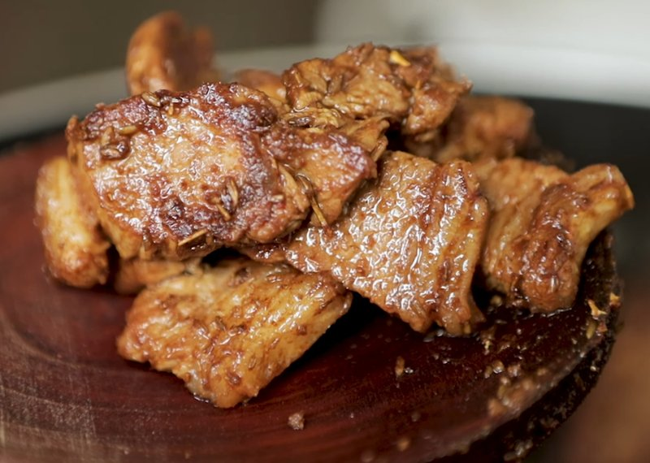

# Pan Kabap

*The home-kitchen Uyghur kebab: a quick pan-fried version that skips the skewer and the tandoor. Thin slices of fatty lamb sear hard in a single layer, then get a layered seasoning of salt, sweet chilli pepper powder and cumin, repeated 2-4 times for depth. Eats as a topping for polo (Uyghur rice pilaf) or alongside fresh-baked naan.*

**Serves:** 1-2

**Prep Time:** 10 minutes

**Cook Time:** 10 minutes

## Overview
The dish is essentially a stripped-back tonur kebab: thin slices of fatty lamb, cumin, sweet chilli pepper powder, salt, no marinade and no skewer. The pleasure is in what you don't add. Cumin coats the slices in layered passes (two or three small sprinkles rather than one large dump), so the spice toasts gently into the rendering fat instead of scorching. The result is meat that tastes intensely of cumin and lamb fat with a deep gold sear on the edges. Smell carries across a flat: cumin and animal fat at high heat is one of the most evocative aromas in Central Asian cooking. Genuinely fast and forgiving as long as you respect two rules: the lamb must have fat on it, and the pan must already be smoking when the meat goes in. The home-kitchen version of a tradition that's centuries old across Xinjiang, the Hexi Corridor and into Kazakhstan - whenever a household couldn't fire up a clay oven for skewers, this is what they cooked instead.

## Ingredients

- 280 g lamb (back leg with fat layer, or any cut with visible marbling)
- 1 tablespoon olive oil
- 2 teaspoons sweet chilli pepper powder (Aleppo, Kashmiri or Hungarian sweet)
- 2 teaspoons ground cumin
- ½ teaspoon salt

## Method

### Stage 1 - Slice
1. Slice the lamb against the grain into thin pieces, 3-4 mm thick.
1. Every piece should have a little visible fat - that's the flavour.

### Stage 2 - Sear
1. Heat the oil in a wide pan over high heat, coating the bottom and sides.
1. When the oil is lightly smoking, lay the lamb in a single layer.
1. Sear 60-90 seconds without moving so the edges brown.

### Stage 3 - Layer the seasoning
1. Reduce heat to low.
1. Sprinkle the salt over; stir through.
1. Sprinkle a third of the sweet chilli pepper powder; stir.
1. Sprinkle a third of the cumin; stir.
1. Repeat the chilli powder + cumin layering twice more, stirring between each, until both spices are fully in.
1. Cook a further 2-3 minutes on low so the spices toast slightly into the fat.

### Stage 4 - Serve
1. Slide onto a hot plate immediately.
1. Eat over polo (Uyghur rice pilaf), over Bazaar naan, or threaded onto bamboo skewers for the look.

## Notes
- **Fat is the flavour:** lean lamb makes for a dry kebab. Each slice should carry a strip of fat that crisps during the sear.
- **Layer, don't dump:** dumping all the spice at once cools the pan and the cumin scorches. Three small additions, each stirred through, keeps things moving.
- **Sweet chilli pepper, not hot:** the Uyghur preparation uses a *sweet* dried red pepper (Kashmiri, Hungarian sweet, Aleppo). Substituting cayenne gives the wrong heat profile.

## Storage
- Best straight from the pan; the texture changes on standing.
- Leftovers keep 2 days refrigerated; reheat briefly in a hot pan.
