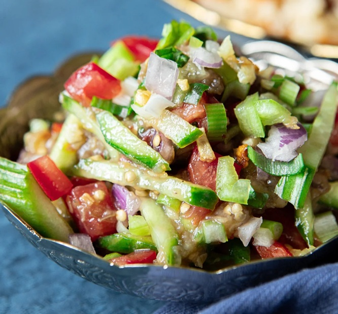

# Grilled Eggplant Salad

*Uyghur eggplant salad: whole eggplants roasted soft (traditionally in a tonur clay oven, an oven at home), their smoky flesh scooped out and tossed with finely chopped tomato, cucumber, mild green pepper, basil and a garlic-browned olive oil. Black rice vinegar sharpens. Eats alongside Uyghur polo or naan as a fresh, juicy counter to heavier mains.*

**Serves:** 4

**Prep Time:** 15 minutes

**Cook Time:** 30 minutes

## Overview
A juicy room-temperature salad built around the smoky soft flesh of whole-roasted eggplant. The eggplant flavour anchors everything - mildly bitter, deeply smoky if you can blister the skin first, almost meaty in texture once scooped. Around it, finely chopped tomato and cucumber release their water and form a brothy dressing on the bottom of the bowl, sweetened slightly by the addition of a pinch of sugar and sharpened by black rice vinegar (Chinkiang - the malty, dark, slightly sweet variety, not the white-rice kind). Browned garlic in olive oil folds in last and carries the aroma. Easy to make and forgiving; the only step that requires care is roasting the eggplants long enough that the flesh is properly soft. Sits alongside polo or naan as a fresh, juicy counter to the heavier mains of the Uyghur table, and the kind of dish made every day in summer when eggplants are cheap and good in the Kashgar bazaars.

## Ingredients

- 2 whole eggplants (~440 g total)
- 4 tomatoes (~370 g, finely chopped)
- 2 cucumbers (~350 g, cut into thin strips)
- 1 mild green pepper (~40 g, finely chopped)
- 1 onion (~85 g, finely chopped)
- 1 spring onion (finely chopped)
- ½ bulb garlic (finely chopped)
- 5 g fresh basil (finely chopped)
- 100 ml black rice vinegar
- 2 tablespoons olive oil
- 2 g salt
- 2 g ground white pepper
- 1 g ground black pepper
- 2-3 g caster sugar

## Method

### Stage 1 - Roast the eggplants
1. Preheat the oven to 250°C / 480°F (some ovens cap at 230°C; that's fine).
1. Place the whole eggplants on a tray; roast 25 minutes until the skin is wrinkled and the flesh feels soft when pressed.
1. Cool until handleable.

### Stage 2 - Browned garlic oil
1. Heat the olive oil in a small pan over medium-low heat.
1. Add the minced garlic; cook 1-2 minutes until just lightly golden.
1. Off heat; set aside (oil and garlic together).

### Stage 3 - Combine
1. Halve the cooled eggplants lengthways; scoop the soft flesh out with a spoon and chop finely.
1. In a wide bowl, combine the eggplant, tomato, cucumber, green pepper, onion, spring onion and basil.
1. Add the vinegar, salt, white pepper, black pepper and sugar.
1. Pour the browned garlic and its oil over the top.
1. Toss gently by hand. Taste; adjust salt and vinegar.

### Stage 4 - Serve
1. Transfer to a shallow serving dish.
1. Serve at room temperature alongside polo, laghman, or fresh-baked naan.

## Notes
- **Brown the garlic, don't burn it:** raw garlic is too sharp for this salad; toasted dark is bitter. Aim for just-golden, then pull off heat.
- **Black rice vinegar (Chinkiang) specifically:** white rice vinegar reads as sharper and thinner. Use the dark, malty black vinegar for the right depth.
- **Roast longer for smoke:** the source eggplants come out smokier from a hotter oven or charred over a gas flame first. Char the skin if you can.

## Storage
- Best eaten within an hour of mixing; the vegetables release water on standing.
- Keep up to 1 day refrigerated; lift the eggplant out and re-toss before serving.
