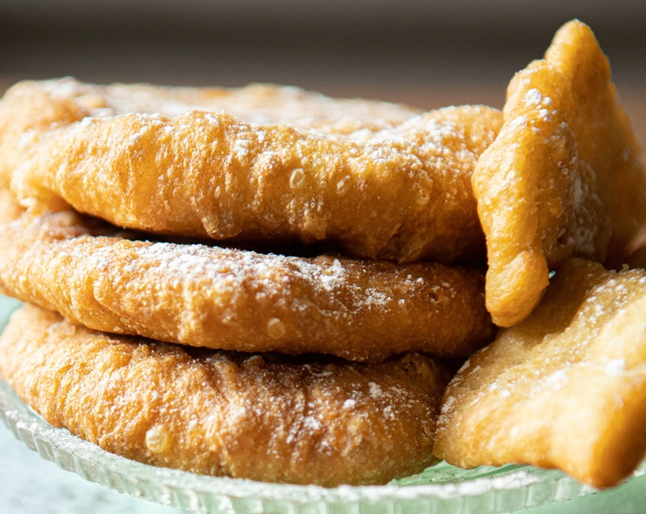

# Peushkel

*The simplest Uyghur donut: flour, water and yeast deep-fried till golden and dusted with icing sugar. Eaten warm for breakfast or with afternoon tea.*

**Serves:** Makes 12-15 donuts

**Prep Time:** 15 minutes (plus 2-6 hours rise)

**Cook Time:** 20 minutes

## Overview
The most stripped-down Uyghur fried bread: flour, water, yeast, salt absent, sugar absent. The honesty of the ingredient list is the point, what you taste is fermented wheat, fresh oil, and the dusting of icing sugar on top. The hot-oil pass before shaping (the same technique that defines [[twisted-donuts]]) gives the surface a faint crackle and a darker fry colour than a plain yeasted dough would manage; the two short slits down the middle let steam escape and create the puffed shape that gives peushkel its silhouette. Smell is warm bread and frying oil, and very little else. Easy enough that this is the snack Uyghur children learn to make first, no measuring fussy quantities, no decorative shaping. Eaten across Xinjiang for breakfast with milk tea, or as a mid-afternoon pick-me-up, and a household staple in homes where every cookable scrap of flour matters; peushkel exists, in part, because it's what you can make when the cupboard is mostly bare.

## Ingredients

### Dough
- 150 g plain flour
- 70 ml water
- 2 g instant yeast

### Hot-oil pass
- 40 ml olive oil (heated)
- ½ teaspoon baking soda
- 1 handful flour (for the pass)

### To fry
- 1 ½ litres olive (or sunflower oil, for deep-frying)
- Icing sugar, to finish

## Method

### Stage 1 - Dough
1. Combine flour, yeast and water; knead 10 minutes until smooth and uniform.
1. Cover with a damp cloth; rise 2-6 hours at room temperature until doubled.

### Stage 2 - Hot-oil pass
1. Tip the dough into a bowl; flatten between your palms.
1. Sprinkle the baking soda and the handful of flour over.
1. Heat the 40 ml of oil until lightly smoking; pour straight onto the dough.
1. Mix with a spoon until it cools enough to handle, then knead by hand into a smooth ball.
1. Rest 5 minutes.

### Stage 3 - Shape and fry
1. Heat the frying oil to ~170°C / 340°F.
1. Take walnut-sized pieces of dough; roll each into a ball.
1. Flatten with a rolling pin to ~1 cm thick rounds.
1. Make two short slits down the middle of each round.
1. Gently lower 3-4 rounds at a time into the oil; fry 2-3 minutes until light gold, turning once.
1. Lift onto kitchen paper.
1. Dust generously with icing sugar while warm. Serve.

## Notes
- **Less is more:** no milk, no sugar, no eggs is the point. The dough relies on the yeast and the hot-oil pass for flavour. Anything more makes a different donut.
- **The two slits:** the cuts give the dough room to puff and create the signature peushkel shape. Skip them and you get domed rounds.
- **Eat warm:** the dough firms as it cools. Best within the hour.

## Storage
- Best the day of frying.
- Keep 1 day at room temperature in a paper bag; revive briefly in a hot oven.
