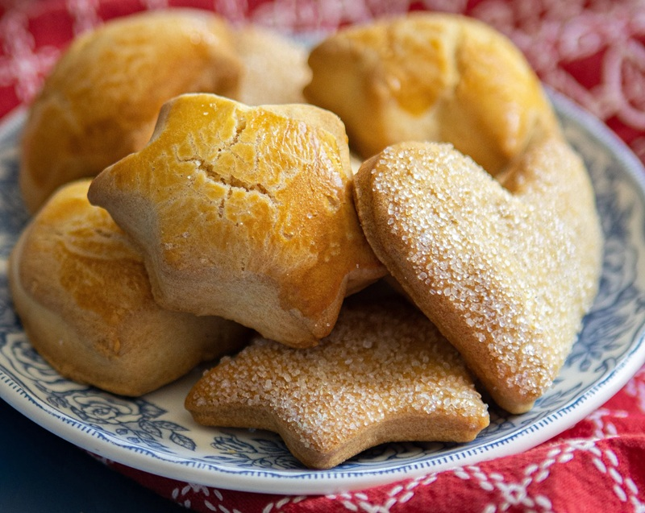

# Pichene

*Uyghur cut-out sugar-topped cookies. A simple oil-and-egg dough, rolled thin, cut into shapes, dipped sugar-side-down on a plate of sugar, baked until just-set. A childhood Uyghur snack served with milk tea.*

**Serves:** Makes ~24 cookies

**Prep Time:** 15 minutes (plus 10 minutes dough rest)

**Cook Time:** 15-20 minutes

## Overview
Soft butter-yellow biscuits with a layer of crystalline white sugar pressed into the top before baking. The flavour is plain and clean: egg, milk, sunflower oil, baking soda, the kind of childhood cookie that's exactly as sweet as a child's tea wants. The sugar crust on top is the signature; pressing each cookie face-down into a plate of sugar before the tray is what bonds the topping, and it gives the finished biscuit a faint crunch over a soft, cake-like crumb underneath. Smell is buttery-vanilla even though there's no vanilla in the recipe. Genuinely easy to make: no chilling, no rolling-to-millimetres, no nuanced technique. Roll, cut, press into sugar, bake. A staple of Uyghur tea tables, packed into tin boxes for car journeys and bus trips across Xinjiang, and the snack that every Uyghur grandmother makes for visiting children. The shapes, stars, circles, hearts, are improvisational, so home versions look as varied as the cutters in the kitchen drawer.

## Ingredients

- 100 ml sunflower oil
- 100 g caster sugar
- 100 ml milk
- 2 eggs
- 1 teaspoon baking soda
- 1 teaspoon baking powder
- ~250 g plain flour (added gradually until firm)
- Extra caster sugar, for topping

## Method

### Stage 1 - Dough
1. In a wide bowl, mix the oil, sugar, eggs, milk, baking soda and baking powder until smooth.
1. Add flour a handful at a time, mixing until the dough is firm enough to handle.
1. Knead briefly to bring it together; cover and rest 10 minutes.

### Stage 2 - Shape
1. Preheat the oven (see below for temperature based on thickness).
1. Oil the work surface lightly to prevent sticking.
1. Roll the dough to 5 mm thick.
1. Cut shapes with cookie cutters.
1. Pour the extra sugar onto a flat plate. Hold each cookie face-down, press it firmly into the sugar, then lay sugar-side up on a lined tray.

### Stage 3 - Bake
1. **Thin/crisper:** 180°C (160°C fan) for 20-25 minutes.
1. **Thicker/softer:** 200°C (180°C fan) for 12-15 minutes.
1. Cookies are ready when the bases are lightly golden.
1. Cool on the tray a few minutes before lifting onto a rack.

## Notes
- **Sugar dip not topping:** the sugar adheres because the cookie is pressed firmly into it before baking. Sprinkling on top after baking falls off.
- **Dough firmness:** add flour gradually. The wetter the dough, the more it spreads. Aim for a dough that lifts off a clean wooden spoon.

## Storage
- Keeps 1 week in an airtight tin at room temperature.
- Don't freeze - the sugar crust softens on thaw.
