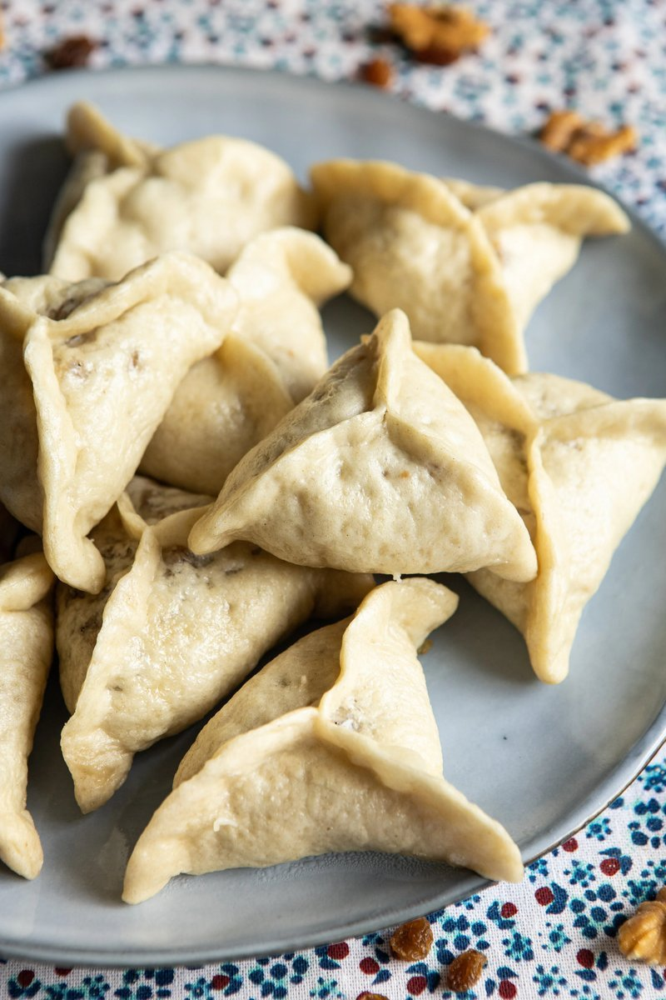

# Sheker Manta

*Uyghur sugar dumplings: yeasted dough wrapping chopped walnuts, raisins, sugar and lamb fat, pinched into triangles and steamed in stacking trays.*

**Serves:** Makes 12 dumplings

**Prep Time:** 30 minutes (plus 2-4 hours dough rise)

**Cook Time:** 15 minutes

## Overview
A sweet steamed dumpling with the surprising savoury-rich note of rendered lamb fat carrying the filling. Walnuts and raisins give crunch and chew respectively; sugar sweetens; lamb fat, slowly rendered to clear oil and stirred through warm, coats every piece of fruit and nut so the whole filling holds together as a glossy paste rather than a dry crumble. Vegetable oil is the standard vegetarian swap, but tastes lighter and lacks the meaty undertone that defines the original. The dough wrapper is yeasted and pillowy, slightly thicker in the centre than at the edges, and pinches into a clean triangle with a small visible swirl at the centre seam. A Uyghur snack with deep roots; the manta family of steamed dumplings runs across Central Asia from Turkey to Mongolia, and the Uyghur sweet variant is one of the few in that family that breaks the savoury convention.

## Ingredients

### Dough
- 250 g plain flour
- 110 ml cold water
- 2 g instant yeast
- 2 pinches salt

### Filling
- 138 g walnuts (finely chopped)
- 67 g raisins (finely chopped)
- 29 g lamb fat (finely chopped; or 30 ml neutral oil for vegetarian)
- 26 g caster sugar

## Method

### Stage 1 - Dough
1. Mix flour, salt, yeast and cold water in a bowl; knead until smooth.
1. Cover with a damp cloth; rise 2-4 hours at room temperature until doubled.

### Stage 2 - Filling
1. Render the lamb fat: chop fine, heat in a small pan over low heat until it melts into clear oil. Cool slightly.
1. Combine the cooled fat, sugar, walnuts and raisins. The mixture will be tacky and bind together.

### Stage 3 - Wrap
1. Oil the inside of a steamer's tray bottoms.
1. Tip the risen dough out, knock back, and roll into a 5 cm-thick rope.
1. Cut into 12 walnut-sized pieces. Roll each into a ball.
1. Flatten each ball into a wrapper by pressing the edges outward from the centre with your thumb. The centre stays thicker; edges thin.
1. Place a tablespoon of filling in the centre.
1. Pinch the edges from outside inward to form a triangle; press firmly to seal.

### Stage 4 - Steam
1. Bring the steamer water to a rolling boil.
1. Arrange the parcels in the oiled trays, leaving room between each.
1. Steam 15 minutes.
1. Lift the lid carefully (mind the steam); use a thin spatula to ease the dumplings free.
1. Serve warm. Eat with the fingers.

## Notes
- **Lamb fat carries the dish:** the rendered fat coats the dried fruits, sweetens with the sugar, and gives the filling its characteristic Uyghur richness. Vegetable oil works but reads as a different (lighter) dish.
- **Thicker centre, thinner edges:** the dough wrapper does double duty, thicker centre takes the weight of the filling; thinner edges fold cleanly to a sealed triangle.

## Storage
- Best warm from the steamer.
- Keep 2 days refrigerated; re-steam 5 minutes to warm.
- Freezes well: freeze pre-steaming in a single layer, then bag. Steam from frozen 18-20 minutes.
