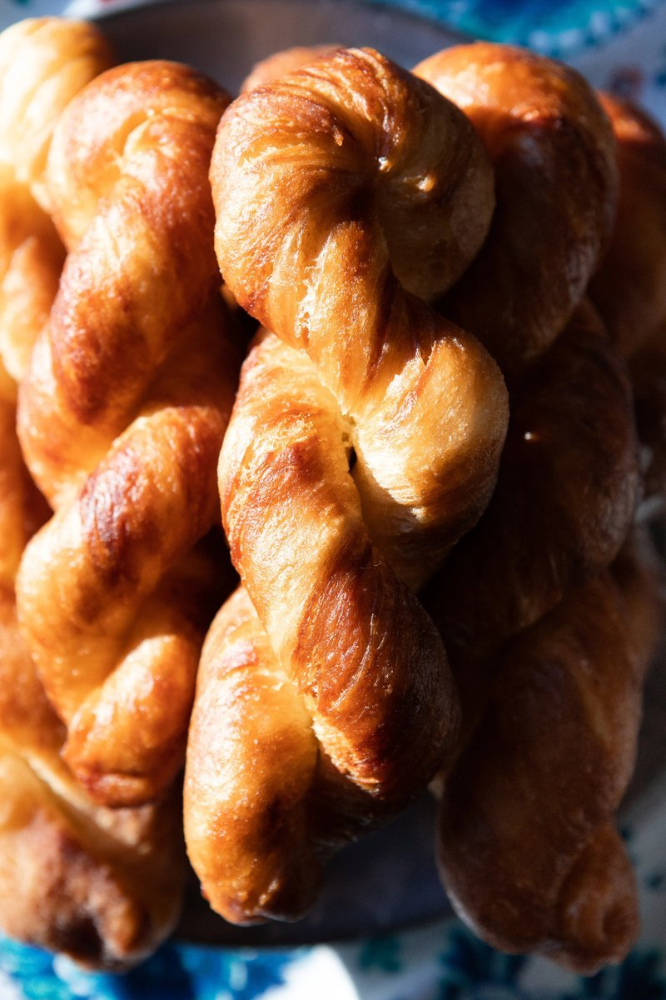

# Uyghur Twisted Donuts

*Uyghur fried-dough ropes: hand-twisted into spirals and deep-fried till golden, then dusted with icing sugar. A milk-tea companion across Xinjiang.*

**Serves:** Makes 7 twists

**Prep Time:** 20 minutes (plus 2-4 hours rise)

**Cook Time:** 15 minutes

## Overview
A fried dough with a glassy, slightly biscuit-crisp shell and a soft, chewy, slightly elastic interior, the texture you only get from a yeasted dough that's had a "hot-oil pass" before frying. Pouring smoking oil onto risen dough with a sprinkle of baking soda is the trick: the heat partially cooks the surface gluten, the baking soda neutralises some acidity, and the result fries up with a deeper colour and a crackle that plain donut dough can't manage. The flavour is simple and yeasty, sweetened only by the icing-sugar dusting at the end. Smell is warm wheat and fresh oil. The signature is the shape, a hand-twisted rope that doubles back on itself and counter-twists into a tight spiral, genuinely satisfying to make once you've got the rhythm. A bazaar street snack across Xinjiang, sold from glass-fronted carts next to milk-tea stalls; you eat one warm in the morning with milk tea and it's enough until lunch.

## Ingredients

### Dough
- 300 g plain flour
- 3 g instant yeast
- 30 g caster sugar
- 1 egg
- 120 ml water
- 1 teaspoon baking soda
- 30 ml sunflower oil (heated, for the dough)

### To fry and finish
- Sunflower oil (or vegetable oil, 1 litre, for deep-frying)
- Icing sugar, to dust

## Method

### Stage 1 - Dough rise
1. Combine flour, yeast, sugar, egg and water in a bowl. Knead 5 minutes until smooth.
1. Cover with a damp cloth or cling film; rise 2-4 hours at room temperature until doubled.

### Stage 2 - Hot-oil pass
1. Sprinkle the baking soda and a small handful of flour over the risen dough.
1. Heat the 30 ml of sunflower oil until lightly smoking; pour it directly onto the dough.
1. Stir vigorously with a spoon (it'll be hot). When cool enough to handle, knead until smooth again.
1. Cover and rest 10 minutes.

### Stage 3 - Shape and twist
1. Divide the dough into 7 equal pieces.
1. Roll each into a rope ~28 cm long and 2 cm thick.
1. Hold one end of the rope steady; with the other hand, twist tight (multiple rotations).
1. Lift the rope off the surface; bring the two ends together. The rope will counter-twist on itself into a tight spiral.
1. Repeat 1-2 more rotations until the spiral has 3-4 visible twists; pinch the ends to seal.
1. Lay on a tray; rest 15-30 minutes, flipping once for even rise.

### Stage 4 - Fry
1. Heat the frying oil over medium-high heat to ~170°C / 340°F. Test with a wooden chopstick: small even bubbles around it means ready.
1. Lower the heat to its lowest setting.
1. Gently add 3-4 twists at a time; fry 2 minutes per side, 4-5 minutes total, until deep gold.
1. Lift onto kitchen paper to drain.
1. Dust with icing sugar while still warm. Serve immediately, or once cool.

## Notes
- **Hot oil into the dough:** the second-stage hot oil + baking soda + flour pass is the Uyghur trick. The hot oil flavours the dough and the baking soda crisps the fried surface.
- **Lowest heat for frying:** the dough fries through to the centre at moderate heat. Hot oil burns the surface before the inside cooks.
- **Twist count:** more twists = tighter spiral = sturdier finished shape. Aim for 3-4 visible turns minimum.

## Storage
- Eat the same day for best texture.
- Freezes well up to 1 month; thaw at room temperature.
