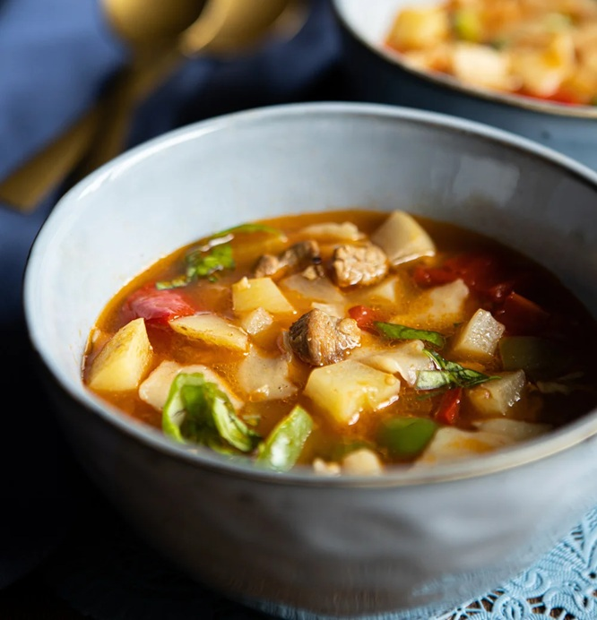

# Suykash

*The Uyghur hand-torn pasta soup: lamb and vegetables in a tomato-pepper broth, with fresh dough torn into nail-sized pieces directly into the pot.*

**Serves:** 3-4

**Prep Time:** 30 minutes (plus 15 minutes dough rest)

**Cook Time:** 30 minutes

## Overview
A bowl of warm, slightly tangy tomato-and-lamb broth thickened by the starch of just-cooked hand-torn pasta. The shape of the noodles is the soul of the dish: irregular thumbnail-sized squares with thick centres and thin edges that grab the broth differently in every spoonful. Aromatics lean savoury rather than spicy; cumin and white pepper sit in the background, fresh basil hits at the end, and a splash of black rice vinegar lifts everything. Texturally it's chunky and homely, diced turnip, potato, peppers and lamb, all about the same size as the pasta pieces, so it eats with one motion of the spoon. Easy to make solo, but the traditional way is collective: several people tearing pasta directly into the boiling pot at the same time, faster and looser. The dish is everyday food across Uyghur households and a counterpart to the more elaborate hand-pulled laghman; the name suykash translates roughly as "water tear", which captures the technique exactly.

## Ingredients

### Dough
- 200 g plain flour
- 80 ml water
- 2 pinches salt

### Soup
- 155 g lamb (diced small)
- 50 ml olive oil
- 1 turnip (medium, purple-top or green-top, diced)
- 1 potato (medium, ~120 g, diced small)
- 1 red sweet pepper (diced)
- ½ green bell pepper (diced)
- 25 g fresh ginger (finely chopped)
- 6 tomatoes (~220 g, finely chopped)
- 1 onion (diced small)
- 1 bulb garlic (finely chopped)
- 1 teaspoon white pepper
- 1 teaspoon black pepper
- ½ teaspoon ground cumin
- 1 teaspoon salt (to taste)
- 1 ½ litres water
- 10 g fresh basil (roughly chopped, to finish)
- 1 tablespoon black rice vinegar (optional, to finish)

## Method

### Stage 1 - Dough
1. Combine flour, salt and water; mix and knead 5 minutes until smooth.
1. Cover with a damp cloth and rest 15 minutes at room temperature.

### Stage 2 - Soup base
1. Heat the olive oil in a wide saucepan over medium-high heat until lightly smoking.
1. Add the lamb; brown 3-4 minutes.
1. Add the onion, salt, pepper, cumin, tomato, ginger, garlic and fresh peppers. Stir to combine.
1. Pour in the water; bring to the boil.
1. Add the turnip and potato. Return to the boil, then reduce to a medium-low simmer.

### Stage 3 - Pasta in the pot
1. Flatten the rested dough into a rectangle on an oiled surface; cut lengthways into 8 strips about a finger thick.
1. Roll each strip thinner with your palm, then flatten with fingertips.
1. Hold the strip across your hand and tear it into nail-sized pieces, dropping each directly into the simmering soup as you go.
1. Stir after each section so the pieces don't clump.
1. Boil 3-5 minutes until the pasta is just cooked and the broth has thickened from released starch.

### Stage 4 - Finish
1. Taste the broth; adjust salt.
1. Off heat, fold in the fresh basil and the black rice vinegar (if using).
1. Ladle into deep bowls. Eat with a spoon.

## Notes
- **Tear, don't roll-and-cut:** the irregular hand-torn shapes are the dish. Even pieces eat like generic pasta.
- **Communal preparation:** traditionally several people tear pasta into the pot at once. Faster, looser, more fun.
- **Seasonal flex:** the recipe changes with the vegetables available - swap in pumpkin, courgette, beans or whatever's in season.

## Storage
- Best fresh; the pasta softens further on standing.
- Leftover broth keeps 3 days refrigerated; the pasta turns soft but flavour deepens.
