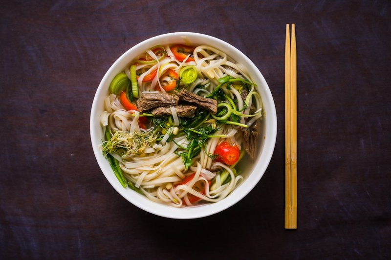

# Beef Pho

*Vietnam's defining noodle soup: a slow-simmered beef bone broth scented with star anise, cinnamon, charred onion and ginger.*

**Serves:** 4

**Prep Time:** 20 minutes

**Cook Time:** 30 minutes

## Overview
Phở bò is Vietnam's defining noodle soup, a slow-simmered beef broth scented with star anise, cinnamon, charred onion and ginger, ladled over flat rice noodles with paper-thin slices of raw beef that poach in the hot broth at the table. The broth carries the whole dish, so the spices must toast properly and the beef must be sliced as thin as you can manage (partial-freezing the fillet makes this much easier; if it starts to thaw mid-slice, return it to the freezer for 15 minutes). Soak rice noodles in boiling water for 15 to 20 minutes till just tender, drain. Build the broth by combining beef stock with a single star anise, sliced fresh ginger, a couple of pig's trotters for body, half an onion studded with cloves, bashed lemongrass, crushed garlic and white pepper. Bring to the boil and simmer gently for 30 minutes so the aromatics infuse, then strain through a fine sieve into a clean pot and stir in the fish sauce off the heat. Divide the soaked noodles between deep bowls, lay the paper-thin slices of raw beef across the top with beansprouts, sliced spring onions, chopped coriander, mint and half the chillies. Bring the broth to a rolling boil and ladle straight over the beef so the meat cooks instantly in the heat, no further cooking needed. Serve with extra chillies, mint, coriander, lime quarters and a small jug of fish sauce on a side platter for each diner to season their own bowl.

## Ingredients
### Noodles
- 200 grams rice noodles

### Broth
- 1 ½ litres beef stock
- 1 star anise
- 4 cm fresh ginger (sliced)
- 2 pigs trotters
- ½ onion studded with 2 cloves
- 2 lemon grass stems (pounded)
- 2 garlic cloves (crushed)
- ¼ teaspoons white pepper
- 1 tablespoon fish sauce

### Protein
- 400 grams beef fillet (frozen)

### Vegetables and herbs
- 90 gram bean sprouts (trimmed)
- 2 spring onions (thinly sliced on the diagonal)
- 25 grams coriander leaves (chopped)
- 25 grams mint (chopped)
- 2 fresh red chillies (thinly sliced)
- mint leaves (extra to serve)
- coriander leaves (extra to serve)
- 2 limes (quartered)
- fish sauce (to serve)

## Method

### Stage 1 - Prepare beef and noodles
1. Slice the frozen beef as thinly as possible. If the beef begins to thaw, put it back in the freezer for 15 minutes.
1. Soak the noodles in boiling water for 15 - 20 minutes. Drain.

### Stage 2 - Make broth
1. Bring the stock, star anise, ginger, trotters, onion, lemon grass, garlic and white pepper to the boil in a large saucepan.
1. Reduce the heat and simmer for 30 minutes.
1. Strain, return to the same pan and stir in the fish sauce.

### Stage 3 - Assemble and serve
1. Divide the noodles among bowls, then top with beef strips, bean sprouts, spring onion, coriander, mint and half of the chillies.
1. Ladle over the broth.
1. Put the remaining chillies, mint, coriander, lime quarters and fish sauce in small bowls on a platter and serve with the soup.

## Notes
- **Beef:** Freeze briefly for easy thin slicing; it cooks instantly in hot broth.
- **Broth:** Simmer gently to extract maximum flavor from spices.
- **Noodles:** Soak in hot water; avoid boiling to prevent mushiness.
- **Herbs:** Add fresh herbs at serving for vibrant flavor.

## Serving
- Serve hot with accompaniments.

## Storage
- Best served immediately; broth can be refrigerated for 2 days.
