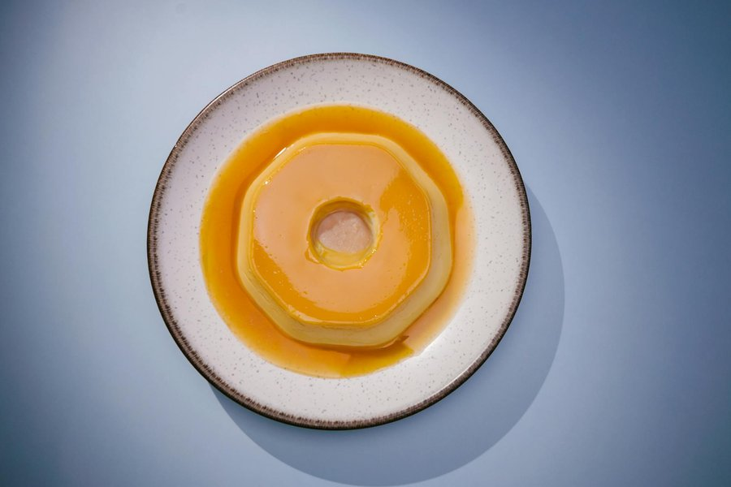

# Bánh Flan

*Vietnam's crème caramel: smoother and more egg-rich than its French cousin, served over crushed ice with a shot of strong coffee or coconut cream poured on top.*

**Serves:** 6

**Prep Time:** 15 minutes

**Cook Time:** 50 minutes (plus 4 hours chilling)

## Overview
A simple custard of whole eggs, condensed milk and evaporated milk is poured over a hard caramel base and baked in a bain-marie at low temperature for a silken set. The caramel melts into a sauce as the flan chills overnight in the fridge. Tipped out onto a plate, the dark caramel runs down the sides and pools at the base.

## Ingredients

### Caramel
- 150 g caster sugar
- 3 tablespoons water
- 1 teaspoon lemon juice

### Custard
- 4 whole eggs
- 2 egg yolks
- 1 x 397 g tin sweetened condensed milk
- 1 x 410 g tin evaporated milk (or 400 ml whole milk for a lighter flan)
- 1 teaspoon vanilla extract
- ½ teaspoon instant coffee granules (optional but traditional)
- A pinch of fine sea salt

### To serve
- Crushed ice
- A small jug of strong black coffee (optional but classic)
- 4 tablespoons coconut cream (optional)

## Method

### Stage 1 - Make the caramel
1. Preheat the oven to 150 °C (130 °C fan).
2. Place six 150 ml ramekins (or one 1 litre flan dish) on the counter, ready to fill.
3. In a small heavy-based saucepan, combine the sugar, water and lemon juice. Place over medium heat without stirring.
4. Swirl the pan gently as the sugar dissolves and the syrup begins to colour. Once it turns pale gold, watch it closely.
5. Cook to a deep amber, about the colour of dark honey, 5-7 minutes total. Do not let it go past dark brown or it will taste bitter.
6. Immediately pour a thin layer of caramel into the bottom of each ramekin, tilting to coat evenly. The caramel will harden into a glassy disc as it cools. Work quickly; once the caramel sets in the pan it's hard to redistribute.

### Stage 2 - Make the custard
1. In a large mixing bowl, gently whisk the whole eggs and egg yolks. Whisk just enough to combine; do not aerate. Bubbles create a foamy, pock-marked surface on the finished flan.
2. Add the condensed milk, evaporated milk, vanilla, coffee (if using) and salt. Whisk gently until smooth and uniform.
3. Strain the mixture through a fine sieve into a jug. This catches the chalazae (the white ropy bits in egg whites) and gives the flan its glassy texture.
4. Let the strained custard rest 5 minutes, then skim any foam off the top with a spoon.

### Stage 3 - Bake in a bain-marie
1. Place the caramel-lined ramekins in a deep roasting tin.
2. Pour the custard into each ramekin, filling almost to the top.
3. Boil the kettle. Pour boiling water into the roasting tin until it comes halfway up the sides of the ramekins.
4. Cover the whole tin loosely with foil (this prevents a skin forming on top).
5. Slide carefully into the oven and bake for 40-45 minutes. The flans should jiggle as one set unit when nudged, with no liquid wobble in the centre. A skewer inserted slightly off-centre should come out clean.
6. If the flans look like they're rising or cracking, the oven is too hot; lower the temperature by 10 °C.

### Stage 4 - Chill
1. Remove the ramekins from the water bath. Let cool on a wire rack for 30 minutes.
2. Cover each with cling film and refrigerate for at least 4 hours, ideally overnight. Chilling allows the caramel to liquefy into a sauce.

### Stage 5 - Turn out and serve
1. Run a thin knife around the inside edge of each ramekin.
2. Invert a serving plate over the top, then flip the whole thing. Give a sharp downward shake; the flan should release with a satisfying schlop. The caramel sauce will run down the sides.
3. Spoon any caramel still clinging to the ramekin onto the flan.
4. For the classic Vietnamese coffee-shop service: place each flan in a small bowl over a layer of crushed ice, then pour a tablespoon of strong black coffee around the base just before serving. Add a drizzle of coconut cream if you like.

## Notes
- **Low and slow:** A bain-marie at 150 °C is what gives bánh flan its silken set. Higher temperatures curdle the eggs and you'll end up with a pitted, sponge-textured custard.
- **Don't overbake:** The flan should still jiggle in the centre when you take it out. It firms up completely as it cools and chills. Overbaked flan has the texture of scrambled egg.
- **Strain the custard:** Worth the extra 30 seconds. Unstrained flan has a slightly grainy mouthfeel.
- **Caramel colour:** Light amber is bland; dark mahogany is bitter. Aim for the colour of dark maple syrup. The lemon juice prevents crystallisation as the sugar cooks.
- **Coffee finish:** A shot of strong robusta coffee poured around the base of the flan is the Vietnamese way. Vietnamese coffee from a phin filter is ideal; a strong espresso works.

## Variations
**Coconut flan (bánh flan dừa):** Replace the evaporated milk with 400 ml coconut milk. The texture is slightly softer but the flavour is wonderful.
**Pandan flan:** Steep 4 pandan leaves (or 1 teaspoon pandan extract) in the warmed milk for 20 minutes. Strain before mixing with the eggs. The flan turns pale green and smells like jasmine rice.
**Cinnamon flan:** Add a cinnamon stick to the warmed milk in the same way.

## Serving
Serve with: a shot of strong black coffee poured around the base over crushed ice, the standard Saigon café preparation.
Garnish with: a drizzle of coconut cream or a few coffee beans on the plate.

## Storage
- Keeps 4 days refrigerated in the ramekins, covered with cling film
- The longer it sits, the more caramel sauce develops; day-two flan is better than day-one
- Do not freeze; the texture turns icy and grainy
