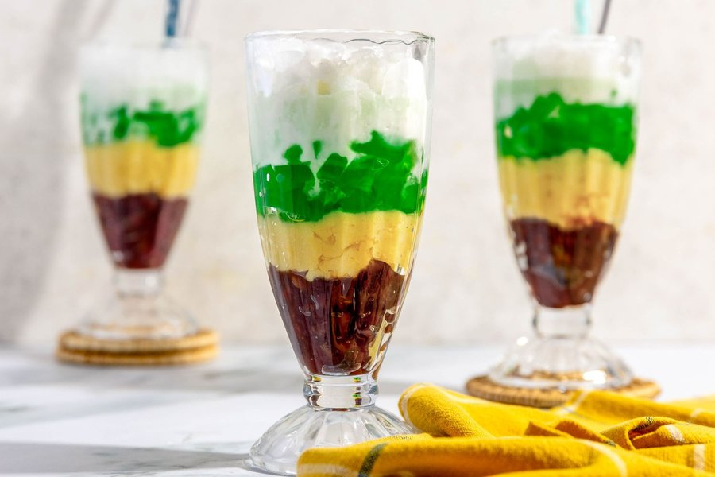

# Chè Ba Màu

*Vietnam's three-colour dessert: red bean, yellow mung bean and emerald pandan jelly layered in a tall glass, topped with crushed ice and coconut cream.*

**Serves:** 4

**Prep Time:** 20 minutes (plus overnight soaking)

**Cook Time:** 1 hour

## Overview
Chè ba màu is Vietnam's three-colour dessert: layers of sweetened azuki red beans, yellow mung beans and emerald pandan agar jelly stacked in a tall glass over crushed ice and drowned in salt-and-sugar coconut cream. The point is the contrast. The layers stay distinct until a long spoon is pushed down to the bottom of the glass and pulls up red bean, mung bean, jelly and coconut cream all together for the first bite. Three components, each prepared separately: the red beans simmered till just yielding and glazed with sugar and salt while still hot, the mung beans cooked till tender but not collapsed, the pandan jelly set in a thin sheet and cut into small cubes. Agar must actually boil to set; under-cooked it stays loose. Built in tall glasses with crushed ice and a slick of coconut cream that soaks down through the layers. Eat immediately with a long iced-tea spoon. First-time eaters need to be told to dig to the bottom on every scoop.

## Ingredients

### Red bean layer (đậu đỏ)
- 100 g dried azuki red beans (soaked overnight)
- 50 g caster sugar
- A pinch of fine sea salt

### Mung bean layer (đậu xanh)
- 100 g dried split yellow mung beans (đậu xanh tách vỏ; soaked 2 hours)
- 40 g caster sugar
- A pinch of fine sea salt

### Pandan jelly layer (thạch lá dứa)
- 4 g agar agar powder (about 1 teaspoon)
- 400 ml water
- 50 g caster sugar
- 1 teaspoon pandan extract (or 4 pandan leaves blended with the water and strained)
- A few drops green food colouring (optional, for a vivid green)

### Coconut cream topping
- 200 ml coconut cream
- 50 ml water
- 2 tablespoons caster sugar
- A pinch of fine sea salt
- 1 teaspoon cornflour mixed with 1 tablespoon water

### To serve
- 400 g crushed ice
- 2 tablespoons toasted sesame seeds (or crushed roasted peanuts, optional)

## Method

### Stage 1 - Cook the red beans
1. Drain the soaked red beans and rinse. Place in a saucepan with 600 ml fresh water.
2. Bring to the boil, then reduce to a gentle simmer. Cook for 40-50 minutes, topping up with hot water as needed, until the beans are completely soft but still hold their shape. They should crush easily between two fingers.
3. Drain off most of the liquid (leave a tablespoon or two clinging to the beans). Stir in the sugar and salt while still hot. The sugar will melt and glaze the beans.
4. Set aside to cool.

### Stage 2 - Cook the mung beans
1. Drain the soaked mung beans. Place in a saucepan with 400 ml fresh water.
2. Bring to a simmer over medium heat. Cook for 15-20 minutes until tender but not collapsed. Mung beans cook far faster than red beans.
3. Drain off the cooking liquid (it should be mostly absorbed). Stir in the sugar and salt while warm.
4. Set aside to cool. The mung beans will firm up as they cool into a soft, scoopable mass.

### Stage 3 - Make the pandan jelly
1. Place a small square baking dish (about 15 x 15 cm) on the counter.
2. In a small saucepan, whisk the agar agar powder into the water until dispersed.
3. Bring to a simmer over medium heat, whisking constantly. Cook for 2 minutes; agar needs to actually boil to set.
4. Add the sugar and whisk until dissolved. Stir in the pandan extract and food colouring (if using).
5. Pour into the baking dish to a depth of about 1 cm. Leave to set at room temperature for 20 minutes (agar sets at warm temperatures, unlike gelatine).
6. Once firm, slice into small 6 mm cubes.

### Stage 4 - Make the coconut cream topping
1. In a small saucepan, combine the coconut cream, water, sugar and salt. Bring to a gentle simmer over medium heat.
2. Whisk in the cornflour slurry and cook for 1 minute, stirring, until very lightly thickened. It should still pour easily.
3. Tip into a jug and cool to room temperature.

### Stage 5 - Assemble
1. Take 4 tall glasses (200-300 ml capacity each).
2. Spoon 2 tablespoons of red beans into the bottom of each glass.
3. Layer 2 tablespoons of mung beans on top.
4. Add 2 tablespoons of pandan jelly cubes.
5. Top with a generous handful of crushed ice.
6. Pour over 3-4 tablespoons of coconut cream to soak through the ice.
7. Scatter with sesame seeds or peanuts if using.
8. Serve immediately with a long iced-tea spoon.

## Notes
- **Eat from the bottom:** The whole point of chè ba màu is mixing the layers as you spoon. Tell first-time eaters to dig down to the bottom of the glass on every spoonful so they get red bean, mung bean, jelly and coconut cream all together.
- **Agar, not gelatine:** Agar sets firm at room temperature and holds its shape against the ice, gelatine would melt. Vegan-friendly too.
- **Bean texture:** Cook the red beans until soft, but don't let them break down into mush; you want distinct beans. The mung beans should be the opposite, soft enough that a spoon glides through.
- **Pandan flavour:** Fresh pandan leaves (blended with water then strained) give a more rounded flavour than extract. Asian grocers sell them frozen in bundles. Extract works fine if you can't find them.
- **Make ahead:** All three layers and the coconut cream keep separately for 3 days in the fridge. Assemble at the moment of serving so the ice doesn't melt.

## Variations
- **Four-colour (chè bốn màu):** Add a fourth layer of tapioca pearls cooked until clear.
- **With taro:** Replace one bean layer with 100 g steamed and sweetened taro cubes.
- **With sweet corn (chè bắp):** Stir 2 tablespoons of sweet corn kernels into the coconut cream topping.

## Serving
- Serve with: a long iced-tea spoon and an extra jug of coconut cream on the side for those who want more.
- Garnish with: a fresh pandan leaf curled into the glass, or a sprinkle of toasted coconut.

## Storage
- Assembled chè is best eaten within 15 minutes before the ice melts and dilutes everything
- All components keep separately in the fridge for 3 days
- The pandan jelly can be cut and kept in cold water in the fridge for up to 4 days
- Do not freeze any of the layers
