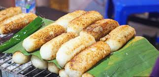

# Chuối Nướng

*Vietnam's grilled banana dessert: bananas wrapped in sweet sticky rice, charred over coals till the rice crusts, drowned in warm coconut sauce and peanuts.*

**Serves:** 4

**Prep Time:** 15 minutes (plus 2 hours soaking)

**Cook Time:** 25 minutes

## Overview
Chuối nướng is Vietnam's grilled banana dessert: small Asian bananas wrapped in sweetened sticky rice, parcelled in banana leaves and grilled over coals till the rice forms a chewy crust and the banana inside steams to soft and hot. Split open at the table and drowned in warm salted coconut sauce, scattered with toasted peanuts and sesame, the whole pleasure is the contrast: crisp burnt-edged rice outside, soft sweet hot banana inside, cool coconut sauce running through it all. The bananas matter. Small Vietnamese chuối sứ are the traditional choice (slightly tart, hold their shape when cooked), but firm just-yellow Cavendish bananas with no brown spots substitute. Soak the glutinous rice for two hours minimum; unsoaked rice stays chalky in the centre. The banana leaves need a brief pass over a flame on both sides to shift from brittle green to pliable glossy before wrapping. On the grill the leaves char and blacken, which protects the rice underneath. Eat hot, split and drowned in coconut sauce.

## Ingredients

### Rice wrapping
- 200 g glutinous (sticky) rice (soaked 2 hours in cold water)
- 200 ml coconut milk
- 2 tablespoons caster sugar
- ½ teaspoon fine sea salt

### Bananas
- 4 Vietnamese bananas (small, chuối sứ) or 2 large under-ripe regular bananas (cut in half lengthways)
- 4 banana leaves (fresh or frozen-thawed; cut into 25 x 25 cm squares)

### Coconut sauce
- 250 ml coconut cream
- 1 tablespoon caster sugar
- ½ teaspoon fine sea salt
- 1 teaspoon cornflour mixed with 1 tablespoon water
- 1 pandan leaf (optional, for fragrance)

### To finish
- 3 tablespoons roasted peanuts (roughly crushed)
- 1 tablespoon toasted sesame seeds
- A pinch of flaky sea salt

## Method

### Stage 1 - Cook the sticky rice
1. Drain the soaked rice and rinse. Steam in a bamboo or metal steamer lined with muslin for 20 minutes, until the grains are translucent and tender when pinched.
2. While the rice steams, gently warm the coconut milk, sugar and salt in a small saucepan until the sugar dissolves. Do not boil.
3. Tip the hot rice into a bowl and pour the warm coconut milk over. Stir gently with a spatula to coat every grain. Cover and rest 10 minutes, the rice will absorb the liquid and turn glossy.

### Stage 2 - Soften the banana leaves
1. If using fresh leaves, pass each square briefly over a low gas flame, both sides, until they turn glossy and pliable, about 5 seconds per side. They'll go from a stiff, brittle leaf to something that bends without cracking.
2. If using frozen leaves, thaw and pat dry; they're already pliable.
3. If using foil, no prep needed.

### Stage 3 - Wrap the bananas
1. Lay a banana leaf square on the counter, shiny side down.
2. Spread 3 tablespoons of sticky rice in a flat oval roughly 12 x 7 cm in the centre of the leaf, about 1 cm thick.
3. Lay a banana (or banana half) along the centre of the rice.
4. Using the leaf as a sling, lift the long edges up and press the rice firmly around the banana so it's fully encased. Smooth any gaps with damp fingers.
5. Wrap the leaf tightly around the rice-encased banana, folding the ends underneath like a parcel. Secure with a toothpick if the leaf wants to spring open. Repeat for all 4.

### Stage 4 - Grill
1. Heat a charcoal grill to medium-high, or set a heavy griddle pan or non-stick frying pan over medium-high heat. Charcoal gives the authentic smoky note but a pan works.
2. Place the parcels on the grill and cook for 4-5 minutes per side, turning twice, total 16-20 minutes. The banana leaf will char and blacken; this is fine, it's protecting the rice.
3. To check doneness, unwrap one parcel slightly: the rice should have a golden brown crust on the outside and the banana inside should be soft and steaming. If the rice is pale and soft, give it another 3 minutes.

### Stage 5 - Make the coconut sauce
1. While the parcels grill, combine the coconut cream, sugar, salt and pandan leaf (if using) in a small saucepan over low heat.
2. Bring to a bare simmer, stirring. Whisk in the cornflour slurry and cook for 1 minute until very lightly thickened, like single cream.
3. Remove from the heat. Fish out the pandan leaf if used.

### Stage 6 - Serve
1. Unwrap each parcel from its leaf and place on a plate, or serve in the leaf like a banana boat.
2. Split open lengthways with a knife so the banana shows.
3. Spoon over the warm coconut sauce generously, letting it run into the split.
4. Scatter with crushed peanuts, sesame seeds and a tiny pinch of flaky salt to lift the sweetness.
5. Serve immediately while warm.

## Notes
- **Banana type matters:** Vietnamese chuối sứ are small, slightly tart and hold their shape when cooked. They're available at Asian grocers. If you only have Cavendish (the regular supermarket variety), use ones that are firm and just-yellow with no brown spots; over-ripe bananas turn to mush. Cut in half lengthways so each portion gets a flat banana piece.
- **Sticky rice prep:** Don't skip the soak. Unsoaked sticky rice steams unevenly and stays chalky in the centre. Two hours is the minimum; overnight is fine.
- **Banana leaves:** Frozen leaves are sold in big plastic bags at Asian grocers and Caribbean stores. They impart a subtle grassy aroma that foil can't match, but the recipe still works wrapped in foil if you can't find them.
- **The grill char:** The blackened outer leaf is supposed to look almost burnt. The rice underneath only just catches a golden crust. If the rice itself burns, the heat was too high.
- **Salt is essential:** The pinch of salt on top at serving is what makes the sweetness sing. Don't skip it.

## Variations
- **Sticky rice without banana (xôi):** Skip the banana and just steam the coconut rice into a coil; serve as a sweet rice dish.
- **Pandan rice:** Steam the rice with a pandan leaf tucked in, and add a few drops of pandan extract to the coconut milk for a green-tinted, jasmine-scented version.
- **Black sesame finish:** Substitute black sesame seeds for white for visual contrast and a deeper nutty flavour.

## Serving
- **Serve with:** a small scoop of vanilla or coconut ice cream alongside for a temperature contrast; the cold ice cream against the warm grilled banana is a modern Saigon-café trick.
- **Garnish with:** a few extra crushed peanuts and a final pinch of flaky salt.

## Storage
- Best eaten warm, straight off the grill
- Wrapped parcels can be assembled raw and refrigerated for 1 day, then grilled to order
- Cooked, leftover parcels keep 1 day refrigerated and reheat in a 180 °C oven for 8 minutes wrapped in foil
- Sauce keeps 3 days in the fridge; reheat gently with a splash of water if it thickens too much
