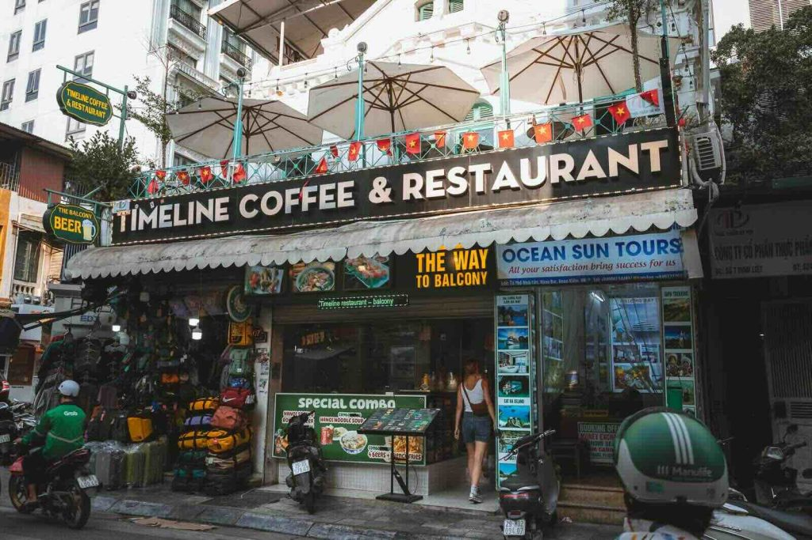

# Vietnamese Cuisine

Light, herb-driven cooking shaped by Chinese and French influences. Fish sauce, lime, mint, coriander, Thai basil and chilli give every dish its lift; rice noodles and rice paper supply the structure. Long-simmered broths like pho, grilled and fresh-rolled meats, and table-side assembly with herbs and lettuce define the experience.
