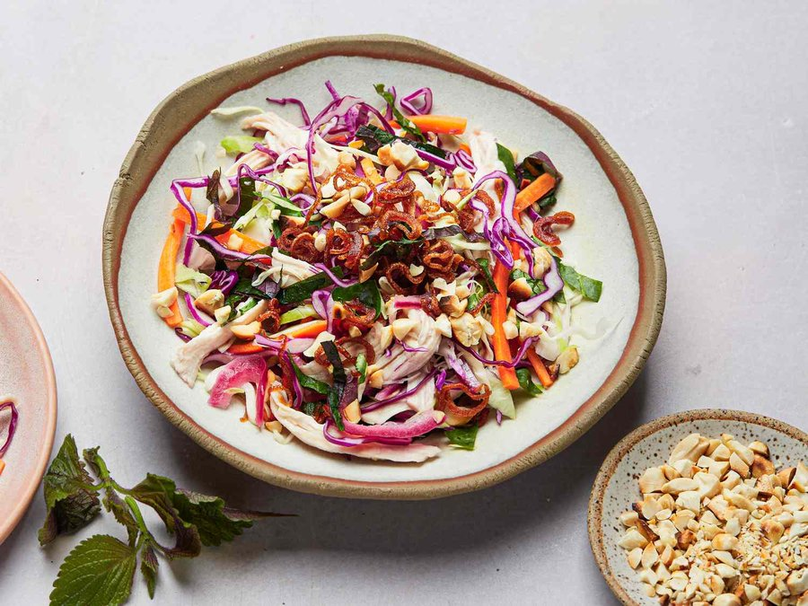

# Gỏi Bắp Cải

*Gỏi bắp cải is the Vietnamese cabbage and chicken salad you find at family gatherings: poached chicken shredded into ribbons of crunchy white cabbage, lifted with mint, Vietnamese coriander and a sharp lime and fish-sauce dressing. Light, fresh and built for hot weather.*

**Serves:** 4

**Prep Time:** 20 minutes

**Cook Time:** 15 minutes

## Overview
Poached chicken is shredded and tossed with finely shredded cabbage, carrot and onion that has been softened in a light vinegar bath. A bright nước chấm style dressing brings everything together and toasted peanuts and fried shallots finish the top. The trick is balance: the salad should be crunchy, not waterlogged, and the dressing should taste sharp on its own before it hits the salad.

## Ingredients

### Chicken
- 2 chicken breasts (about 400 g total)
- 1 thumb-sized piece of ginger (sliced)
- 2 spring onions (cut in half)
- 1 teaspoon fine sea salt

### Salad
- 400 g white cabbage (very finely shredded)
- 1 carrot (medium, julienned)
- 1 red onion (small, very thinly sliced)
- 2 tablespoons rice vinegar
- ½ teaspoon caster sugar
- A large handful mint leaves
- A large handful Vietnamese coriander (rau răm) or regular coriander
- 2 tablespoons crispy fried shallots
- 3 tablespoons roasted peanuts (roughly crushed)

### Nước chấm dressing
- 3 tablespoons lime juice (about 2 limes)
- 3 tablespoons fish sauce
- 3 tablespoons caster sugar
- 4 tablespoons warm water
- 2 garlic cloves (finely grated)
- 1 bird's-eye chilli (finely chopped, seeds in for heat)

## Method

### Stage 1 - Poach the chicken
1. Place the chicken breasts in a saucepan with the ginger, spring onions and salt. Cover with cold water by 2 cm.
2. Bring to a gentle simmer over medium heat. Once bubbles break the surface, reduce the heat to low and cook for 10 minutes.
3. Turn off the heat, cover the pan and leave the chicken to finish in the residual warmth for 10 minutes. The internal temperature should reach 74 °C.
4. Lift out and cool. Shred into thin strips by hand along the grain.

### Stage 2 - Soften the onion and dress
1. Combine the red onion with the rice vinegar and sugar in a small bowl. Toss and leave for 10 minutes. This takes the raw bite off the onion and dyes the rings pink.
2. In a jar, shake together the lime juice, fish sauce, sugar, warm water, garlic and chilli until the sugar dissolves. Taste: it should be aggressive on its own.

### Stage 3 - Assemble
1. In a large mixing bowl, combine the shredded cabbage, carrot, the pickled onion (drained) and the mint and Vietnamese coriander leaves.
2. Add the shredded chicken.
3. Pour over three-quarters of the dressing and toss thoroughly with clean hands or tongs for a full minute. The salt and acid will start to wilt the cabbage slightly. Taste and add more dressing if needed.
4. Pile onto a serving plate. Scatter the fried shallots and crushed peanuts over the top.

## Notes
- **Cabbage cut:** Slice the cabbage as fine as you can. Thick shreds stay tough and don't carry the dressing. A mandolin set to 2 mm is ideal.
- **Don't pre-dress:** Mix the salad only when you are ready to serve. Dressed cabbage releases water quickly and loses its crunch within 30 minutes.
- **Rau răm:** Vietnamese coriander has a peppery, citrus edge that's quite different from regular coriander. Asian grocers stock it; if you can't find it, use regular coriander with a few extra mint leaves to compensate.
- **Chicken texture:** Hand-shredding gives more surface area for the dressing to cling to than knife-cut pieces.

## Variations
- **Prawn version:** Replace chicken with 300 g cooked prawns, halved lengthways.
- **Beef version:** Use 300 g rare-cooked flank steak, sliced thinly across the grain.
- **Vegetarian:** Skip the chicken, double the cabbage and add 200 g pan-fried firm tofu cut into batons. Use soy sauce in place of fish sauce.

## Serving
- Serve with: prawn crackers (bánh phồng tôm) or as a starter before a noodle main.
- Garnish with: extra herbs, a wedge of lime and a few slices of red chilli.

## Storage
- Best eaten immediately after dressing
- Undressed components keep separately for 1 day refrigerated; assemble just before serving
- Leftover dressing keeps 1 week in a sealed jar in the fridge
