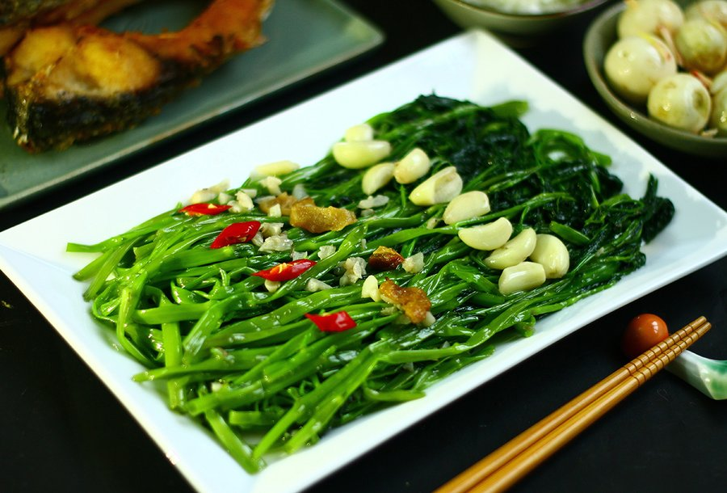

# Rau Muống Xào Tỏi

*Rau muống xào tỏi is the everyday Vietnamese vegetable dish: water spinach stir-fried with a heavy hand of garlic and a quick splash of fish sauce. Hollow stems stay crunchy while the leaves wilt to glossy green. Five minutes, three ingredients, and a benchmark of any cook's stir-fry technique.*

**Serves:** 4 (as a side)

**Prep Time:** 10 minutes

**Cook Time:** 5 minutes

## Overview
Water spinach (also called morning glory or kangkung) is cut into manageable lengths and stir-fried hard and fast in a screaming-hot pan with smashed garlic and a touch of oil. A finishing splash of fish sauce, oyster sauce and sugar glazes the leaves. The whole thing takes longer to wash than to cook.

## Ingredients

### Vegetables
- 500 g water spinach (rau muống)
- 6 garlic cloves (4 finely chopped, 2 smashed whole)

### Sauce
- 1 tablespoon fish sauce
- 1 tablespoon oyster sauce
- 1 teaspoon caster sugar
- 2 tablespoons water

### To cook
- 2 tablespoons vegetable oil
- ¼ teaspoon ground white pepper

## Method

### Stage 1 - Prep
1. Trim the bottom 3 cm off each water spinach stem (the woody, fibrous part). Discard or save for stock.
2. Cut the remaining stems and leaves into 8 cm lengths. Wash thoroughly in cold water, ideally two changes; water spinach often hides grit. Spin or shake completely dry. Wet greens steam instead of frying.
3. Whisk the fish sauce, oyster sauce, sugar and water in a small bowl.

### Stage 2 - Stir-fry
1. Heat a wok or large frying pan over the highest heat your hob will deliver until it just starts to smoke.
2. Add the oil and swirl. Add the smashed garlic cloves and the finely chopped garlic together. Stir-fry for 15 seconds until fragrant and pale gold. Do not let it brown.
3. Add the water spinach all at once. It will look like far too much for the pan. Toss aggressively with tongs or a wok ladle for 60 seconds. The stems should still snap, the leaves should wilt to a darker green.
4. Pour the sauce around the edge of the pan (this lets it caramelise on the hot metal). Toss for a further 30-45 seconds until the leaves are coated and glossy. Total cook time should be under 2 minutes.
5. Add the white pepper, give one last toss and tip onto a serving plate.

## Notes
- **Heat matters most:** This is the lesson stir-fry teaches. A lukewarm pan stews water spinach into a sad green pile. Heat the pan until it smokes faintly before any oil goes in.
- **Dry leaves:** Water clinging to washed greens will drop the pan temperature and turn the dish wet. Spin or air-dry on a tea towel.
- **No water spinach?** Substitute with regular spinach (cook 30 seconds), choi sum (cook 90 seconds), or sweet potato leaves. The technique is identical.
- **Two-stage garlic:** Smashed cloves give a mellow background flavour; finely chopped garlic catches in the leaves and provides aromatic punch. Use both.

## Variations
**Rau muống xào chao:** Replace the fish and oyster sauce with 1 tablespoon fermented bean curd (chao) mashed with the sauce ingredients. Funkier and a bit pungent.
**With shrimp paste (mắm tôm):** Add ½ teaspoon shrimp paste with the sauce. Strong and divisive; not for first-timers.
**Beef version:** Slip 150 g thinly sliced beef into the hot oil for 30 seconds before the garlic. Remove, then add back at the end.

## Serving
Serve with: steamed jasmine rice and any Vietnamese main like grilled pork, braised fish or a clear soup. This is a side dish, not a main.
Garnish with: a few extra slices of fresh red chilli for colour.

## Storage
- Eat immediately. Stir-fried greens never reheat well; the stems lose their snap and the colour dulls within an hour.
- Wash and trim the day before if you want to save time; store cut greens loose in a bag with a paper towel for up to 2 days.
