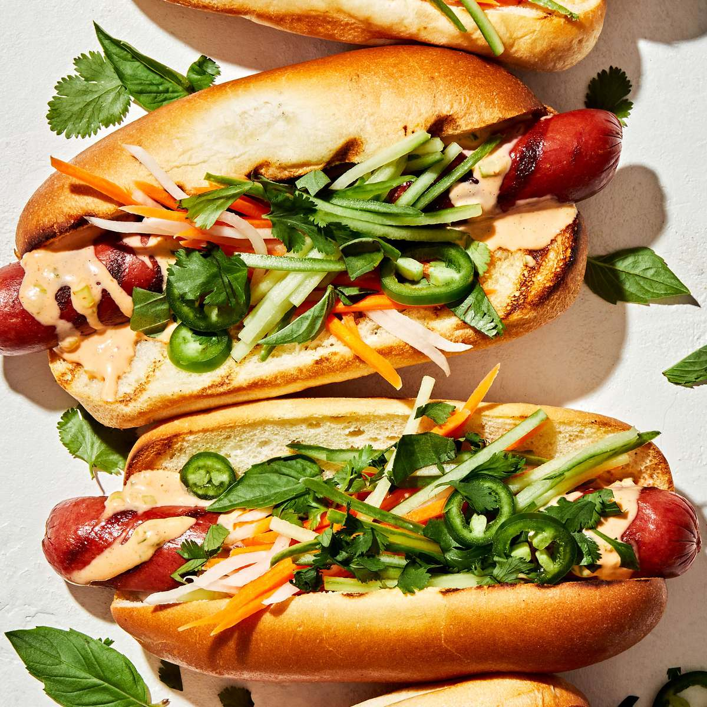

# Banh Mi Hot Dog

*Vietnam's bánh-mì-style hot dog: a grilled sausage tucked into a crusty Vietnamese baguette, smeared with pâté and Kewpie mayo, layered with pickled daikon-and-carrot, sliced cucumber, fresh coriander, and a drizzle of sriracha and Maggi seasoning. The Saigon street-cart fusion of French baguette tradition and Vietnamese flavour vocabulary.*

**Serves:** 4

**Prep Time:** 30 minutes (plus 1 hour pickling)

**Cook Time:** 15 minutes

## Overview
The bánh mì hot dog is Vietnam's hot-dog interpretation of the iconic bánh mì sandwich (which itself is a Vietnamese reinvention of the French colonial baguette sandwich): a Vietnamese-style baguette (lighter and crispier than the French one, with a paper-thin shatter-crust and an airy interior) hollowed out slightly to make room for the fillings, smeared on one side with a thin layer of chicken liver pâté and on the other side with Kewpie Japanese mayonnaise (the canonical bánh mì spread combination), layered with a grilled sausage (canonically a thick pork-and-beef Vietnamese hot dog called "xúc xích"; or substitute with bratwurst), a heap of pickled daikon-and-carrot slaw (the canonical bánh mì pickle: white daikon + orange carrot in sweet-tangy rice-vinegar brine), thinly sliced cucumber, sliced fresh red chilli, a fistful of fresh coriander, sliced spring onion, and finished with a few dashes of Maggi seasoning sauce and sriracha. Three details: proper Vietnamese baguette (light + crisp), pâté + mayo as the canonical spread, pickled daikon-carrot is essential.

## Ingredients

### Pickled daikon and carrot (đồ chua)
- 200 g daikon radish (julienned into matchsticks)
- 200 g carrot (julienned into matchsticks)
- 200 ml rice vinegar
- 4 tablespoons caster sugar
- 1 teaspoon fine sea salt
- 100 ml warm water

### Sausages
- 4 Vietnamese-style xúc xích sausages OR substitute with quality bratwurst or thick all-pork hot dog
- 1 tablespoon vegetable oil

### Baguettes
- 4 Vietnamese-style baguettes (crispy crust, airy interior; or substitute with French baguettes warmed in the oven 5 min to crisp up)

### Spreads
- 100 g chicken liver pâté
- 4 tablespoons Kewpie Japanese mayonnaise

### Fillings
- 1 cucumber (sliced into thin lengthwise strips)
- 1 small bunch fresh coriander (cilantro; whole sprigs)
- 2 spring onions (sliced into 5cm lengths)
- 2 fresh red chillies (sliced into rings)
- 2 tablespoons Maggi seasoning sauce (the Vietnamese signature condiment; substitute with soy sauce + a pinch of MSG)
- 2 tablespoons sriracha

### To serve
- Cà phê sữa đá (Vietnamese iced coffee with condensed milk)
- Or a cold 333 (Ba Ba Ba) beer

## Method

### Stage 1 - Pickle daikon and carrot
1. Whisk rice vinegar, sugar, salt, warm water till sugar dissolves.
2. Toss julienned daikon and carrot in the brine.
3. Rest at room temp 1 hour (or refrigerate up to 1 week).
4. Drain when ready to use; squeeze gently.

### Stage 2 - Cook the sausages
1. Heat oil in a wide pan over medium-high heat.
2. Cook the sausages 8-10 minutes, turning, till browned all over and cooked through.
3. (Or grill over medium-high heat for the same time, for char marks.)
4. Slice lengthwise down the middle (butterflied; lets the sausage open up into the bread).

### Stage 3 - Warm and split the baguettes
1. Briefly warm the baguettes in a low oven (160°C) for 4 minutes to crisp the crust.
2. Slice lengthwise but not all the way through (hinge-cut so the baguette opens like a book).
3. Optional: gently pull out some of the soft interior to make room for the fillings.

### Stage 4 - Spread
1. On the bottom interior of each baguette: smear a thin layer of chicken liver pâté.
2. On the top interior: a generous zigzag of Kewpie mayo.

### Stage 5 - Build
1. Lay a butterflied grilled sausage along the length of the baguette.
2. Pile drained pickled daikon and carrot generously on top.
3. Add cucumber strips alongside.
4. Scatter coriander sprigs generously.
5. Spring onion lengths.
6. Sliced red chilli rings.
7. A few dashes of Maggi seasoning sauce drizzled over.
8. A zigzag of sriracha.

### Stage 6 - Close and serve
1. Close the baguette; press gently.
2. Serve with iced Vietnamese coffee or a cold beer.

## Notes
- **Vietnamese baguette (light + crispy):** the bread is the structural signature. French baguette is too dense; sub-rolls are too soft.
- **Pâté + Kewpie mayo:** the bánh-mì-defining spread combo. Don't skip either.
- **Pickled daikon-carrot:** the sharp-sweet pickle is what makes it bánh mì, not just a sausage sandwich.
- **Maggi sauce essential:** the Vietnamese seasoning signature; soy sauce isn't a direct sub but works.

## Variations
**With Vietnamese sausage (giò lụa):** swap the hot dog for slices of giò lụa (Vietnamese pork sausage).
**Spicier:** double sriracha + extra fresh chillies.
**With grilled lemongrass pork:** swap the sausage for lemongrass-marinated grilled pork (bánh mì thịt nướng style).
**Vegetarian:** swap pâté for mushroom pâté; sausage for marinated grilled tofu.

## Serving
At a Saigon street cart in the morning; at a Vietnamese sandwich shop in the West (Lee's Sandwiches, Ba Le, etc.); at home with iced coffee or beer.

## Storage
- Pickled daikon-carrot keeps refrigerated 2 weeks.
- Cooked sausages refrigerate 4 days.
- Baguettes: best fresh; freeze 1 month.
- Don't assemble in advance; the baguette goes soggy.
