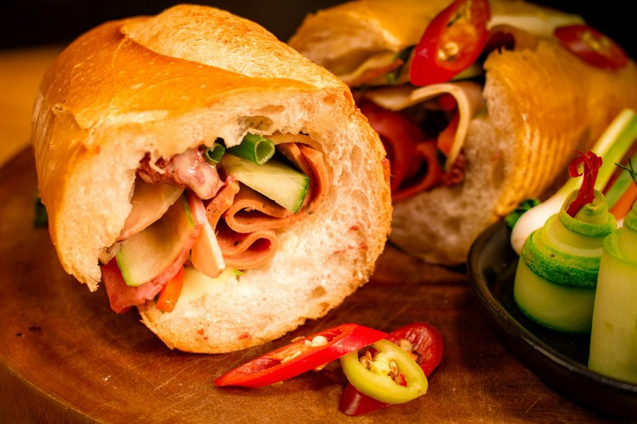

# Bánh Mì

*Vietnam's French-baguette sandwich: cold cuts and pâté layered with cucumber, coriander, dưa chua pickle and chilli, packed into a shatteringly crisp roll.*

**Serves:** 2

**Prep Time:** 15 minutes (plus pickle time if making fresh)

**Cook Time:** 5 minutes

## Overview
A good bánh mì is mostly assembly. The bread should be light and crackly, the pâté smeared on thickly, the mayo generous, the meat layered cold and the herbs and pickles loaded right to the edges. A short blast in a hot oven is what crisps the loaf; the filling goes in straight after. Eat standing up over the sink.

## Ingredients

### Bread
- 2 Vietnamese baguettes (small, or short French baguettes, each about 25 cm long, with thin crusts)

### Spread
- 4 tablespoons good-quality smooth pork (or chicken pâté, Brussels-style if available)
- 4 tablespoons Kewpie (or other Japanese-style mayonnaise)

### Filling
- 8 thin slices of Vietnamese pork roll (chả lụa) or cooked ham
- 4 slices of Vietnamese head cheese (giò thủ) or cooked pork shoulder
- 4 slices of char siu (Chinese roast pork) or grilled pork belly (optional but classic)
- 1 cucumber (small, cut into long batons)
- 150 g [dưa chua](../side-dishes/do-chua.md) (Vietnamese pickled carrot and daikon)
- 1 bird's-eye chilli (thinly sliced; deseed for less heat)
- A large handful coriander (whole sprigs, stems on)

### Seasoning
- 1 teaspoon soy sauce
- ½ teaspoon Maggi seasoning sauce (optional but traditional)
- A pinch of ground black pepper

## Method

### Stage 1 - Crisp the bread
1. Preheat the oven to 200 °C (180 °C fan).
2. Place the baguettes directly on the oven rack for 3-4 minutes, until the crust crackles when squeezed. Do not over-bake or the bread becomes brittle and shatters when bitten.
3. Lift out and let cool just long enough to handle, about a minute.

### Stage 2 - Open and spread
1. Slice each baguette lengthways with a serrated knife, leaving a hinge on one side so the loaf opens like a book. Don't cut all the way through.
2. If the inside is very doughy, pull out a small handful of crumb from each side to make room for the filling. Eat the scraps as cook's perks.
3. Smear 2 tablespoons of pâté along the bottom half of each baguette, edge to edge.
4. Smear 2 tablespoons of mayonnaise along the top half.

### Stage 3 - Build
1. Layer the cold cuts on the bottom half: pork roll first, then head cheese, then char siu if using. Aim for an even covering.
2. Add the cucumber batons in a single layer down the middle.
3. Top with a generous pile of pickled carrot and daikon (about 75 g per sandwich). Don't be shy.
4. Tuck in the coriander sprigs so the stems and leaves both poke out at the edges. This is part of the look.
5. Scatter the chilli over the herbs.

### Stage 4 - Season and close
1. Drizzle the soy sauce and Maggi over the filling, sharing the seasoning between both sandwiches.
2. Grind black pepper over the top.
3. Press the sandwich firmly closed. Some squashing is correct; the loaf should compress under hand pressure.
4. Cut on the diagonal if serving on a plate, or wrap in greaseproof paper for eating on the go.

## Notes
- **The bread is the recipe:** A heavy sourdough or thick-crusted artisan baguette will not work. You need a light, thin-shelled, slightly sweet roll, often made with a small amount of rice flour. Vietnamese bakeries sell them frozen; pull from the freezer and crisp from frozen.
- **Pâté generously:** It might seem like a lot, but the pâté is what makes a bánh mì taste like a bánh mì rather than a ham sandwich.
- **Cold and warm:** The bread should be just-warm-crisp; the filling stays cold. Don't toast a filled sandwich; the herbs will wilt.
- **Maggi or soy:** Maggi seasoning is the original Saigon flavour. Soy works but tastes slightly different. A small drizzle is enough.
- **Pickle ahead:** The dưa chua pickle needs at least an hour. Make a batch the day before; it keeps for weeks.

## Variations
- **Bánh mì xíu mại:** Replace cold cuts with two warm Vietnamese pork meatballs in tomato sauce, split open.
- **Bánh mì gà:** Use shredded poached chicken tossed in a little mayo and pepper instead of cold cuts.
- **Bánh mì trứng:** Add a fried egg, soft yolk, on top of the cold cuts.
- **Vegetarian:** Swap the meats for pan-fried lemongrass tofu, mushroom pâté and extra pickles.

## Serving
- Serve with: a glass of iced Vietnamese coffee (cà phê sữa đá) or a salty plum soda.
- Garnish with: a side of extra pickled chillies for the brave.

## Storage
- Best eaten within an hour of assembly; the pickle juices will soak the bread soft after that
- Prepped components keep separately: pickle 3 weeks, cold cuts 5 days, pâté 5 days, mayo 1 week
- Do not refrigerate an assembled sandwich; the bread loses its crackle and the herbs blacken
