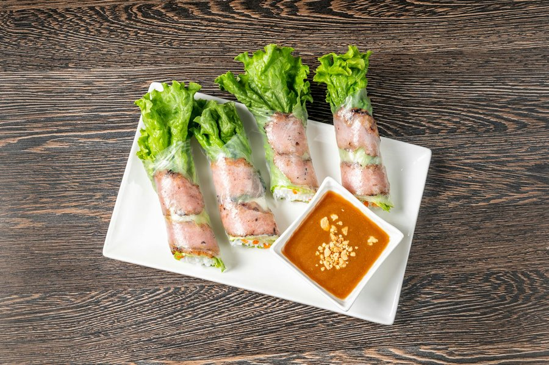

# Gỏi Cuốn

*Vietnam's fresh summer rolls: rice paper wrapped around prawns, sliced pork belly, vermicelli, lettuce and herbs. Served cool with peanut-hoisin sauce.*

**Makes:** 12 rolls (serves 4)

**Prep Time:** 30 minutes

**Cook Time:** 25 minutes

## Overview
Pork belly is simmered until tender, prawns are poached briefly, and vermicelli is cooked just al dente. Everything cools to room temperature, then rice paper rounds are dipped briefly in warm water and rolled around lettuce, herbs and the protein with the pink of the prawns showing through the wrapper. The peanut-hoisin sauce is the make-or-break: it should be thick, sweet and lightly garlicky.

## Ingredients

### Protein
- 300 g piece of pork belly (skin-on or off, your preference)
- 12 raw prawns (large, peeled, deveined, tails removed)
- 1 thumb-sized piece of ginger (sliced)
- 1 spring onion (cut into 3 pieces)
- 1 teaspoon fine sea salt

### Rolls
- 100 g rice vermicelli noodles
- 2 teaspoons toasted sesame oil
- 12 sheets rice paper (22 cm rounds; bánh tráng)
- 1 small head butter lettuce (or little gem, separated into leaves, ribs trimmed)
- A large handful mint leaves
- A large handful coriander leaves
- A large handful Thai basil leaves (or perilla if available)
- A handful chives (or garlic chives, cut into 8 cm lengths)
- ½ cucumber (cut into thin batons)

### Peanut-hoisin dipping sauce
- 4 tablespoons hoisin sauce
- 2 tablespoons smooth peanut butter
- 2 tablespoons rice vinegar
- 1 tablespoon caster sugar
- 1 garlic clove (finely grated)
- 60-100 ml hot water (to loosen)
- 1 bird's-eye chilli (finely sliced; optional)
- 2 tablespoons crushed roasted peanuts
- 1 teaspoon hot chilli oil (optional, for drizzling)

## Method

### Stage 1 - Cook the pork
1. Place the pork belly in a small saucepan with the ginger, spring onion and salt. Cover with cold water by 3 cm.
2. Bring to a gentle simmer over medium heat. Skim any foam from the surface.
3. Reduce the heat to low and simmer, partially covered, for 20 minutes until the pork is tender when pierced with a skewer.
4. Lift out and rest on a board for 5 minutes. Slice as thinly as possible across the grain (3 mm slices); a sharp knife makes the difference here. Set aside on a plate, covered.

### Stage 2 - Cook the prawns
1. Return the pork cooking liquid to a simmer.
2. Add the prawns and poach for 90 seconds, until they curl tightly and turn pink throughout.
3. Drain immediately and plunge into cold water to stop the cooking. Pat dry.
4. Slice each prawn in half lengthways (butterflied) so they lie flat. This is what shows pink through the wrapper.

### Stage 3 - Cook the noodles
1. Bring a saucepan of water to the boil. Add the rice vermicelli and cook per packet instructions, usually 3-4 minutes.
2. Drain and rinse under cold water until completely cool.
3. Toss with the sesame oil to prevent clumping.

### Stage 4 - Make the dipping sauce
1. In a small saucepan over low heat, whisk together the hoisin, peanut butter, vinegar, sugar and garlic.
2. Whisk in hot water a tablespoon at a time until the sauce is glossy and pourable but still coats a spoon thickly.
3. Tip into a serving bowl. Top with the chilli (if using), crushed peanuts and a drizzle of chilli oil.

### Stage 5 - Set up the rolling station
1. Fill a wide, shallow bowl or pie dish with warm water.
2. Lay a clean tea towel on the work surface for rolling.
3. Arrange all fillings within arm's reach: lettuce, prawns (pink side down on the plate), pork, vermicelli, herbs, cucumber, chives.

### Stage 6 - Roll
1. Dip one rice paper round in the warm water for 5-8 seconds. It should still feel slightly firm; it will continue softening on the board.
2. Lay flat on the tea towel.
3. Lay 2 prawn halves pink-side down across the middle (slightly above the lower third). This is what becomes the visible pink stripe.
4. Lay a small leaf of lettuce above the prawns.
5. On the lettuce, pile a small handful of vermicelli (about a tablespoon), 2-3 slices of pork, a few mint, coriander and basil leaves, a cucumber baton, and let two chive lengths poke out the right-hand side.
6. Fold the bottom of the wrapper up over the lettuce, tucking firmly under the filling. The prawns stay exposed against the bottom edge.
7. Fold the left side in. Roll up tightly to the right, leaving the chives sticking out. The prawns should now be visible through the top of the roll.
8. Place seam-side down on a serving plate. Cover with a damp cloth so they don't dry out.
9. Repeat for all 12.

### Stage 7 - Serve
1. Cut each roll diagonally in half just before serving (optional, but it shows off the layers).
2. Serve with the peanut-hoisin sauce.

## Notes
- **Prawn placement:** The prawns go on first, flat side up against the rice paper, so they show pink when the roll is finished. This is the visual signature of gỏi cuốn.
- **Warm water, not hot:** Hot water makes the wrapper sticky and tears easily. Warm tap-temperature water is correct.
- **Short dip:** Five to eight seconds is plenty. The wrapper continues softening for another 20-30 seconds on the board, which is exactly the time you need to lay out the fillings.
- **Roll tight, eat soon:** Loose rolls split as you bite. Tuck the bottom edge firmly under the filling and roll snugly. Rolls are best within the hour; after a few hours covered they turn rubbery.
- **Pork belly tip:** A piece with even fat marbling slices better than a very fatty piece. If your butcher sells thin pork loin chops, those work too (poach 12 minutes only).

## Variations
**Beef gỏi cuốn:** Replace pork with 200 g flank steak, seared rare and sliced thinly.
**Chicken version:** Poach 2 chicken breasts as in stage 1 (15 minutes instead of 20) and shred.
**Vegetarian:** See goi-cuon-chay at the cuisine root for the tofu version.

## Serving
Serve with: the peanut-hoisin sauce as the standard pairing. A second small bowl of nước chấm (fish sauce, lime, sugar, garlic, chilli) is the southern Vietnamese way; some diners prefer it.
Garnish with: extra crushed peanuts and a few sprigs of mint on the plate.

## Storage
- Best within an hour of rolling
- Components keep separately for 1 day refrigerated: cooked pork, cooked prawns, dressed noodles, washed herbs
- Sauce keeps 1 week refrigerated; thin with hot water before serving
- Do not refrigerate rolled gỏi cuốn for more than 6 hours; the wrappers turn rubbery
