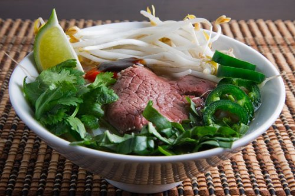

# Vietnamese Beef Soup

*Pho bo*

**Serves:** 4

**Prep Time:** 15 minutes

**Cook Time:** 20 minutes

## Overview
This is the quicker home-cook phở bò: paper-thin slices of rump steak cooked instantly in a fragrant broth spiced with star anise and cinnamon, served over fresh rice noodles with herbs, beansprouts and chilli at the table. The trick is the slicing. Freeze the rump till very firm, then slice as thinly as possible across the grain (3 mm or thinner). If the beef thaws while you work, return it to the freezer for 15 minutes to firm up again. The broth wants only the simplest infusion: beef stock with half an onion, fish sauce, a single star anise, a cinnamon stick and a pinch of white pepper. The point is to ladle the broth out boiling-hot so the raw beef cooks on contact in the bowl rather than poaching in the pot, which would overcook it. Lemon wedges at the table for squeezing.

## Ingredients

### Protein
- 400 grams rump steak (frozen)

### Aromatics
- ½ onion
- 1 white onion (small, thinly sliced)

### Seasonings
- 1 ½ tablespoons fish sauce
- 1 star anise
- 1 cinnamon stick
- pinch ground white pepper

### Liquid/Broth
- 1 ½ litres beef stock
- 500 ml water

### Other
- 300 grams fresh thin rice noodles
- 3 spring onions (thinly sliced)
- 15 grams mint leaves
- 90 grams bean sprouts (washed and trimmed)
- 1 red chilli (small, thinly sliced)
- lemon wedges (to serve)

## Method

### Stage 1 - Prepare beef and noodles
1. Slice the frozen beef as thinly as possible. If the beef begins to thaw, put it back in the freezer for 15 minutes.
2. Cover the noodles with boiling water and gently separate the strands. Drain and refresh under cold water.

### Stage 2 - Make broth
1. Put the onion, fish sauce, star anise, cinnamon stick, pepper, stock and 500 ml of water in a large saucepan.
2. Bring to the boil, then reduce the heat, cover and simmer for 20 minutes.
3. Discard the onion, star anise and cinnamon stick.

### Stage 3 - Assemble and serve
1. Divide the noodles and spring onion among four deep bowls. Top with the beef, mint, bean sprouts, spring onion and chilli. Ladle the hot broth over the top and serve with the lemon wedges.

## Notes
- **Beef:** Freeze for easy slicing; cooks instantly in hot broth.
- **Broth:** Simmer gently to infuse spices.
- **Noodles:** Soak in hot water; don't boil.
- **Herbs:** Add fresh for brightness.

## Serving
- Serve hot with lemon wedges for squeezing.

## Storage
- Refrigerate broth up to 2 days; assemble fresh.
- Not suitable for freezing.
- Best eaten immediately.

*This dish works best with raw beef that has been sliced paper thin, as it cooks in seconds when placed in the hot broth.*
