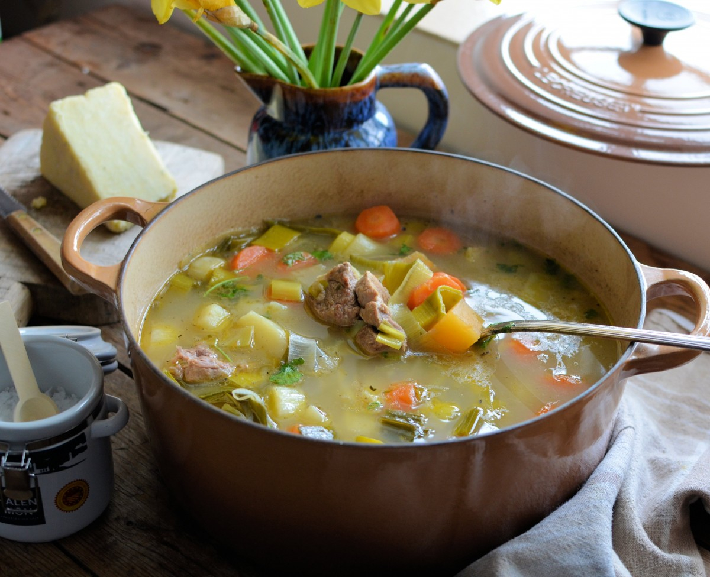

# Cawl

*Wales's national dish: a clear, long-simmered broth of lamb (or mutton), leek, potato, swede and carrot, eaten with a wedge of Caerphilly cheese and a hunk of bread on the side.*

**Serves:** 6

**Prep Time:** 20 minutes

**Cook Time:** 2 hours 30 minutes

## Overview
Cawl is the everyday hill-farm stew of Wales, a long, gentle simmer of lamb on the bone with the root vegetables a smallholding could grow through winter. Traditionally it was made on a Monday with the bone from Sunday's roast, eaten thin and brothy on day one, then reheated thicker and richer on day two. Leek goes in late so it keeps its bite. The broth is clear, the seasoning is restrained (salt, pepper, a bay leaf), and the lamb does the heavy lifting. It is served in deep bowls, often with a wedge of Caerphilly cheese and crusty bread on the side, and in many Welsh homes a separate spoon is used for the broth and a fork for the meat. The dish takes its name from the Welsh word for soup or broth.

## Ingredients

- 1 kg lamb neck or shoulder, on the bone, cut into large chunks
- 2 litres cold water
- 2 bay leaves
- 1 tsp black peppercorns
- 1 tsp salt, plus more to taste
- 2 large carrots, cut into thick rounds
- 300 g swede (rutabaga), peeled and cut into 3 cm chunks
- 1 large parsnip, cut into thick rounds
- 600 g floury potatoes, peeled and cut into 4 cm chunks
- 3 large leeks, white and pale green parts, sliced into 2 cm rings
- Small bunch flat-leaf parsley, chopped
- To serve: Caerphilly cheese and crusty bread

## Method

### Stage 1 - Build the broth
1. Put the lamb, water, bay leaves, peppercorns and salt into a large heavy pot.
2. Bring slowly to a simmer; skim the grey foam from the surface for the first 10 minutes.
3. Lower the heat; cover loosely; simmer 90 minutes until the lamb is tender and the broth tastes of lamb.

### Stage 2 - Add the roots
1. Add the carrot, swede and parsnip; simmer 20 minutes.
2. Add the potato; simmer a further 15 minutes until just tender.

### Stage 3 - Finish with leeks
1. Add the sliced leeks; simmer 8 minutes (they should keep some bite).
2. Taste; adjust salt and pepper.
3. Scatter parsley over the pot.

### Stage 4 - Serve
1. Ladle into deep bowls, broth first, then a generous spoonful of meat and vegetables.
2. Serve a wedge of Caerphilly cheese and a hunk of bread on the side.

## Notes
- **Day-two cawl is better:** the broth deepens overnight in the fridge; lift the cooled fat cap off before reheating.
- **Bone matters:** the bone gives the broth its body. If you can only get boneless lamb, add a piece of bone or a small marrow bone to the pot.
- **Leeks late:** add them in the last 8 minutes so they keep their sweet bite.
- **Skim early:** the first 10 minutes of skimming is what makes the broth clear.
- **Mutton is more traditional:** if you can find hogget or mutton, use it; cook time goes up by 30 to 45 minutes.

## Variations
- **Cawl cennin:** leek-led version with less lamb, leaning vegetable.
- **Welsh beef cawl:** beef shin in place of lamb, longer cook.
- **With pearl barley:** add 50 g pearl barley with the roots for a thicker pot.
- **Smoked bacon cawl:** add a piece of smoked bacon hock with the lamb for a south-Wales twist.
- **Modern thickened version:** mash a few of the potatoes back into the broth at the end.

## Serving
At the kitchen table on a cold day · at a chapel supper or community gathering · on St David's Day with leeks on the plate · as a Monday lunch using the Sunday roast bone · in a Welsh pub with bread and Caerphilly.

## Storage
- Keeps 3 days refrigerated; the flavour improves on day two.
- Freezes well for 3 months; freeze without the potatoes if you can, add fresh on reheat.
- Reheat gently, do not boil hard or the lamb dries out.
