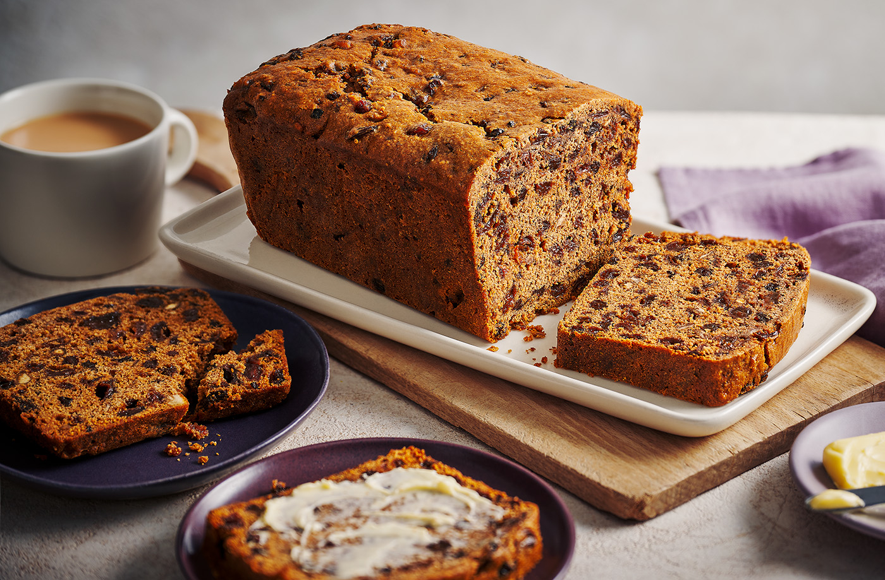

# Bara Brith

*"Speckled bread": a tea-soaked dried-fruit loaf, dense, sticky and treacly, sliced thick and spread with salty butter. The chapel-tea cake of Wales.*

**Serves:** Makes 1 loaf (10 slices)

**Prep Time:** 15 minutes (plus overnight soaking)

**Cook Time:** 1 hour 30 minutes

## Overview
Bara brith (literally "speckled bread") is the long-keeping Welsh fruit loaf that turned up at every chapel tea, miner's tea and farmhouse Sunday in the country for the best part of two hundred years. The construction is unusual: dried fruit is soaked overnight in strong hot tea, then mixed with flour, sugar, egg and spice and baked low and slow until the inside is dark, dense and treacly. There is no butter or oil in the loaf itself; the moisture comes entirely from the soaked fruit. It improves over a week in a tin and is traditionally cut thick and spread with salty Welsh butter. Two traditions exist: the yeasted version, made like a bread, and this everyday baking-powder version that every Welsh kitchen knows. Both share the deep dark crumb and the long keeping.

## Ingredients

- 400 g mixed dried fruit (currants, sultanas, raisins; a handful of chopped candied peel if you have it)
- 300 ml hot strong black tea (2 tea bags brewed strong, then cooled to hot)
- 150 g soft dark brown sugar
- 1 large egg, beaten
- 250 g self-raising flour
- 1 tsp ground mixed spice
- 1/2 tsp ground cinnamon
- Pinch of salt
- 1 tbsp marmalade (optional, for gloss and a faint orange note)

## Method

### Stage 1 - Soak the fruit (night before)
1. Put the dried fruit and sugar into a large bowl.
2. Pour the hot tea over; stir; cover; leave overnight (at least 8 hours, up to 24).
3. The fruit plumps up and the sugar dissolves into a dark syrup.

### Stage 2 - Heat the oven and prepare the tin
1. Heat the oven to 150°C fan.
2. Line a 900 g (2 lb) loaf tin with baking parchment, letting it overhang the long sides for easy lifting.

### Stage 3 - Mix the loaf
1. Beat the egg into the soaked fruit.
2. Sift in the flour, mixed spice, cinnamon and salt.
3. Add the marmalade if using.
4. Fold together until just combined; do not overwork.

### Stage 4 - Bake
1. Tip into the prepared tin; level the surface.
2. Bake on the middle shelf 1 hour 20 minutes to 1 hour 30 minutes.
3. A skewer inserted into the centre should come out clean (a few sticky crumbs are fine).
4. If the top browns too quickly, cover loosely with foil for the last 20 minutes.

### Stage 5 - Cool
1. Cool in the tin 15 minutes.
2. Lift out using the parchment; cool fully on a wire rack.
3. Best left a day in a tin before slicing.

### Stage 6 - Serve
1. Slice thick (about 1.5 cm).
2. Spread with salted Welsh butter.

## Notes
- **Soak overnight:** the fruit must plump, the sugar must dissolve, the tea must penetrate. Short soak gives a dry loaf.
- **Strong black tea:** Welsh brew, Assam or English breakfast; do not use green or herbal tea.
- **Low and slow:** high heat burns the sugary outside before the inside cooks through.
- **A day in the tin first:** bara brith improves dramatically the day after baking.
- **Salted butter:** the salt sets off the sweet sticky fruit.

## Variations
- **With chopped walnuts:** add 75 g walnut pieces with the flour.
- **Brandy bara brith:** use 50 ml brandy + 250 ml tea for the soak.
- **Yeasted bara brith:** the older version made with strong bread flour and 7 g fast-action yeast, no baking powder.
- **Glazed top:** brush the warm loaf with warmed honey for shine.
- **Mini loaves:** divide between 6 small tins, bake 50 minutes; good for gifts.

## Serving
At chapel tea on a Sunday afternoon · in a packed lunch tin · sliced thick with strong tea · at a Welsh wedding tea · as a Christmas gift loaf wrapped in greaseproof paper.

## Storage
- Keeps 10 days in an airtight tin and improves over the first week.
- Freezes whole or sliced for 3 months.
- Refresh stale slices in a low oven for 5 minutes, then butter generously.
