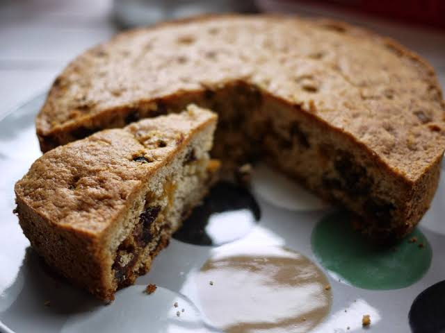

# Teisen Lap

*The miner's pocket cake: a shallow moist fruit cake of the South Wales valleys, baked flat in a roasting tray so a wedge could be wrapped in greaseproof and carried down the pit in a tin.*

**Serves:** Makes 1 tray (16 squares)

**Prep Time:** 15 minutes

**Cook Time:** 45 minutes

## Overview
Teisen lap means "moist cake", and that is exactly what it is: a shallow, butter-rich fruit cake of the South Wales valleys, baked flat in a roasting tray no more than 4 cm deep. The shallow shape is the point. Deeper cakes dry on the way down the mineshaft; teisen lap stays moist all day in a miner's snap-tin, wrapped in greaseproof, and was the cake of choice for collier shifts at Tower, Six Bells and the great Rhondda pits. The crumb is soft and slightly damp, the spice is light, the fruit is mixed currants and sultanas, and a splash of buttermilk gives it the lift. It is at its best a day after baking, cut into wedges or squares, and eaten with a strong cup of tea. The southern valleys, the slate country of Gwynedd and the farms of Cardiganshire each have their own version.

## Ingredients

- 350 g self-raising flour
- 225 g unsalted butter, softened
- 175 g caster sugar
- 250 g mixed dried fruit (currants and sultanas)
- 50 g chopped candied mixed peel (optional)
- 2 large eggs, beaten
- 150 ml buttermilk (or 150 ml whole milk + 1 tsp lemon juice, left to curdle)
- 1 tsp ground mixed spice
- 1/4 tsp grated nutmeg
- Pinch of salt

## Method

### Stage 1 - Heat the oven and tin
1. Heat the oven to 160°C fan.
2. Line a 30 by 20 cm shallow roasting tray (no more than 4 cm deep) with baking parchment.

### Stage 2 - Rub in
1. Sift the flour, mixed spice, nutmeg and salt into a large bowl.
2. Add the softened butter; rub in with your fingertips until like coarse breadcrumbs.

### Stage 3 - Add the dry mix
1. Stir in the caster sugar.
2. Stir in the dried fruit and candied peel.

### Stage 4 - Add the wet mix
1. Whisk the beaten eggs into the buttermilk.
2. Pour into the flour-fruit mix.
3. Fold together gently until just combined; the batter should be soft but not pourable.

### Stage 5 - Bake
1. Spread the batter into the prepared tray; level the top.
2. Bake on the middle shelf for 40 to 45 minutes.
3. A skewer in the centre should come out clean; the top should be deep gold.

### Stage 6 - Cool and store
1. Cool in the tray for 15 minutes.
2. Lift out using the parchment; cool fully on a wire rack.
3. The cake improves overnight in a tin.

### Stage 7 - Serve
1. Cut into 16 squares (or wedges).
2. Eat with strong tea.

## Notes
- **Shallow tin is the rule:** a deep cake dries out; the whole point of teisen lap is the flat moist crumb.
- **Buttermilk gives the lift:** the slight acid reacts with the raising agent in the flour.
- **Don't overbake:** the cake should stay moist; a clean skewer with a single damp crumb is the right point.
- **Better day two:** like bara brith, teisen lap deepens in flavour overnight.
- **Greaseproof wrap:** the proper miner's-tin wrapper; keeps a wedge moist all morning.

## Variations
- **With chopped apricot:** swap 100 g of the fruit for chopped dried apricot.
- **With glace cherry:** add 50 g chopped glace cherries.
- **Lemon teisen lap:** stir 1 tbsp lemon zest into the batter.
- **Welsh whisky version:** soak the fruit in 50 ml Penderyn for an hour before mixing.
- **Iced teisen lap:** drizzle a thin lemon icing over the top once cooled.

## Serving
- With a strong mug of tea after work · in a packed lunch wrapped in greaseproof · on a Welsh tea-table alongside bara brith and Welsh cakes · cut into squares for a chapel tea · as a teatime cake for a long Sunday afternoon.

## Storage
- Keeps 5 days in an airtight tin.
- Wrap squares individually in greaseproof for a packed lunch.
- Freezes well for 2 months; wrap tightly.
