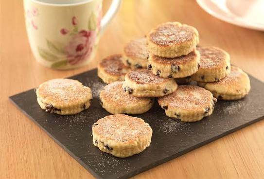

# Welsh Cakes

*Picau ar y maen, "stones on the bakestone": small spiced rounds of butter-rich dough with currants, cooked dry on a hot iron griddle and dusted with caster sugar while still warm.*

**Serves:** Makes 16 cakes

**Prep Time:** 15 minutes

**Cook Time:** 15 minutes

## Overview
Welsh cakes are the country's most-loved teatime baking: small spiced rounds, somewhere between a scone, a biscuit and a pancake in texture, cooked dry on a flat iron griddle (the maen, or bakestone) rather than in an oven. The dough is enriched with butter and lard, lifted with baking powder, spiced lightly with nutmeg and mixed spice, and studded with currants. The trick is the griddle: a heavy flat iron pan, medium-hot, no oil, the cakes flipped once they puff and the bottom is dark gold. Eat them warm, dusted with caster sugar, often within minutes of cooking; they keep a few days in a tin and are sometimes split and buttered the next morning. Every Welsh grandmother's tin had a stack waiting after school.

## Ingredients

- 225 g self-raising flour
- 100 g unsalted butter, cold, cubed
- 25 g lard, cold, cubed (or 25 g more butter if avoiding lard)
- 85 g caster sugar, plus extra for dusting
- 75 g currants
- 1/2 tsp ground mixed spice
- 1/4 tsp grated nutmeg
- Pinch of salt
- 1 large egg, beaten
- 1 to 2 tbsp whole milk, only if needed

## Method

### Stage 1 - Rub in the fats
1. Sift the flour, mixed spice, nutmeg and salt into a large bowl.
2. Add the cold butter and lard.
3. Rub in with your fingertips until the mix looks like coarse breadcrumbs.

### Stage 2 - Mix in the sugar and currants
1. Stir in the caster sugar and currants.

### Stage 3 - Bring together
1. Make a well; add the beaten egg.
2. Bring together with a knife, then with hands, into a firm dough; add milk only if the dough refuses to come together.
3. The dough should be the texture of pastry, not soft.

### Stage 4 - Roll and cut
1. Roll out on a lightly floured surface to 8 mm thick.
2. Cut with a 6 cm round cutter.
3. Re-roll the trimmings and cut again.

### Stage 5 - Cook on the bakestone
1. Heat a flat heavy iron griddle (or a heavy non-stick frying pan) over medium-low heat for 3 minutes.
2. Lightly grease the surface with a smear of butter on a kitchen-paper wipe.
3. Cook the cakes 3 minutes a side; they should be deep gold, slightly cracked, and cooked through to the centre.
4. Keep the heat medium-low: too hot and they burn outside while raw inside.

### Stage 6 - Dust and serve
1. Tip the warm cakes onto a plate.
2. Dust with caster sugar.
3. Eat warm.

## Notes
- **Medium-low heat is the rule:** these are not pancakes, they need time for the inside to cook.
- **Dry griddle, no oil:** the cakes have enough fat in them.
- **Don't overwork the dough:** like pastry, it will go tough.
- **The first batch is the test:** adjust the heat by what you see.
- **A heavy pan beats a thin one:** the iron holds steady heat.

## Variations
- **Plain Welsh cakes:** no fruit, dust with sugar only.
- **Sultana and lemon:** swap currants for sultanas and add 1 tsp lemon zest.
- **Apricot Welsh cake:** swap currants for chopped dried apricot.
- **Savoury Welsh cake:** skip sugar and spice, add 50 g grated cheddar and 1 tsp dried sage.
- **Saffron Welsh cake:** infuse the milk with a pinch of saffron for a Cornish-Welsh twist.

## Serving
At afternoon tea on St David's Day · in the school lunchbox · split warm and buttered for breakfast · with a cup of strong tea after a walk · as a Welsh chapel raffle prize.

## Storage
- Keeps 5 days in an airtight tin.
- Re-warm in a 150°C oven for 4 minutes to refresh.
- Freezes well for 2 months; defrost at room temperature, then warm.
