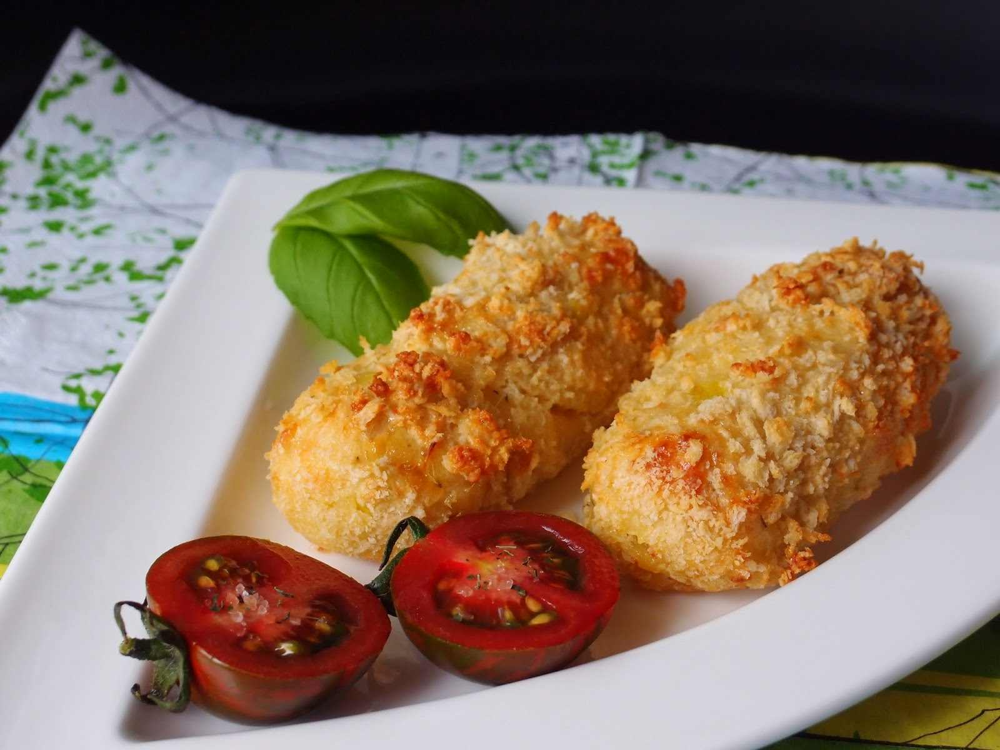

# Glamorgan Sausages

*The vegetarian "sausage" of Glamorgan: crisp golden cylinders of leek, Caerphilly cheese and breadcrumb, shaped like a sausage and fried until the cheese pulls inside.*

**Serves:** 4 (8 sausages)

**Prep Time:** 20 minutes

**Cook Time:** 12 minutes

## Overview
Glamorgan sausages take their name from a now-extinct breed of Glamorgan cattle whose milk was used to make a sharp white cheese, but the dish outlived the cow and now uses Caerphilly, the everyday Welsh white. There is no meat: leek, cheese, breadcrumbs, egg and mustard are mixed, rolled into thumb-thick cylinders, coated in more breadcrumb, and shallow-fried until dark gold and crisp. They were on the wartime ration tables of the 1940s as a meat-saving supper and have stayed in Welsh kitchens since. Eat them hot, when the cheese inside is still molten, with a sharp chutney or pickle on the side. They are good cold the next day, sliced into a packed-lunch sandwich with mustard.

## Ingredients

- 200 g Caerphilly cheese, grated (or a sharp white cheddar)
- 150 g fresh white breadcrumbs, plus 100 g for coating
- 2 medium leeks (about 250 g), finely chopped
- 1 tbsp butter
- 2 large eggs (1 in the mix, 1 for coating)
- 2 tsp English mustard
- 1 tbsp chopped fresh thyme (or 1 tsp dried)
- 1 tsp salt
- Black pepper
- 50 g plain flour, for dusting
- 4 tbsp sunflower or vegetable oil, for frying

## Method

### Stage 1 - Soften the leeks
1. Melt the butter in a small pan over medium-low heat.
2. Add the chopped leek; cook 8 minutes until soft and sweet but not coloured.
3. Cool 5 minutes.

### Stage 2 - Mix
1. Combine the cooled leek, grated cheese, 150 g breadcrumbs, mustard, thyme, salt and pepper in a large bowl.
2. Beat 1 egg; stir it into the mix.
3. Squeeze the mixture together with your hands; it should hold its shape (if it crumbles, add 1 tbsp milk).

### Stage 3 - Shape
1. Divide into 8 equal portions.
2. Roll each into a sausage about 8 cm long and 3 cm thick.
3. Chill 15 minutes.

### Stage 4 - Coat
1. Set out three plates: flour, beaten egg, breadcrumbs.
2. Roll each sausage in flour, then egg, then breadcrumbs, pressing to coat.

### Stage 5 - Fry
1. Heat the oil in a wide frying pan over medium heat.
2. Fry the sausages 8 to 10 minutes total, turning, until dark gold all over.
3. Drain on kitchen paper.

### Stage 6 - Serve
1. Serve hot with chutney, pickle or HP sauce.

## Notes
- **Caerphilly is the right cheese:** it is dry and tangy and holds its shape; a soft brie-type cheese will leak.
- **Chill before frying:** the rest firms the mix and stops them breaking apart in the pan.
- **Medium heat, not high:** they need long enough for the inside to warm without burning the crust.
- **Soft middle:** the cheese should be molten when you cut in; pulled too early they go raw, left too long they go grainy.
- **Make the day before:** the mix improves in the fridge overnight.

## Variations
- **Baked version:** oven at 200°C fan for 20 minutes, turning once; drier crust but no oil.
- **With apple:** add 1 grated apple to the mix for sweetness.
- **Cheddar swap:** sharp mature cheddar works if Caerphilly is hard to find.
- **Chilli kick:** add 1 finely chopped red chilli to the mix.
- **Mini bites:** roll into 16 small balls for canapés.

## Serving
- At a Welsh pub kitchen as a vegetarian main · in a packed lunch sliced into a sandwich · at a chapel supper · on a brunch plate with poached eggs · with a sharp chutney and pickled walnuts.

## Storage
- Uncooked shaped sausages keep 2 days refrigerated; coat just before frying.
- Cooked sausages keep 3 days refrigerated; reheat in a hot oven 10 minutes.
- Freeze shaped uncooked sausages on a tray, then bag; fry from frozen, add 3 minutes to cook time.
