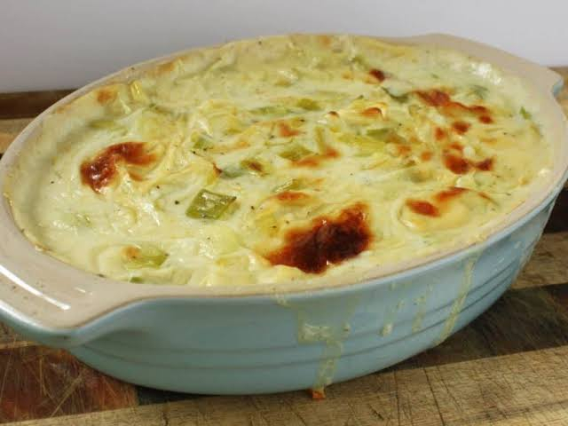

# Welsh Leeks in Cheese Sauce

*Whole baby leeks blanched then baked under a thick mustard-cheddar sauce until the top blisters: the classic Welsh side, equally a Sunday-roast accompaniment and a chapel-supper main.*

**Serves:** 4

**Prep Time:** 15 minutes

**Cook Time:** 30 minutes

## Overview
The leek is the national emblem of Wales, and this is the dish that puts it on the centre of the plate. Whole baby leeks are blanched until just tender, laid in a dish, covered with a thick mustard-spiked cheddar bechamel, sprinkled with more cheese and breadcrumbs, and baked until the top goes deep gold and the sauce bubbles up the sides. It is one of those Welsh dishes that crosses categories: served alongside a Sunday roast of lamb, it is a side; served on its own with bread, it is the main event at a chapel supper or weeknight tea. Mature cheddar is the everyday choice, but a sharp Hafod or a crumble of Caerphilly stirred through at the end lifts the dish into something special.

## Ingredients

- 8 baby leeks (or 4 medium leeks, halved lengthways)
- 1 tsp salt (for the blanching water)
- 50 g butter
- 50 g plain flour
- 500 ml whole milk, warm
- 1 tsp English mustard
- 150 g mature cheddar, grated, plus 50 g for the top
- 30 g fresh breadcrumbs
- Pinch of nutmeg
- Salt and black pepper

## Method

### Stage 1 - Prep the leeks
1. Trim the leeks; remove the toughest outer leaves; cut to fit your baking dish.
2. Wash under cold running water, splaying the layers to release any grit.

### Stage 2 - Blanch
1. Bring a wide pan of salted water to a boil.
2. Add the leeks; simmer 6 to 8 minutes until just tender to a knife tip.
3. Lift out; drain very well on a clean tea towel (wet leeks dilute the sauce).
4. Heat the oven to 200°C fan.

### Stage 3 - Make the cheese sauce
1. Melt the butter in a heavy pan over medium-low heat.
2. Stir in the flour; cook 1 minute to a pale roux.
3. Pour in the warm milk slowly, whisking, until smooth and just thickened.
4. Simmer 3 minutes; whisk often.
5. Off the heat, stir in 150 g cheese, the mustard, nutmeg and a good grind of pepper.
6. Taste and salt.

### Stage 4 - Assemble and bake
1. Lay the leeks in a buttered baking dish in a single layer.
2. Pour the cheese sauce over to cover.
3. Mix the remaining 50 g cheese with the breadcrumbs; scatter over the top.
4. Bake 20 minutes until blistered and bubbling.

### Stage 5 - Rest and serve
1. Rest 5 minutes (the sauce settles).
2. Serve straight from the dish.

## Notes
- **Dry the leeks:** wet leeks ruin the sauce, the cheese pools at the bottom.
- **Warm milk for the bechamel:** prevents lumps and shortens cooking time.
- **Mature cheddar:** mild cheese disappears under the leeks.
- **Mustard is essential:** it lifts the cheese and cuts the cream.
- **Rest before serving:** 5 minutes lets the bubbles settle and the sauce stay on the spoon.

## Variations
- **With Caerphilly:** crumble 80 g Caerphilly over the top instead of the breadcrumb mix.
- **With ham:** wrap each leek in a slice of cooked ham before saucing.
- **Cream-finished:** swap 100 ml milk for double cream for a richer sauce.
- **With a poached egg:** top each portion with a poached egg, turn it into a main.
- **Grilled finish:** skip the oven, finish under a hot grill 5 minutes.

## Serving
Alongside a Sunday roast of lamb · as a chapel-supper main with bread · at St David's Day lunch · with grilled gammon · as a weeknight tea served with mashed potato.

## Storage
- Keeps 3 days refrigerated, the sauce thickens on chilling.
- Reheat covered at 180°C for 20 minutes, adding a splash of milk if needed.
- Not ideal for freezing, the sauce splits.
