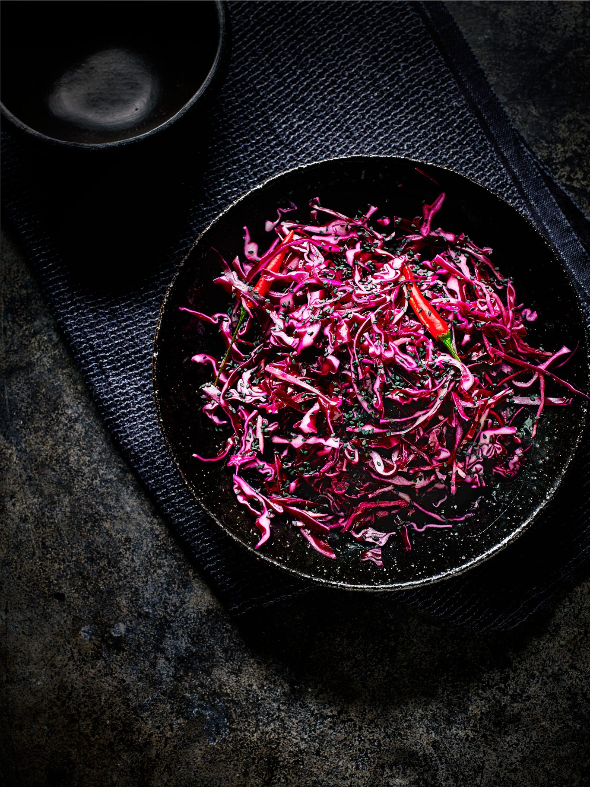

# Welsh Pickled Red Cabbage (Bresych Coch Sur)

*The crunchy magenta side jar on every Welsh Sunday-roast table: red cabbage shredded fine and pickled in spiced cider vinegar with cloves, bay and a little brown sugar; ready in two weeks, keeps for months.*

**Serves:** 1 large jar (about 1 kg, 10-12 servings)

**Prep Time:** 30 minutes (plus overnight salt cure and 2 weeks pickling rest)

**Cook Time:** 5 minutes

## Overview
Welsh pickled red cabbage is the standing accompaniment to every roast at a Welsh chapel-tea or Sunday table: cold sliced ham at Christmas, lamb on Easter Sunday, cawl on a winter night. The Welsh version leans on cider vinegar (a south-Wales orchard product) rather than the harsher malt vinegar of the English north. The technique is in two stages: the shredded cabbage is salt-dry-cured overnight to draw the water out (the difference between a crisp pickle and a soggy one), then packed into jars and covered with hot spiced vinegar. A two-week minimum rest lets the spices steep and the colour deepen into a deep magenta. The jar keeps in a cool cupboard for six months unopened, two months in the fridge once opened.

## Ingredients
- 1 large red cabbage (about 1.2 kg)
- 2 tablespoons fine sea salt

### Spiced vinegar
- 600 ml cider vinegar
- 100 g soft light brown sugar
- 2 teaspoons whole black peppercorns
- 1 teaspoon whole cloves
- 1 teaspoon whole allspice berries
- 4 fresh bay leaves
- 1 small cinnamon stick
- 1 small piece dried orange peel (optional)
- 1 teaspoon yellow mustard seed
- 1 small fresh red chilli (split, optional)

### Equipment
- 1 large mixing bowl
- 1 colander
- 1 large 1-litre sterilised glass jar (Kilner or Mason style)
- 1 small saucepan

## Method

### Stage 1 - Shred and salt-cure (day 1)
1. Quarter and core the cabbage.
2. Shred the cabbage finely with a sharp knife or mandoline (about 3 mm wide).
3. Tumble into a large bowl with the salt; toss thoroughly with your hands.
4. Cover; leave overnight (8-12 hours) in a cool place.

### Stage 2 - Rinse and dry (day 2)
1. Tip the cabbage into a colander; rinse thoroughly under cold water.
2. Squeeze handfuls firmly to drain off all the liquid.
3. Pat dry between two clean tea towels; the drier the cabbage, the crisper the pickle.

### Stage 3 - Spiced vinegar
1. Combine the cider vinegar, brown sugar and all the spices in a small saucepan.
2. Bring slowly to a simmer over low heat, stirring to dissolve the sugar.
3. Simmer 3 minutes (don't boil hard, the vinegar fumes are sharp).
4. Take off the heat; let the spices infuse 10 minutes.

### Stage 4 - Pack the jar
1. Sterilise the jar (boil in a pan or run through a hot dishwasher cycle).
2. Pack the cabbage into the jar firmly, layer by layer.
3. Pour the hot spiced vinegar (with all the spices) over till the cabbage is fully submerged.
4. Tap the jar on the worktop to release air pockets.
5. Top up with vinegar if any cabbage rises above the liquid.

### Stage 5 - Seal and rest
1. Seal tightly.
2. Cool to room temperature.
3. Store in a cool dark cupboard at least 2 weeks before opening (1 month is better).

### Stage 6 - Serve
1. Lift servings out with a clean fork (no double-dipping).
2. Refrigerate once opened.

## Notes
- **Salt cure overnight:** this is the step home cooks skip and pay for; without it the pickle is watery.
- **Cider vinegar, not malt:** the Welsh signature. Malt is too harsh; white wine vinegar works at a pinch.
- **Pack tight, submerge fully:** any cabbage above the liquid line goes mouldy.
- **Two-week minimum rest:** newer than that and the cabbage is still raw-tasting and pale; the colour and depth develop over time.
- **Clean fork every time:** double-dipping introduces moisture and bacteria that shorten shelf life.

## Variations
- **With star anise:** add 1 star anise to the spice mix for a faint liquorice note.
- **Christmas pickled cabbage:** add 2 tablespoons port to the cooled vinegar before pouring.
- **With ginger:** add 30 g fresh ginger sliced thin to the vinegar.
- **Sweeter version:** double the brown sugar for a chutney-leaning pickle.
- **With juniper:** add 1 teaspoon juniper berries; goes well with cured ham and game.

## Serving
- With Welsh Sunday roast lamb (the classic pairing) · alongside cawl in a winter bowl · on a Christmas cold-cuts plate with ham and pickles · with the Welsh leek and bacon pie · in a bara brith ploughman's sandwich · stirred through a winter coleslaw.

## Storage
- Unopened in a cool cupboard: 6 months.
- Opened in the fridge: 2 months.
- Don't freeze (the texture collapses).
- The colour deepens with age; flavour mellows from sharp-month-1 to balanced-month-3.
