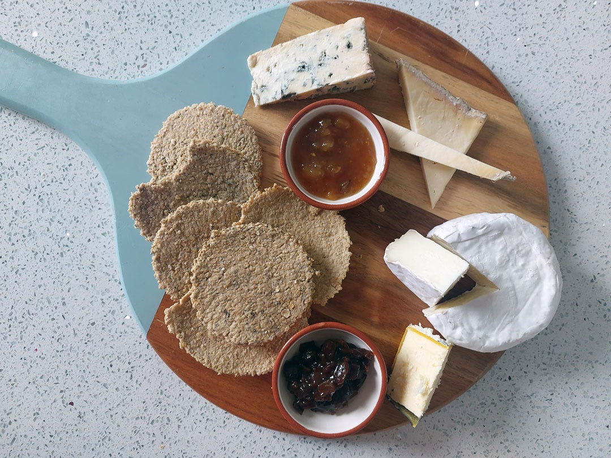

# Bara Ceirch (Welsh Oatcakes)

*Thin lacy Welsh oatcakes baked till crisp and snappable: pinhead oats, water, a little salt and bacon fat, rolled paper-thin on a board with a bakestone-pin and finished on a hot griddle.*

**Serves:** 24 oatcakes

**Prep Time:** 15 minutes

**Cook Time:** 25 minutes

## Overview
Bara ceirch is the Welsh hill-farm oatcake, a thin lacy biscuit closer in texture to a poppadom than to the dense Scottish oatcake. Welsh oats were grown on hillsides where wheat would not, so oatcakes were the everyday bread of the upland small-holding. The traditional construction uses pinhead (steel-cut) oatmeal mixed to a stiff paste with hot water and a little bacon fat, rolled out flat on a heavily-oatmeal'd board with a long bara ceirch pin, then baked dry on a bakestone (planc) or in a hot oven. The result is a snappable cracker that tastes of toasted oats, ideal with strong Welsh cheddar, with a smear of butter and honey, or alongside a bowl of cawl. They keep for weeks in a tin.

## Ingredients
- 300 g pinhead oatmeal (steel-cut) OR 300 g medium oatmeal
- 50 g rolled oats (for dusting the board)
- 2 tablespoons bacon fat (or melted butter, or lard)
- 1/2 teaspoon fine sea salt
- 1/2 teaspoon bicarbonate of soda
- 220 ml just-boiled water

### To serve
- 100 g mature Welsh cheddar OR Caerphilly cheese (sliced)
- A small jar of pickled red cabbage
- A pat of butter

## Method

### Stage 1 - Mix
1. Combine the oatmeal, salt and bicarbonate of soda in a large bowl.
2. Stir the bacon fat into the just-boiled water till it melts.
3. Pour the hot liquid into the dry oatmeal.
4. Stir quickly with a wooden spoon to a stiff paste.
5. Cover; rest 5 minutes so the oats absorb the water.

### Stage 2 - Roll
1. Heat the oven to 180°C (160°C fan, gas 4).
2. Scatter half the rolled oats over a clean worktop.
3. Tip the oatmeal paste out; knead briefly into a ball.
4. Divide into 2 equal pieces (the dough cools quickly; work one piece at a time).
5. Press the first piece flat on the oat-dusted worktop.
6. Roll out to about 3 mm thick (paper-thin); the edges will crack as it thins, this is normal.
7. Cut into 6 cm rounds with a biscuit cutter, or into rough triangles with a knife.
8. Gather the offcuts; re-roll once.

### Stage 3 - Bake
1. Line 2 baking sheets with baking paper.
2. Lift the oatcakes onto the sheets with a palette knife.
3. Bake 18-22 minutes till the edges are pale gold and the centres feel dry to a tap (not browned; bara ceirch is meant to be pale).
4. Halfway through, swap the trays top-to-bottom for even baking.

### Stage 4 - Cool
1. Lift onto a wire rack to cool.
2. They crisp up as they cool.
3. Repeat with the second half of the dough.

### Stage 5 - Serve
1. Pile onto a plate with sliced Welsh cheddar, a pat of butter and a forkful of pickled red cabbage.
2. Eat with a mug of strong tea.

## Notes
- **Pinhead oatmeal, not porridge oats:** pinhead gives the lacy snappable texture. If using rolled oats instead, expect a softer biscuit.
- **Hot water, not cold:** scalds the oats and starts a gentle gelling, which holds the cracker together.
- **Roll thin, very thin:** 3 mm or thinner. Thick oatcakes are stodgy.
- **Don't brown them:** bara ceirch is pale gold; deep brown means burnt-bitter oats.
- **Bacon fat traditional:** lifts the flavour; melted butter is the modern substitute.

## Variations
**On the griddle:** cook on a dry hot griddle (planc) at medium-low heat 3-4 minutes a side; turn once.
**Cheese oatcakes:** stir 50 g grated mature Welsh cheddar into the dough.
**Seeded:** add 1 tablespoon caraway, fennel or poppy seeds.
**Sweet bara ceirch:** drop the salt and bacon fat; add 2 tablespoons brown sugar; serve with honey.
**Gluten-free already:** pure oats are gluten-free; check the oat packet for "gluten-free" certification if needed (some oats are cross-contaminated).

## Serving
With a slice of Welsh cheddar and a mug of tea (the standard) · with cawl as a snappable side · with cheese and pickled red cabbage at a Welsh chapel-tea · with butter and honey for breakfast · on a Welsh cheese board with Caerphilly and Perl Las · packed into a hill-walker's bag for a Brecon Beacons trail snack.

## Storage
- Keeps 3 weeks in an airtight tin.
- If they soften, refresh 4 minutes at 150°C in the oven.
- Freezes well 3 months; reheat from frozen at 160°C for 5 minutes.
- Don't store anywhere humid (the lacy texture absorbs moisture fast).
