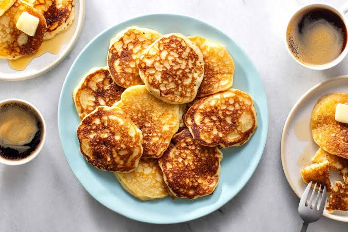

# Crempogau

*Welsh pancakes: thin, light buttermilk rounds raised with bicarbonate, cooked on a hot iron griddle in batches and stacked tall with butter and honey or brown sugar between the layers.*

**Serves:** 4 (makes about 16 pancakes)

**Prep Time:** 10 minutes (plus 1 hour resting)

**Cook Time:** 20 minutes

## Overview
Crempogau (the plural of crempog) are Welsh pancakes, and they sit between an English drop scone and an American buttermilk pancake: small, thick enough to hold a smear of butter, light enough to fold on themselves, slightly tangy from the buttermilk and lifted with bicarbonate of soda. They are cooked on a flat iron griddle (the same one used for Welsh cakes), and the traditional way to eat them is to stack 10 or 12 high on a plate, with butter and either honey or soft brown sugar spread between each layer, until the stack collapses slightly and the butter runs down the sides. Cut into wedges like a cake. They were the centrepiece of a Welsh tea on a saint's day or birthday, and the older family member would lay out the stack one pancake at a time on the table.

## Ingredients

- 250 g plain flour
- 1 tsp bicarbonate of soda
- 1 tsp cream of tartar
- 1 tbsp caster sugar
- 1/2 tsp salt
- 2 large eggs
- 400 ml buttermilk
- 50 g unsalted butter, melted, plus more for the griddle and to spread
- 1 tbsp vinegar (white wine or cider)
- To serve: butter and clear honey, or butter and soft brown sugar

## Method

### Stage 1 - Make the batter
1. Sift the flour, bicarbonate, cream of tartar, sugar and salt into a large bowl.
2. Beat the eggs into the buttermilk.
3. Stir in the melted butter and vinegar.
4. Pour the wet into the dry; whisk to a smooth, pourable batter the texture of double cream.
5. Rest 1 hour at room temperature (the bicarbonate works through the buttermilk).

### Stage 2 - Heat the griddle
1. Heat a flat iron griddle (or a heavy non-stick frying pan) over medium-low heat for 3 minutes.
2. Wipe lightly with a butter-dipped paper.

### Stage 3 - Cook
1. Drop tablespoons of batter onto the hot griddle, well spaced; each should be about 8 cm across.
2. Cook 90 seconds until the surface bubbles and the edges look set.
3. Flip; cook a further 60 seconds until pale gold on the second side.
4. Stack on a warm plate under a clean tea towel.
5. Repeat with the rest of the batter; wipe the griddle with butter between batches.

### Stage 4 - Build the stack
1. Lay one pancake on a serving plate.
2. Smear with butter; drizzle with honey or sprinkle with brown sugar.
3. Top with the next; repeat to build a stack of 8 to 12 layers.

### Stage 5 - Serve
1. Cut the stack into wedges with a sharp knife.
2. Eat with the butter running down.

## Notes
- **Rest the batter:** the bicarbonate needs time to react with the buttermilk acid; skip the rest and the pancakes are flat.
- **Medium-low heat:** they cook gently; high heat burns the outside before the inside sets.
- **Stack tall:** the stack is the dish, not the individual pancake.
- **Butter between every layer:** non-negotiable, this is the binding.
- **Eat the same day:** crempogau go dry overnight.

## Variations
- **Lemon crempogau:** add 1 tbsp lemon zest to the batter.
- **Bara planc cousin:** scale up to large 18 cm rounds for a flat pan-bread version.
- **With apple:** layer in thin slices of stewed apple between pancakes.
- **Savoury crempog:** skip the sugar, fold cooked bacon or grated cheese between layers.
- **With Welsh whisky honey:** stir a splash of Penderyn into the honey before drizzling.

## Serving
- On a Welsh birthday tea-table · on St David's Day with honey and Welsh butter · in a tall stack as a special-Sunday treat · cut into wedges for a teatime · with a pot of strong tea on the side.

## Storage
- Best eaten the day they are made.
- Cold pancakes keep 2 days wrapped, refresh in a hot dry pan for 30 seconds.
- Freeze with parchment between each pancake for 1 month.
