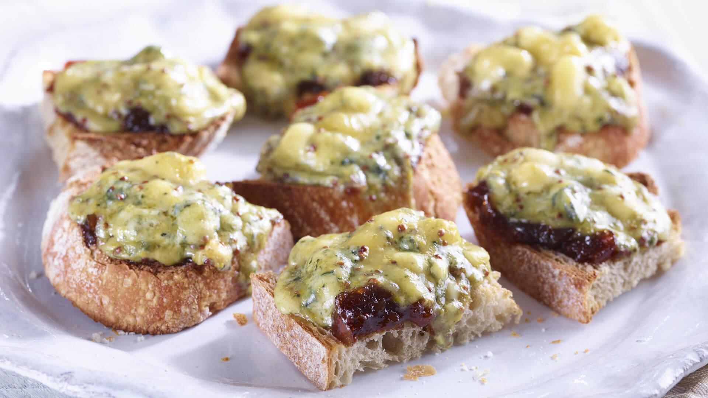

# Welsh Rarebit Bites

*The canapé form of Welsh rarebit: small toasted rounds of bread piled with the proper ale-mustard-cheddar mix and flashed under a hot grill until they blister, eaten in one bite with a drink in the other hand.*

**Serves:** Makes 24 bites

**Prep Time:** 15 minutes

**Cook Time:** 10 minutes

## Overview
Welsh rarebit bites take the proper pub-supper rarebit (the cooked roux-based cheese sauce, sharp with mustard and brown ale, glossy with egg yolk) and shrink it down to canapé scale: a 4 cm round of toasted bread piled with a heaped teaspoon of the mix and run under the grill until the top blisters. They take less than 10 minutes from cold pan to plate and travel through a party tray in even less. The trick is the same as the full-size dish: the rarebit must be a cooked sauce, not just grated cheese, and the topping must be thick enough to bubble without sliding off. Make the rarebit base up to three days ahead; the assembly is the work of a moment. A Welsh new-year drinks tray, a chapel reception, a wedding cocktail hour.

## Ingredients

- 24 small rounds (4 cm) cut from a slightly stale white loaf or sourdough
- 25 g unsalted butter
- 25 g plain flour
- 100 ml brown ale or stout (Welsh ale if you can)
- 200 g mature cheddar, grated
- 1 tsp English mustard
- 1 tsp Worcestershire sauce
- 1 large egg yolk
- Pinch of cayenne pepper
- Black pepper
- Optional: finely sliced spring onion or chives, to scatter

## Method

### Stage 1 - Make the rarebit base
1. Melt the butter in a small heavy pan over medium-low heat.
2. Stir in the flour; cook 1 minute to a pale roux.
3. Pour in the ale slowly, whisking; let it bubble to a thick paste.
4. Off the heat, stir in the cheese, mustard, Worcestershire, cayenne and black pepper.
5. Stir until smooth.
6. Beat in the egg yolk last.
7. Cool 10 minutes; the mix should be thickly spreadable.

### Stage 2 - Toast the rounds
1. Heat the grill to its highest setting.
2. Lay the bread rounds on a tray; toast 90 seconds a side until pale gold both sides.
3. Cool on the tray (a fully hot round will collapse under the cheese).

### Stage 3 - Top
1. Spoon a heaped teaspoon of the rarebit mix on each round; press down lightly.
2. Spread to the edges (bare crust burns).

### Stage 4 - Grill
1. Grill the tray 3 to 4 minutes until blistered, dark gold and bubbling.
2. Watch closely from the 2-minute mark.

### Stage 5 - Serve
1. Scatter chives or spring onion if using.
2. Serve hot on a board or platter.

## Notes
- **Make ahead:** the rarebit mix is happy for 3 days in the fridge; the bites are an assembly job.
- **Spread to the edges:** uncovered crust burns under the grill.
- **Thick topping:** thin mix slides off as it grills.
- **Slightly stale bread holds up:** fresh bread goes soggy under the mix.
- **Eat hot:** the top sets fast as the bites cool, the inside should still be molten when served.

## Variations
- **With chutney:** dab 1/4 tsp of Welsh apple chutney on the bread before topping.
- **Leek bite:** stir 50 g softened sliced leek into the rarebit mix.
- **Smoked cheddar:** use 100 g smoked cheddar with 100 g mature for a stronger version.
- **On oatcakes:** swap the bread rounds for oatcakes; gluten-free and crunchier.
- **With bacon:** add a small piece of crisp bacon on top of each bite.

## Serving
- At a Welsh new-year drinks tray · at a chapel reception · as a cocktail-hour canapé · at a Welsh wedding pre-dinner round · for a St David's Day party with leek soup to follow.

## Storage
- Cooked rarebit base keeps 3 days refrigerated; reheat gently on bread.
- Assembled raw bites keep 2 hours; grill straight from cold.
- The grilled bites do not store, eat the same hour.
