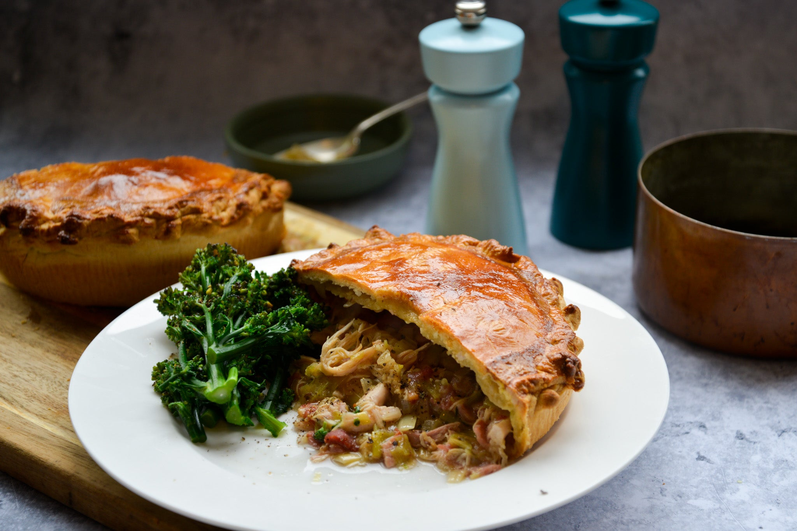

# Welsh Leek and Bacon Pie (Pastai Gennin a Chig Moch)

*The Welsh national emblem in a pie dish: slow-sweated leeks bound with smoked bacon, cream and mature Welsh cheddar under a buttery shortcrust lid, baked till the steam holes ribbon out fragrant.*

**Serves:** 6

**Prep Time:** 30 minutes

**Cook Time:** 1 hour 10 minutes

## Overview
The Welsh leek and bacon pie is one of the country's everyday Sunday-table dishes, built on the two ingredients every Welsh smallholding kept: leeks from the cold-frame garden and bacon from the home-cured pig. The leek (the national emblem) goes in by the kilo and is slow-sweated in butter till it collapses into a soft pale-green tangle; smoked bacon is rendered to crisp and folded through; mature Welsh cheddar and a little double cream bind it; the whole lot is sealed under a shortcrust lid and baked till the pastry is biscuit-gold. The combination is the leek-and-bacon flavour you find in cawl, concentrated into pie form. Eat warm with mustard and a glass of dry cider.

## Ingredients

### Pastry
- 300 g plain flour
- 1/2 teaspoon fine sea salt
- 150 g cold butter (diced)
- 1 egg yolk
- 4-5 tablespoons cold water
- 1 egg (beaten, for glaze)

### Filling
- 1 kg leeks (white and pale-green parts; about 4 large)
- 50 g butter
- 300 g smoked back bacon (diced into 1 cm pieces)
- 1 small onion (finely diced)
- 2 cloves garlic (finely chopped)
- 200 ml double cream
- 150 g mature Welsh cheddar (grated)
- 1 tablespoon plain flour
- 1 tablespoon English mustard
- 2 teaspoons fresh thyme leaves
- 1/2 teaspoon fine sea salt
- 1 teaspoon coarsely cracked black pepper
- 1 small handful fresh parsley (finely chopped)

## Method

### Stage 1 - Pastry
1. Combine flour and salt in a large bowl.
2. Add the cold diced butter; rub in till the mix looks like coarse breadcrumbs.
3. Whisk the egg yolk with 4 tablespoons cold water; add to the bowl.
4. Bring together with a fork; add the last tablespoon of water if needed.
5. Knead briefly; flatten to a 2 cm disc.
6. Wrap and rest 30 minutes in the fridge.

### Stage 2 - Leeks
1. Trim and slice the leeks into 1 cm half-moons; wash thoroughly in cold water (leeks hold grit).
2. Drain well.
3. Melt the butter in a wide pan over low heat.
4. Add the leeks and a pinch of salt.
5. Sweat 18-20 minutes till soft and silky, stirring often (don't brown).
6. Tip into a colander to drain off any liquor.

### Stage 3 - Bacon
1. In the same pan, render the diced bacon over medium heat 6-8 minutes till crisp at the edges.
2. Add the onion and garlic; cook another 5 minutes till the onion is soft.
3. Sprinkle the flour over; stir 1 minute.
4. Pour in the cream; stir till thickened.
5. Off the heat, stir in the mustard, thyme, pepper, and the drained leeks.
6. Fold in two-thirds of the grated cheddar; check seasoning (the bacon is salty, so go easy on salt).
7. Stir in the parsley.
8. Let the filling cool to room temperature.

### Stage 4 - Assemble
1. Heat the oven to 200°C (180°C fan, gas 6).
2. Roll two-thirds of the pastry into a circle large enough to line a 23 cm pie dish.
3. Lay it in; trim the overhang to 1 cm.
4. Tip the cooled filling in; level the top.
5. Scatter the last third of cheddar over.
6. Roll the remaining pastry into a circle for the lid.
7. Brush the rim with beaten egg; lay the lid over; press to seal.
8. Trim and crimp the edge.
9. Brush the lid with beaten egg.
10. Cut 4 small steam holes in the centre.

### Stage 5 - Bake
1. Sit the pie on a baking tray (catches any leaks).
2. Bake 35-40 minutes till the lid is deep golden and you can see steam ribboning from the holes.
3. Rest 10 minutes before cutting (the filling firms up).

### Stage 6 - Serve
1. Cut into 6 wedges.
2. Eat warm with extra mustard, pickled red cabbage, and a glass of dry Welsh cider.

## Notes
- **Wash the leeks well:** they hold soil and grit between the layers.
- **Cool the filling fully before adding to the pastry:** hot filling melts the butter in the pastry and makes the base soggy.
- **Mature cheddar, not mild:** the punchier the cheese, the more it cuts through the cream.
- **Smoked back bacon, not streaky:** less fat, more meat, better texture.
- **Baking tray under the dish:** any creamy leak burns the oven base, not the pie.

## Variations
- **With Caerphilly cheese:** swap the cheddar for crumbly Caerphilly (the Welsh cheese on the front of the cheese trolley).
- **With a puff-pastry lid:** use shortcrust below, puff on top for a crisp-flaky finish.
- **Vegetarian leek pie:** drop the bacon; add 200 g chestnut mushrooms sweated with the onion.
- **With laverbread:** stir 2 tablespoons cooked laverbread into the filling for a Gower-coast version.
- **Individual pies:** divide the pastry and filling into 6 small ramekins; bake 25 minutes.

## Serving
- At a Welsh Sunday lunch · for a chapel-tea family gathering · with a glass of Brains SA · at a Welsh wedding buffet · cold from the fridge with chutney for a packed lunch · with a green salad for a weeknight supper.

## Storage
- Keeps 3 days in the fridge.
- Reheat at 160°C for 15 minutes (the pastry crisps back up).
- Freezes well unbaked: wrap, freeze 2 months, bake from frozen at 180°C for 1 hour.
- Don't microwave (the pastry goes soft).
