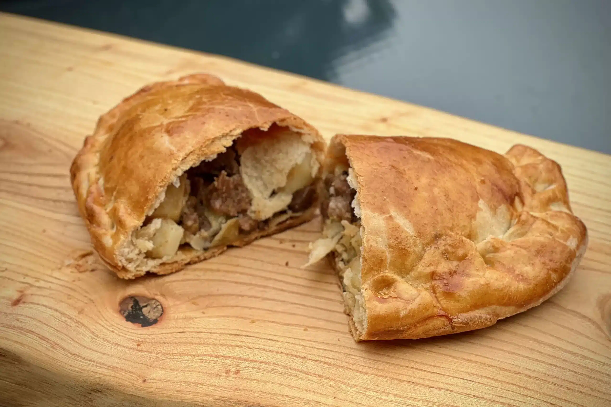

# Welsh Oggie

*The south-Wales mining valleys' pocket-pasty: a horseshoe-shaped shortcrust shell filled with diced lamb, leek, swede and potato, sealed and baked until the gravy thickens inside.*

**Serves:** 4 pasties

**Prep Time:** 30 minutes

**Cook Time:** 50 minutes

## Overview
The Welsh oggie is the Welsh first cousin of the Cornish pasty. South-Wales coal miners carried them down the pit at the start of a shift and ate them cold or reheated on a coal-fired shovel at break. The Welsh version uses lamb (the Welsh staple meat) where Cornwall uses beef, and folds in leek and swede alongside the diced potato. The pastry is a firm hot-water shortcrust that holds its shape; the filling goes in raw and cooks inside the parcel, the steam thickening the meat juices into a small reservoir of gravy at the bottom of each oggie. The crimped horseshoe seam runs along one curved edge, traditionally so the miner could hold the thicker rim while eating with hands that had been working coal all morning.

## Ingredients

### Pastry
- 450 g plain flour
- 1 teaspoon fine sea salt
- 120 g lard (or 60 g lard + 60 g butter)
- 200 ml boiling water
- 1 egg (beaten, for glaze)

### Filling
- 500 g lamb shoulder (diced into 1 cm cubes)
- 1 large leek (white and pale-green parts, finely sliced)
- 250 g floury potato (peeled, diced into 1 cm cubes)
- 200 g swede (peeled, diced into 1 cm cubes)
- 1 small onion (finely diced)
- 1 tablespoon plain flour
- 2 teaspoons fresh thyme leaves
- 1 teaspoon fine sea salt
- 1 teaspoon coarsely cracked black pepper
- 1 knob butter (for assembly)

## Method

### Stage 1 - Pastry
1. Combine flour and salt in a large bowl.
2. Melt the lard in the boiling water; pour over the flour.
3. Mix with a wooden spoon till it comes together as a soft dough.
4. Knead briefly on the worktop till smooth.
5. Wrap and rest 30 minutes (the dough firms up as it cools).

### Stage 2 - Filling
1. Combine diced lamb, leek, potato, swede, onion in a large bowl.
2. Sprinkle the flour over; toss till the meat and vegetables are lightly coated.
3. Add the thyme, salt and pepper; toss again.

### Stage 3 - Assemble
1. Heat the oven to 200°C (180°C fan, gas 6).
2. Divide the pastry into 4 equal pieces.
3. Roll each into a 22 cm round.
4. Pile a quarter of the filling along one half of each round; dot with a small knob of butter.
5. Brush the edge with beaten egg; fold the pastry over the filling.
6. Crimp the seam by folding small overlapping pleats along the curve, sealing tight.
7. The finished shape is a horseshoe or fat half-moon.
8. Brush the tops with beaten egg.
9. Cut 2 small steam slits in each.

### Stage 4 - Bake
1. Transfer the oggies to a baking sheet lined with baking paper.
2. Bake 50 minutes till the pastry is deep golden and a small skewer pushed into the seam meets no resistance from the swede.
3. If the tops brown too fast, tent with foil for the last 15 minutes.

### Stage 5 - Rest and serve
1. Rest the oggies 5 minutes on the tray before lifting.
2. Eat warm with a mug of strong tea (the traditional miner's pairing).

## Notes
- **Diced, not minced lamb:** the texture matters. Cubes give the filling weight; mince makes the parcel collapse.
- **Raw filling:** the meat and vegetables cook inside the parcel, the steam thickening the juices.
- **Crimp tight:** any opening lets the gravy escape and the pastry below goes soggy.
- **Hot-water crust:** the firm pastry holds the horseshoe shape and survives a packed lunchbox.
- **Eat warm or cold:** both work. Reheat at 160°C for 12 minutes if you want them hot.

## Variations
**Welsh beef oggie:** swap the lamb for diced beef chuck (the rare version).
**With cheese:** crumble 100 g mature Welsh cheddar over the filling before sealing.
**Mini oggies:** roll the dough into 8 smaller rounds for a party platter.
**Vegetable oggie:** double the swede and potato, add a tin of chickpeas; no meat.
**Gluten-free:** use a 1:1 gluten-free flour blend; rest the dough 1 hour rather than 30 minutes.

## Serving
At a south-Wales rugby supper · packed into a walker's bag for the Brecon Beacons · with HP sauce and a pint of Brains SA · as a pub lunch at the Black Mountain Inn · at a Welsh wedding buffet · cold from the lunchbox at a primary-school sports day.

## Storage
- Keeps 3 days in the fridge.
- Freezes well (raw or cooked, 3 months).
- Reheat from frozen at 160°C for 35 minutes; from the fridge for 12 minutes at 160°C.
- The pastry crisps back up on a baking sheet better than in a microwave.
