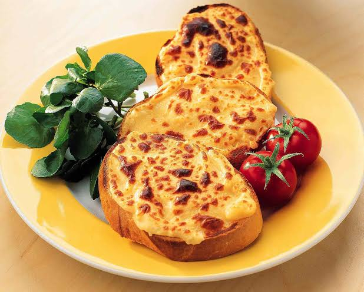

# Welsh Rarebit

*Proper cheese on toast: a thick savoury sauce of cheddar, ale, mustard and Worcestershire spread on toasted bread and bubbled under the grill until it goes blistered and dark gold.*

**Serves:** 2

**Prep Time:** 5 minutes

**Cook Time:** 10 minutes

## Overview
Welsh rarebit is the pub-supper classic that gave its name to a whole tradition of British cheese-on-toast. The trick is that it is not just cheese melted on bread; it is a cooked roux-based cheese sauce, sharp with mustard and ale, glossy with egg yolk, that goes on the toast and then under the grill to blister. The dish is recorded as Welsh rabbit in eighteenth-century English cookery books, and the slightly genteel "rarebit" spelling came later; Welsh hosts long ago shrugged at both and got on with eating it. A mature cheddar gives the right pull and tang, a brown ale gives depth, and English mustard and Worcestershire sauce keep it from going flat. Eat it the second the top sets, while the inside is still molten.

## Ingredients

- 4 thick slices of good white or sourdough bread
- 25 g unsalted butter
- 25 g plain flour
- 100 ml brown ale or stout (Welsh ale if you can)
- 200 g mature cheddar, grated
- 1 tsp English mustard
- 1 tsp Worcestershire sauce
- 1 large egg yolk
- A pinch of cayenne pepper
- Black pepper

## Method

### Stage 1 - Make the rarebit base
1. Melt the butter in a small heavy pan over medium-low heat.
2. Stir in the flour; cook 1 minute to a pale roux.
3. Pour in the ale slowly, whisking; let it bubble to a thick paste.
4. Take off the heat. Add the grated cheese, mustard, Worcestershire, cayenne and a grind of black pepper.
5. Stir until smooth (the residual heat melts the cheese).
6. Beat in the egg yolk last.
7. Cool 5 minutes; the mixture should be thickly spreadable.

### Stage 2 - Toast and top
1. Heat the grill to its highest setting.
2. Toast the bread on both sides under the grill.
3. Spread the rarebit mix thickly over the toast, right to the edges.

### Stage 3 - Grill and serve
1. Slide back under the grill for 3 to 4 minutes until blistered, dark gold and bubbling.
2. Eat at once, with a knife and fork.

## Notes
- **Spread to the edges:** crusts left bare burn before the centre browns.
- **Take it off the heat for the cheese:** boiling the cheese makes it grainy.
- **The egg yolk is the gloss:** it lifts the sauce from cheese-on-toast to rarebit.
- **One thick layer beats two thin ones:** the inside should stay molten.
- **A proper brown ale:** stout, mild or a Welsh brown ale all work; lager is too thin.

## Variations
- **Buck rarebit:** top each piece with a poached egg before serving.
- **Blushing bunny:** add a slice of fresh tomato under the rarebit.
- **Leek rarebit:** stir 50 g softened sliced leek into the mix.
- **Yorkshire rarebit:** top with a slice of crisp bacon or ham before grilling.
- **Make-ahead version:** the rarebit mix keeps 3 days in the fridge, spread cold straight onto toast.

## Serving
- At the pub bar with a pint of ale · as a Sunday supper after a long walk · with a side of pickled onions or chutney · as a quick weeknight tea · on a chapel supper plate.

## Storage
- The cooked rarebit mix keeps 3 days refrigerated in a sealed tub.
- Spread cold onto toast and grill from there.
- Do not freeze the sauce, the cheese splits on thaw.
