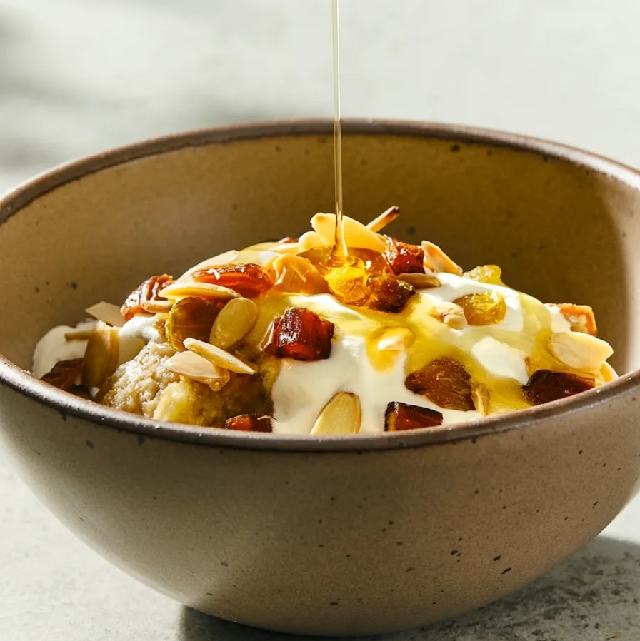

# Masoub

*Yemen's banana-bread pudding: ripe bananas mashed and folded together with crumbled khubz (Yemeni flatbread), warm milk or cream, butter and honey, sometimes topped with bread crumbs, dates and a drizzle of more honey. The Yemeni dessert-and-breakfast that turns up at every Hadhrami household and most Yemeni restaurants in the diaspora.*

**Serves:** 4

**Prep Time:** 15 minutes

**Cook Time:** 10 minutes

## Overview
Masoub is one of Yemen's most beloved sweet dishes and a particular favourite of the Hadhramawt region: ripe bananas mashed and combined with crumbled khubz (Yemeni flatbread), warm milk or cream, butter, honey, crushed cardamom and a touch of saffron, warmed gently to a soft creamy banana-bread pudding. Topped with extra honey, crushed almonds or pistachios, chopped dates and sometimes a drizzle of cream. Sits between a banana bread, a banana pudding and a sweet porridge; served both as a dessert and a sweet breakfast, particularly popular during Ramadan as a comforting iftar dish or sehri pre-dawn breakfast. The bananas must be very ripe (yellow with black spots); under-ripe gives a starchy bland masoub. Outside Yemen, brioche or challah replace the khubz; don't use crusty baguette or dense rye, the texture is wrong. Served warm, not hot; aggressive heating destroys the fresh banana flavour.

## Ingredients

- 4 large very ripe bananas (yellow-with-black-spots; about 500 g peeled weight)
- 200 g Yemeni khubz (or brioche, challah, or soft sweet white bread; torn into pieces)
- 250 ml warm whole milk (or single cream for a richer version)
- 80 g unsalted butter (or samna/ghee)
- 120 g honey (Yemeni Sidr honey if available; or any pure honey)
- 1 teaspoon ground cardamom
- Pinch of saffron threads (optional; infused in 1 tablespoon warm milk)
- ½ teaspoon vanilla extract
- Pinch of fine sea salt

### To finish
- Extra honey for drizzling
- 60 g pitted Medjool dates (chopped)
- 40 g toasted almonds (chopped)
- 30 g toasted pistachios (chopped)
- 2 tablespoons crushed dried rose petals (optional, very Yemeni)

## Method

### Stage 1 - Soften the bread
1. Place the torn bread pieces in a wide bowl.
2. Pour the warm milk over the bread.
3. Let stand 5 minutes till the bread fully absorbs the milk and softens.
4. Mash with a fork to a rough chunky paste; some texture is fine.

### Stage 2 - Mash the bananas
1. Peel the bananas; place in a separate wide bowl.
2. Mash with a fork or potato masher till nearly smooth (some banana chunks are fine for texture).

### Stage 3 - Combine
1. Add the mashed bananas to the bread-milk mixture.
2. Add the cardamom, vanilla and salt.
3. If using saffron, stir in the saffron-infused milk.
4. Mix together with a wooden spoon till combined; the texture should be a soft thick paste.

### Stage 4 - Warm and enrich
1. Tip the mixture into a wide saucepan over low heat.
2. Add the butter; stir as it melts into the mixture.
3. Add 100 g of the honey; stir to combine.
4. Cook gently for 3-4 minutes, stirring frequently, just till everything is warm and combined.
5. Don't bring to a boil; you want a warm soft pudding-like texture, not a cooked sauce.
6. Take off the heat; taste; add more honey if it needs sweetness.

### Stage 5 - Serve
1. Spoon the warm masoub into wide bowls or onto plates.
2. Drizzle each portion generously with extra honey.
3. Scatter chopped dates, toasted almonds, toasted pistachios and dried rose petals over.
4. Serve warm immediately.

## Notes
- **Very ripe bananas are essential:** the dish is built on banana sweetness. Under-ripe bananas give starchy bland masoub. Wait till the bananas are properly black-spotted yellow.
- **Soft bread, not crusty:** Yemeni khubz, brioche, challah or soft white bread. Crusty bread gives the wrong texture. If using day-old soft white bread, that's better than fresh (it absorbs the milk more easily).
- **Don't over-cook:** the dish is warmed, not cooked. Aggressive heating destroys the banana flavour and turns the bread to mush. 3-4 minutes on low heat is enough.
- **Sidr honey if you can:** Yemeni Sidr honey is the traditional choice; complex flavour, expensive, hard to find outside Yemen. Any good pure honey works as a substitute.
- **Cardamom is the spice profile:** the cardamom is what makes masoub Yemeni rather than generic banana pudding. Don't skip.

## Variations
**Date-and-banana masoub:** add 100 g of chopped dates to the warm pudding before serving; gives a sweeter denser version.
**Cream-rich masoub:** swap the milk for single cream; gives a richer dessert version. Common at fancy Yemeni restaurants.
**Cooked masoub (slightly different):** bake the mixed bread-banana-milk-butter-honey in a small dish at 180°C / 350°F for 25 minutes till the top is golden; gives a bread-pudding texture. Less traditional but excellent.
**Coconut masoub:** add 50 g of desiccated coconut to the mix; gives a tropical Yemeni variation.

## Serving
In wide bowls with the toppings scattered generously. Warm, with strong sweet milky tea (Yemeni karak-style) or Yemeni qishr (cardamom coffee). As dessert after a Yemeni meal, as a sweet breakfast, or as iftar during Ramadan. Children love it; adults love it too.

## Storage
- Best eaten warm and fresh.
- Keeps refrigerated 2 days; reheat gently in a saucepan with a splash of milk to loosen, or in the microwave covered.
- Don't freeze; the texture suffers (the bananas go off, the bread goes mushy).
- The components (mashed bananas, soaked bread, melted butter-and-honey) can be made separately and combined fresh; this gives a fresher result for serving the next day.
- The toasted nuts and dates keep separately; add fresh to each serving.
