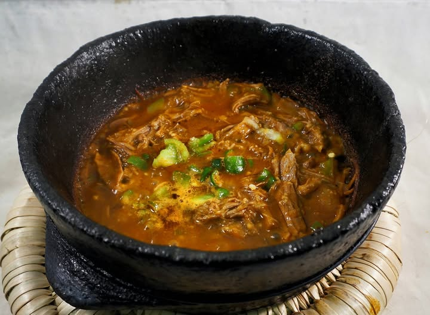

# Fahsa

*A Yemeni cousin of saltah: shredded slow-cooked lamb in a thick spiced gravy, served bubbling in a stone pot under a snowy whipped hulba froth.*

**Serves:** 4

**Prep Time:** 25 minutes (plus overnight for fenugreek)

**Cook Time:** 3 hours

## Overview
Fahsa is the close cousin to saltah, a thick deeply-spiced lamb stew traditionally brought to the Yemeni table in a hot stone pot bubbling so violently that diners flinch back when it lands. The difference from saltah is the meat: fahsa is shredded lamb in a clinging dark sauce, where saltah keeps the meat in chunks in a brothier stew. Shredded is the whole identity, so don't be tempted to leave the meat in pieces. The sauce is built on softened onion, garlic, ginger and a heavy bloom of hawaij (the Yemeni seven-spice mix of cumin, coriander, pepper, turmeric, cinnamon, cardamom and cloves), then reduced tomato and reserved lamb broth till everything clings dark and thick. Transferred to a flameproof stone pot or cast-iron skillet over high heat, brought to a violent boil, carried to the table still bubbling. Topped with snowy dollops of whipped hulba (overnight-soaked fenugreek froth) and a green spoon of sahawiq in the centre. Tear lahoh and scoop directly from the pot.

## Ingredients

- 1 kg lamb shoulder (bone-in, cut into large pieces)
- 1 tablespoon salt (for the boil)
- 3 tablespoons vegetable oil
- 2 onions (large, chopped)
- 8 garlic cloves (crushed)
- 1 thumb ginger (grated)
- 1 (400 g) tin chopped tomatoes
- 2 tablespoons tomato puree
- 2 tablespoons hawaij (or 1 teaspoon each: ground cumin, coriander, black pepper, turmeric, cinnamon)
- 1 teaspoon ground cardamom
- 1 teaspoon ground cloves
- 1 ½ teaspoons salt (to taste)
- 1 bay leaf
- 200 ml hot water (extra, for the sauce)

### To finish
- 1 batch hulba (whipped fenugreek, see Saltah recipe)
- 4 tablespoons [Sahawiq](side-dishes/sahawiq.md)
- Lahoh (or flatbread)

## Method

### Stage 1 - Boil the lamb
1. Place the lamb in a wide pot. Cover with cold water by 5 cm; add the 1 tablespoon salt.
1. Bring to a boil; skim the scum.
1. Reduce to a low simmer; cover; cook 2 hours 30 minutes, until the meat falls apart.
1. Lift the lamb out; reserve 500 ml of the broth.
1. Shred the meat off the bones; discard the bones.

### Stage 2 - Build the sauce
1. In a separate heavy pan, heat the oil.
1. Soften the onion 10 minutes until deep gold.
1. Add garlic and ginger; cook 1 minute.
1. Add hawaij, cardamom and cloves; toast 30 seconds.
1. Add tomato and tomato puree; reduce 8 minutes until thick.

### Stage 3 - Combine
1. Pour in 200 ml of the reserved broth and the extra hot water; add bay; bring to a simmer.
1. Add the shredded lamb; cook 15 minutes on a low simmer to combine, the sauce should be thick and clinging.
1. Add more broth if needed to keep it stew-like.
1. Taste; adjust salt.

### Stage 4 - Plate, boil and serve
1. Transfer to a hot flameproof stone pot or cast-iron skillet.
1. Place on high heat; bring to a violent boil at the table.
1. Spoon dollops of hulba on top.
1. Add a tablespoon of sahawiq in the centre.

### Stage 5 - Eat
1. Tear lahoh; scoop. Eat directly from the pot.

## Notes
- **Shred not chunk:** Fahsa's identity is shredded meat in a thick sauce, distinct from saltah (chunks in a brothier stew). Don't be tempted to leave the meat in pieces.
- **Boil at the table:** The visual and aromatic of a bubbling stone pot is part of the dish; in restaurants, the pot arrives so hot that the diners flinch.
- **Hulba note:** See saltah for technique. Make it fresh, the same day.

## Storage
- Refrigerate 3 days. Reheat covered with a splash of water.
- Hulba doesn't keep, make fresh each time.
