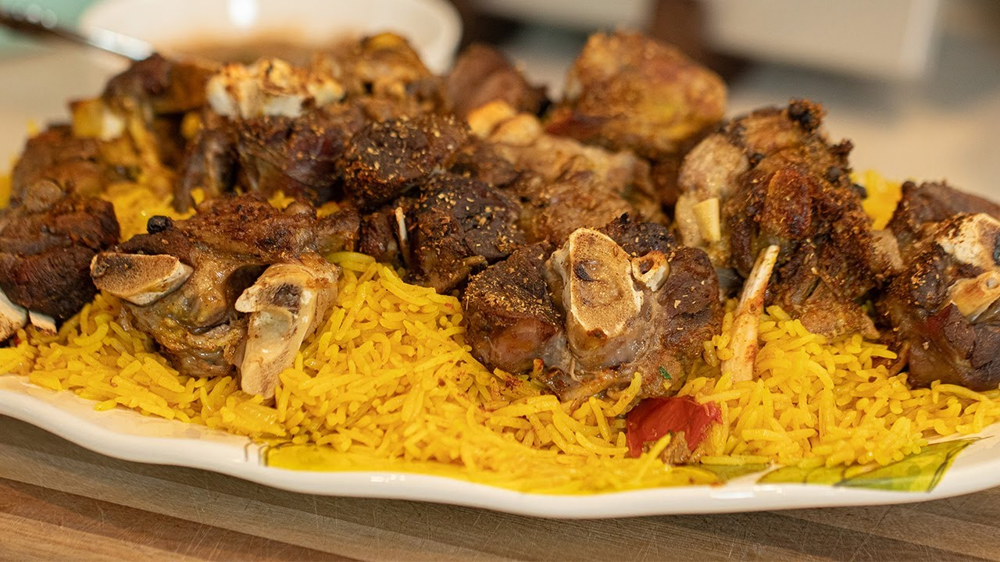

# Hanith

*Yemen's slow-roasted lamb: a bone-in lamb shoulder marinated in a paste of yogurt, garlic, hawaij, lime and salt, slow-roasted in a sealed pot or covered tin for 4 hours till the meat falls from the bone. The Hadhramawt and Sana'a celebration dish, served over fragrant rice with yogurt and bread.*

**Serves:** 6

**Prep Time:** 25 minutes (plus 12 hours marinating)

**Cook Time:** 4 hours

## Overview
Hanith is Yemen's most luxurious lamb celebration dish, particularly associated with the Hadhramawt region in the south and the city of Sana'a in the north: a whole bone-in lamb shoulder marinated in a paste of yogurt, garlic, lime juice and the Yemeni hawaij spice blend, then slow-roasted in a sealed clay pot or tightly-covered roasting tin at low temperature for four hours till the meat falls from the bone and the connective tissue dissolves into a rich self-saucing reduction. Bone-in shoulder is canonical; the bone gives the proper flavour, and the connective tissue dissolves to give the unctuous self-sauce. Hanith is less spice-heavy than zurbian; the lamb's flavour should come through. The sealed slow-roast is non-negotiable, since the steam is what gives the proper falling-apart texture; uncovered roasting dries the lamb out. Served on a large platter over fragrant mandi-style rice with yogurt and sahawiq chilli sauce on the side, and bread (lahoh or khubz tawa) for scooping. Often eaten by hand from a communal platter.

## Ingredients

### Lamb
- 1 bone-in lamb shoulder (about 2.5 kg)

### Marinade
- 250 g plain yogurt
- 10 garlic cloves (crushed)
- 4 tablespoons olive oil
- Juice of 3 limes
- 2 tablespoons hawaij spice mix (or substitute: 2 teaspoons each of cumin, coriander, black pepper, plus 1 teaspoon cardamom and 1 teaspoon turmeric)
- 2 tablespoons ground cumin (additional)
- 1 tablespoon ground coriander
- 2 teaspoons fine sea salt
- 1 teaspoon ground black pepper
- 1 teaspoon ground cinnamon
- 1 tablespoon Yemeni "amba" mango chutney (or substitute with 1 tablespoon Indian mango chutney)

### Cooking liquid
- 400 ml water (or beef stock)
- Juice of 1 lemon
- 4 bay leaves
- 4 whole cardamom pods
- 1 cinnamon stick

### Mandi rice (the canonical Yemeni accompaniment)
- 500 g basmati rice (rinsed 2-3 times)
- 50 g butter (or ghee)
- 1 large onion (finely chopped)
- 4 garlic cloves (crushed)
- 6 cardamom pods
- 4 cloves
- 1 cinnamon stick
- 2 bay leaves
- ½ teaspoon saffron threads (infused in 3 tablespoons warm milk)
- 1 ½ teaspoons fine sea salt
- 1 litre hot chicken stock

### To serve
- 400 g plain yogurt
- Sahawiq (Yemeni green or red chilli sauce; see yemen sides)
- Fresh chopped salad (tomato, cucumber, onion)
- Yemeni lahoh or khubz tawa
- Lemon wedges

## Method

### Stage 1 - Marinate the lamb (overnight)
1. Pat the lamb dry; score the skin in a diamond pattern.
2. Combine all marinade ingredients in a wide bowl; mix to a thick paste.
3. Rub the marinade all over the lamb, pushing into the scored skin and around the bone.
4. Place in a large container; cover; refrigerate 12-24 hours.

### Stage 2 - Bring to room temperature
1. Take the lamb out of the fridge 1 hour before cooking; let warm to room temperature.

### Stage 3 - Sear
1. Preheat the oven to 220°C (425°F).
2. Place the lamb in a large heavy roasting tin or Dutch oven (skin-side up).
3. Sear in the hot oven for 25 minutes till the skin starts to crisp and brown.

### Stage 4 - Add liquid and seal
1. Reduce oven temperature to 140°C (285°F).
2. Pour the water (or stock) into the bottom of the tin (around the lamb, not over the skin).
3. Add the lemon juice, bay leaves, cardamom pods and cinnamon stick.
4. Cover the tin tightly with foil (or use the Dutch oven lid); make a proper steam-tight seal.

### Stage 5 - Slow-roast
1. Roast at 140°C for 3.5-4 hours till the lamb is meltingly tender (a fork should slide in easily; the meat should pull from the bone with no resistance).
2. The internal temperature should be 95°C / 200°F.

### Stage 6 - Make the mandi rice (last 45 minutes of lamb cooking)
1. Melt the butter in a wide heavy saucepan over medium heat.
2. Add the chopped onion; cook 5-6 minutes till soft and pale gold.
3. Add the crushed garlic, cardamom pods, cloves, cinnamon stick and bay leaves; cook 1 minute till fragrant.
4. Add the rinsed-and-drained rice; stir to coat.
5. Add the salt; pour in the hot chicken stock.
6. Bring to a boil.
7. Reduce to lowest heat; cover tightly.
8. Cook 15 minutes covered.
9. Pour the saffron-infused milk over the rice; do not stir (just let it streak through during the rest).
10. Let rest off heat (still covered) for 10 minutes.

### Stage 7 - Brown the lamb skin (optional but recommended)
1. Once the lamb has slow-roasted for 4 hours, lift the foil.
2. Turn the oven up to 220°C / 425°F.
3. Roast uncovered for 20-25 minutes till the skin is deep mahogany and crisp.

### Stage 8 - Rest
1. Lift the lamb onto a warm serving platter.
2. Cover loosely with foil; let rest 15-20 minutes.

### Stage 9 - Plate and serve
1. Spread the mandi rice over a large communal platter.
2. Place the rested lamb on top; the meat will fall apart at the touch of a fork.
3. Lift large pieces and shred slightly with a fork to show the tenderness.
4. Drizzle with some of the pan juices.
5. Garnish with chopped parsley.
6. Serve with yogurt, sahawiq, salad, lahoh and lemon wedges.
7. Eat with the right hand (Yemeni tradition); or use a fork.

## Notes
- **Bone-in lamb shoulder is essential:** the bone gives flavour and the connective tissue dissolves over 4 hours. Boneless cuts don't work.
- **Long marinade is essential:** 12 hours minimum; overnight is better. The yogurt tenderises and the spices penetrate.
- **Seal the pot during slow-roast:** the covered slow-roast cooks the lamb in its own juices. Steam escape gives dry lamb; tight seal gives moist tender lamb.
- **Don't skip the final crisping:** the last 20-25 minutes uncovered gives the proper mahogany-crisp skin. Without this, you have tender lamb with pale fatty skin.
- **The rice cooks while the lamb finishes:** time it so both are ready together; the mandi rice keeps for 30 minutes in its covered pot.

## Variations
**Mandi (charcoal-cooked hanith):** the traditional Yemeni cooking method uses charcoal in a sealed pit (mandi means "pit"); the lamb cooks over slow charcoal and the smoke flavours it. Hard to replicate at home; some Yemeni restaurants do it.
**Goat hanith (al-eb):** swap the lamb for kid goat shoulder; cook the same way. Common variation in rural Yemen.
**Spicier hanith:** add 1 tablespoon of Yemeni chilli flakes (felfel ahmar) to the marinade; gives a properly warm version.
**Saffron-heavy hanith:** double the saffron in the rice; add 1 tablespoon of saffron-infused water to the marinade. Festive variant.

## Serving
On a large communal platter at the centre of the table, the lamb torn over the rice. Side bowls of yogurt, sahawiq, salad, lemon wedges. At Yemeni weddings, Eid celebrations, and major family gatherings. Drink: Yemeni qishr (cardamom-coffee), karkadeh, fresh laban, or water.

## Storage
- Keeps refrigerated 5 days; the flavour deepens noticeably.
- Reheat in a covered oven dish at 160°C / 320°F for 30-40 minutes till hot through.
- Freezes 3 months in portioned containers; defrost in the fridge.
- The shredded leftover lamb is excellent in wraps with yogurt and pickled vegetables.
- The mandi rice keeps refrigerated 3 days; reheat with a splash of water in a covered pan.
