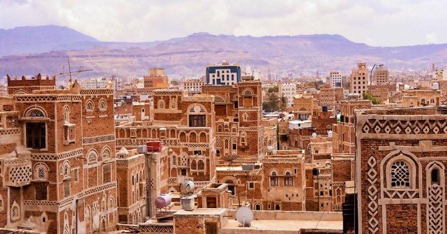

# Yemen Cuisine

The oldest continuous cooking tradition on the Arabian peninsula, built on slow-roasted meats, fermented flatbreads and chilli-fenugreek relishes. Mandi (lamb cooked over smoke in a buried clay oven), saltah (the bubbling meat-and-fenugreek-froth stew), fahsa (lamb in hot stone pot) and zurbian (saffron lamb rice) sit at the centre; lahoh (sourdough pancake) and tawa flatbreads scoop everything. Sahawiq (green chilli relish) and hulba (whipped fenugreek) are universal; bint al-sahn (the layered honey bread) closes feasts.
