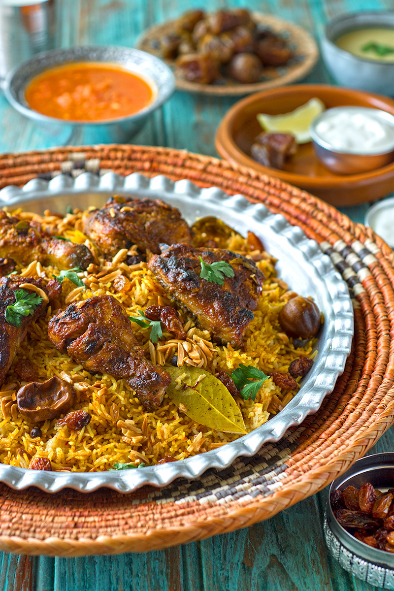

# Mandi

*Yemen's most famous dish: lamb slow-cooked over saffron-and-spice rice, finished with a piece of glowing charcoal sealed under foil for smoke.*

**Serves:** 6

**Prep Time:** 25 minutes (plus 4 hours marinating, optional)

**Cook Time:** 2 hours 45 minutes

## Overview
Mandi is Yemen's most famous dish, the celebration plate that turns up at weddings, Eid feasts and Friday lunches across the Arabian Peninsula: bone-in lamb spice-rubbed and slow-cooked over saffron-scented rice, finished with a piece of red-glowing charcoal sealed under foil so the smoke perfumes the whole pot. The smoking step (called tedkhin) is the signature, the trick that takes mandi from "very good biryani-adjacent rice" into something unmistakably Yemeni. Traditional mandi is cooked in a taboon (a clay oven buried in the ground with coals on top), and the home version on the hob gets surprisingly close. Rub a kilo and a half of bone-in lamb shoulder with hawaij, ground cardamom, crushed garlic, salt, lemon juice and oil till every surface is coated; marinate 4 hours if you can manage it. Brown the lamb hard in a wide heavy lidded pot for four or five minutes a side. Wipe the pot, pour in a litre of hot water with a steaming rack inside (or scrunched foil to lift the meat clear), return the lamb on top and cover tightly with foil and the lid. Steam-roast on the lowest hob heat or in a 150°C oven for two hours till the meat shreds when prodded. Lift the lamb out, strain the liquid and skim the fat; this is the rice stock. In a separate pot, fry sliced onions in ghee for ten minutes till deep gold, reserve half for garnish, then toast cardamom pods, cinnamon, cloves and bay in the remaining onions and ghee. Toast the rinsed rice for a minute, pour in 800 ml of the strained stock with bloomed saffron, simmer covered 15 minutes. Lay the lamb on top of the rice, scatter raisins and almonds, then heat a small piece of natural-lump charcoal directly over a gas flame till red-glowing (five minutes), set it in a small heatproof bowl on top of the rice, drizzle a tablespoon of oil onto the charcoal so it smokes immediately, and cover the pot tight for five minutes. Remove the charcoal bowl carefully, tip the rice onto a wide platter with the lamb on top, scatter the reserved fried onions across, serve with sahawiq, yogurt and lemon wedges.

## Ingredients

### Lamb
- 1 ½ kg lamb shoulder (bone-in, cut into 4 large pieces)
- 2 tablespoons hawaij spice mix (see below) OR 1 teaspoon each ground cumin, coriander, black pepper, turmeric and cinnamon
- 1 tablespoon ground cardamom
- 6 garlic cloves (crushed)
- 1 tablespoon salt
- 1 lemon (juice)
- 3 tablespoons vegetable oil

### Rice
- 500 g long-grain basmati rice (rinsed thoroughly)
- 1 large pinch saffron threads
- 4 tablespoons hot water (for the saffron)
- 2 onions (thinly sliced)
- 4 tablespoons ghee (or vegetable oil)
- 4 cardamom pods (bruised)
- 2 cinnamon sticks
- 4 cloves
- 2 bay leaves
- 1 teaspoon salt (to taste)
- 60 g raisins (optional)
- 40 g flaked almonds (optional)

### Smoking (optional but iconic)
- 1 small piece natural-lump hardwood charcoal (about 3 cm)
- 1 tablespoon vegetable oil

## Method

### Stage 1 - Marinate
1. Mix the hawaij, cardamom, garlic, salt, lemon juice and oil to a paste.
1. Rub all over the lamb. Refrigerate 4 hours if you can; if not, give it 30 minutes at room temperature.

### Stage 2 - Brown the lamb
1. Heat a wide heavy lidded pot over medium-high.
1. Brown the lamb hard on all sides, 4-5 minutes per side. Set aside.

### Stage 3 - Steam-roast the lamb
1. Wipe the pot; add 1 litre of hot water; place a steaming rack inside (or use foil scrunched into a nest).
1. Return the lamb on top of the rack.
1. Cover tightly with foil and the lid; cook on the lowest hob heat (or 150°C oven) 2 hours, until the meat shreds when prodded.
1. Lift the lamb out and rest it on a plate; strain the liquid in the pot - this is your rice cooking stock. Skim the surface fat; you should have 800-900 ml; top up with hot water if needed.

### Stage 4 - Rice
1. Bloom the saffron in the hot water.
1. In a separate wide pot, heat the ghee or oil. Fry the sliced onions 10 minutes until deep gold.
1. Lift half the onions out and set aside as garnish.
1. Add cardamom, cinnamon, cloves and bay; fry 30 seconds.
1. Add the rinsed rice; toast 1 minute.
1. Pour in the strained lamb stock (800 ml); add the saffron and water; check salt.
1. Bring to a boil; reduce heat to lowest; cover; cook 15 minutes.

### Stage 5 - Combine and smoke
1. After 15 minutes, lay the lamb pieces on top of the rice.
1. Scatter raisins and almonds.
1. Place the small heatproof dish on top of the rice. Heat the charcoal piece directly over a gas flame until red-glowing (5 minutes); place in the dish.
1. Drizzle the oil on the charcoal; immediately cover the pot tight; leave 5 minutes.
1. Remove the charcoal dish carefully.

### Stage 6 - Serve
1. Tip the rice onto a wide platter; lay the lamb on top; scatter the reserved fried onions.
1. Serve with sahawiq, yogurt and lemon wedges.

## Notes
- **Hawaij:** A Yemeni spice mix. Buy ready-made at a Middle Eastern shop, or use the substitution in the ingredient list - it's a passable approximation.
- **Smoking is optional:** The charcoal step (called "tedkhin") is signature but skippable. The flavour is otherwise complete; this just adds smoke.
- **Real mandi:** Cooked in a taboon (clay oven) buried in the ground or in coals. The home version (pot-steamed) gets surprisingly close.

## Storage
- Refrigerate 3 days; reheat covered with a splash of water.
- Freezes 2 months.
