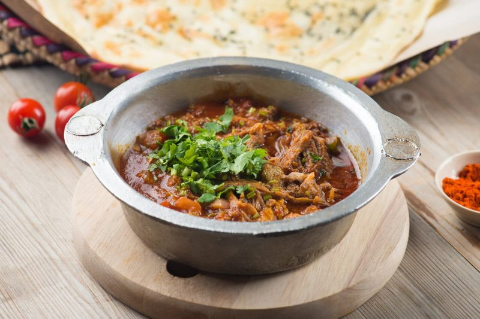

# Saltah

*Yemen's national dish: a deeply savoury stew of slow-cooked lamb, tomato and fenugreek, served in a bubbling clay pot under a snowy whipped hulba froth.*

**Serves:** 4

**Prep Time:** 30 minutes (plus overnight for fenugreek)

**Cook Time:** 2 hours 30 minutes

## Overview
Saltah is Yemen's national dish: a deeply spiced slow-cooked lamb stew (the maraq base) brought to the table in a stone pot still violently boiling, crowned with snowy dollops of whipped fenugreek froth (hulba) and a spoon of bright green chilli relish (sahawiq) dropped into the centre. The hulba is the dish's signature and the technical move that separates saltah from a generic lamb stew: fenugreek seeds soaked overnight and rinsed twice to take the edge off the bitterness, then blended with lemon, garlic and cold water till the mixture triples in volume and looks like fresh meringue. Make this first thing the night before. The maraq is lamb shoulder browned hard, slow-simmered with hawaij, tomato and onion till it falls apart. Brought to the table still bubbling. Tear lahoh or hot flatbread and scoop straight from the pot.

## Ingredients

### Maraq (meat stew)
- 800 g lamb shoulder, neck (or beef shin, cut into 3 cm chunks)
- 3 tablespoons vegetable oil
- 2 onions (chopped)
- 6 garlic cloves (crushed)
- 1 thumb fresh ginger (grated)
- 2 (400 g) tins chopped tomatoes (or 6 fresh, grated)
- 2 tablespoons tomato puree
- 1 tablespoon ground cumin
- 1 tablespoon ground coriander
- 1 teaspoon ground turmeric
- 1 teaspoon ground cardamom
- 1 teaspoon ground black pepper
- 1 teaspoon salt
- 2 bay leaves
- 1.2 litres hot water

### Hulba (whipped fenugreek)
- 3 tablespoons fenugreek seeds (the smaller, more bitter Yemeni variety if available)
- 250 ml cold water (for overnight soaking)
- 1 lemon (juice)
- 1 garlic clove
- ½ teaspoon salt
- 2 tablespoons cold water (for whipping)

### To finish
- 4 tablespoons [Sahawiq](side-dishes/sahawiq.md) (Yemeni green chilli sauce, recipe in the sides)
- Lahoh (or hot flatbread, to scoop)

## Method

### Stage 1 - Soak the fenugreek (the night before)
1. Place fenugreek seeds in a bowl; cover with cold water by 5 cm; soak overnight.
1. Drain; rinse twice to remove the bitter outer slime.

### Stage 2 - Brown the meat
1. Heat the oil in a heavy pot. Pat the meat dry; brown hard on all sides in batches. Set aside.

### Stage 3 - Build the stew
1. In the same pot, soften the onions 10 minutes.
1. Add garlic and ginger; cook 1 minute.
1. Stir in cumin, coriander, turmeric, cardamom, pepper; cook 1 minute.
1. Add tomatoes and tomato puree; reduce 8 minutes until thick.
1. Return the meat with juices; add bay, salt and hot water.
1. Cover; simmer on low 2 hours, until the meat falls apart at a fork.

### Stage 4 - Make hulba
1. Place soaked fenugreek seeds, lemon juice, garlic, salt and 2 tablespoons cold water in a blender.
1. Blend on high until foamy, white and triple in volume (3-4 minutes). It should look like meringue.
1. Refrigerate until serving.

### Stage 5 - Final boil and serve
1. Transfer the hot stew to a flameproof stone pot or cast-iron skillet (or keep in the same pot if no clay).
1. Place over high heat; bring to a violent boil.
1. Spoon dollops of hulba over the surface.
1. Spoon a tablespoon of sahawiq into the centre.
1. Bring the pot, still boiling, to the table.

### Stage 6 - Eat
1. Tear lahoh or flatbread; scoop directly from the pot. The first bites are eaten in the still-bubbling stew.

## Notes
- **Fenugreek bitter at first:** Hulba is an acquired taste - intensely savoury, slightly bitter. Yemenis eat it from childhood. Soaking overnight and rinsing twice keeps the bitterness in check.
- **Stone pot (madra):** Traditional. A cast-iron skillet or any flameproof clay pot works to keep the boiling-at-the-table effect.
- **Heat options:** Add more sahawiq for heat. The hulba itself is not spicy.

## Storage
- Stew refrigerates 3 days; reheats well, though the hulba doesn't keep - make fresh before serving.
- Soaked seeds keep 2 days refrigerated.
