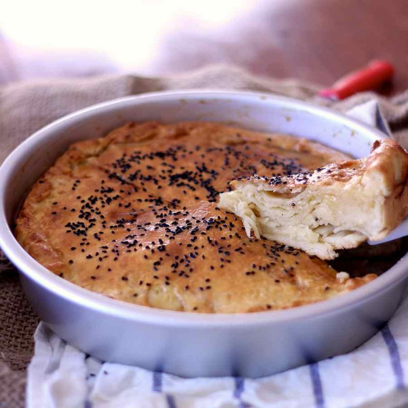

# Bint Al-Sahn

*Yemen's celebration bread: paper-thin pastry stacked seven layers deep with ghee, baked golden and drenched in dark honey and black caraway seeds.*

**Serves:** 6

**Prep Time:** 40 minutes (plus 1 hour resting)

**Cook Time:** 25 minutes

## Overview
A soft eggy dough is rolled into 7-8 paper-thin discs (closer to filo than to bread). Each disc is brushed with melted ghee and stacked into a wide round tin. The whole stack bakes at high heat for 25 minutes until deep gold and crisp at the edges. While hot, it's drenched in raw dark honey and scattered with toasted black caraway seeds (or nigella seeds).

## Ingredients

### Dough
- 400 g plain flour
- 2 eggs (large)
- 1 teaspoon salt
- 1 tablespoon caster sugar
- 200 ml warm milk
- 100 g unsalted butter (softened, plus 100 g melted, for brushing)
- 1 tablespoon vegetable oil

### To finish
- 200 g raw dark honey (sidr honey if you can find it)
- 1 tablespoon black caraway (or nigella seeds, lightly toasted)

## Method

### Stage 1 - Dough
1. Whisk flour, salt and sugar in a bowl. Make a well.
1. Whisk the eggs with the warm milk; pour into the well.
1. Add the softened butter and oil; mix to a soft, slightly tacky dough.
1. Knead 5 minutes until smooth.
1. Cover; rest 1 hour.

### Stage 2 - Divide and roll
1. Divide the dough into 8 equal pieces.
1. Roll the first piece on a very lightly floured surface to a 26 cm round, paper-thin (almost see-through).
1. Lay in a 26 cm round oven dish or springform tin (lightly oiled).
1. Brush generously with melted ghee.

### Stage 3 - Stack
1. Roll the next piece to the same size; lay on top; brush with ghee.
1. Repeat with the remaining 6 pieces, brushing each layer with ghee.
1. The top sheet gets a final brushing with ghee.

### Stage 4 - Bake
1. Heat oven to 220°C (200°C fan).
1. Bake 25-28 minutes until the top is deep gold and the edges are crisp.

### Stage 5 - Finish
1. Lift from the oven. While the bread is still hot, drizzle generously with honey - it should sink between the layers.
1. Scatter with the toasted black caraway / nigella seeds.

### Stage 6 - Serve
1. Cool 10 minutes (otherwise the honey is dangerously hot).
1. Tear into flakes with the hand; serve with cardamom tea.

## Notes
- **Sidr honey:** Yemeni mountain honey is dark, malty, almost bitter at the edges - a famous ingredient. Manuka, Greek thyme honey or any dark honey makes a good substitute.
- **Roll thin:** The character comes from the layers. If your discs are thick, you'll get bread; if they're thin, you'll get a flaky leaved pastry. Closer to filo than to flatbread.
- **Black caraway / nigella:** Black caraway is the traditional seed; nigella (kalonji) is the easy substitute.

## Storage
- Best the day baked.
- Keeps 2 days in foil at room temperature; the honey keeps everything moist. Don't refrigerate - the layers go heavy.
