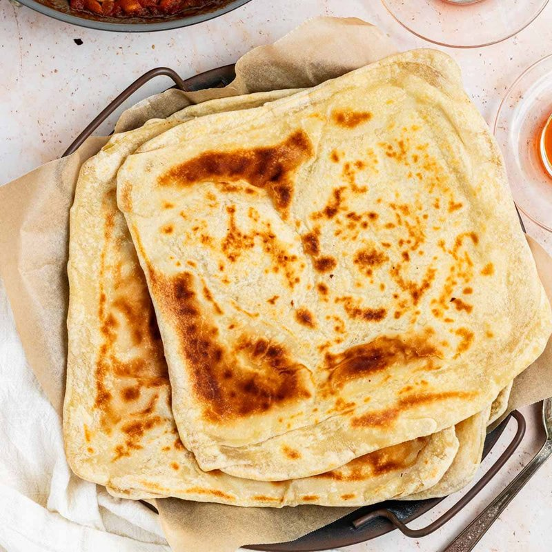

# Khubz Tawa

*Yemen's griddle bread: a soft lightly leavened flatbread cooked on a hot dry pan or iron tawa. Pliable enough to fold around grilled meat.*

**Serves:** 4 (makes 6 breads)

**Prep Time:** 15 minutes (plus 1 hour rising)

**Cook Time:** 20 minutes

## Overview
Khubz tawa is the everyday Yemeni griddle bread: a soft lightly leavened flatbread cooked on a dry hot pan or iron tawa till the surface puffs and small darker spots form, pliable enough to fold around grilled meat or tear and use to scoop saltah, fahsa or any brothy stew. The dough is forgiving and the cook is fast (90 seconds a side), but two technical points carry the bread. Medium-high heat: too hot burns the outside before the inside cooks, too cool dries the bread out. And a tea towel over the finished stack: the steam from each fresh bread keeps the ones underneath soft and pliable. Rolled into 20 cm discs about 3 mm thick; thinner and you've made a tortilla, thicker and the middle stays raw. Served warm, torn or folded around grilled meat.

## Ingredients

- 500 g plain flour
- 1 sachet (7 g) fast-action yeast
- 1 teaspoon salt
- 1 tablespoon caster sugar
- 1 tablespoon olive oil
- 300 ml warm water

## Method

### Stage 1 - Dough
1. Whisk flour, yeast, salt and sugar in a bowl.
1. Add olive oil and warm water; mix to a soft dough.
1. Knead 8 minutes on a lightly floured surface until smooth and elastic (or 5 minutes in a stand mixer with dough hook).
1. Cover; rise 1 hour until doubled.

### Stage 2 - Divide and shape
1. Knock back; divide into 6 equal pieces; roll each into a tight ball.
1. Cover; rest 10 minutes.
1. Press or roll each ball into a 20 cm disc, about 3 mm thick. Cover the discs with a tea towel as you work to stop them drying.

### Stage 3 - Cook
1. Heat a wide dry pan over medium-high heat 2 minutes.
1. Lay one disc onto the dry pan; cook 60-90 seconds, small bubbles will rise.
1. Flip; cook another 60-90 seconds, pressing gently with a spatula to encourage a few darker spots.
1. Stack under a clean tea towel as they come off; the steam keeps them soft.

### Stage 4 - Serve
1. Eat warm, torn or folded around meat, scooping saltah or any stew.

## Notes
- **Pan heat:** Medium-high. Too hot and the outside burns before the inside cooks; too low and the bread dries.
- **Don't roll thin:** 3 mm is right. Thinner and you've made a tortilla; thicker and the middle stays raw.
- **Soft stack:** A tea towel over the stack is non-negotiable. The steam from each fresh bread softens the stack below.

## Storage
- Best fresh, eaten warm. Will keep wrapped in foil at room temperature for 24 hours; reheat briefly on a dry pan.
- Freeze 1 month; thaw at room temperature, refresh on a hot pan.
