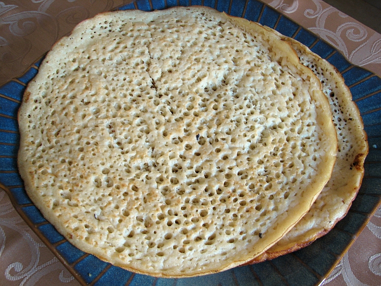

# Lahoh

*Yemeni sourdough flatbread, cooked on a hot dry pan: spongy, tangy, full of small even holes like an English crumpet, but pliable and torn rather than buttered. Eaten with saltah, fahsa or anything brothy that needs scooping. The fermentation gives it a slight sourness; the holes catch the sauce.*

**Serves:** 4 (makes 6 lahoh)

**Prep Time:** 5 minutes (plus 8 hours fermenting)

**Cook Time:** 25 minutes

## Overview
Plain flour, semolina, yeast, water and salt are whisked to a loose pancake batter; left to ferment 8 hours (or overnight). The batter goes onto a hot, lightly oiled pan; bubbles burst across the surface within 90 seconds; it's cooked one side only, no flipping. The top stays creamy white; the bottom turns pale gold. Pulled off the pan with a spatula, stacked, kept warm.

## Ingredients

- 250 g plain flour
- 100 g fine semolina (or replace with more plain flour)
- ½ teaspoon fast-action yeast
- 1 teaspoon salt
- ½ teaspoon caster sugar
- 700 ml warm water (more if needed for consistency)
- 1 teaspoon vegetable oil for the pan

## Method

### Stage 1 - Batter
1. Whisk the flour, semolina, yeast, salt and sugar in a wide bowl.
1. Gradually whisk in the warm water to make a smooth, runny batter - the consistency of single cream.
1. Cover; leave at room temperature 8 hours (or overnight). It should be bubbly and smell pleasantly sour.

### Stage 2 - Adjust consistency
1. Stir the batter gently. It should still be pourable; thin with a splash of water if it has thickened.

### Stage 3 - Cook
1. Heat a non-stick or well-seasoned 24 cm pan over medium heat 2 minutes.
1. Lightly oil with a kitchen paper dipped in oil (no pooled oil).
1. Ladle 120 ml of batter into the centre; swirl quickly to spread into a 20 cm round.
1. Within 30 seconds, bubbles will rise across the surface and burst, leaving open holes.
1. Cook 2-3 minutes until the bottom is pale gold and the top is fully set and dry.
1. Do not flip - lahoh is cooked one side only.

### Stage 4 - Stack
1. Slide onto a plate; cover with a clean tea towel to keep warm and soft.
1. Repeat with the remaining batter, re-oiling the pan lightly between each.

### Stage 5 - Serve
1. Eat warm, torn into pieces to scoop saltah or fahsa.

## Notes
- **Holes are the goal:** A well-fermented batter on a properly hot pan gives the characteristic Swiss-cheese surface. Too thick a batter or too low a heat and the holes don't form.
- **Pan heat:** Medium, not high. Too hot and the holes seal over before bursting; too cool and they form sluggishly. Test with one small spoon of batter first.
- **Sourness adjusts:** Longer ferment = more sour. 8 hours is mild; 18 hours pushes towards sourdough levels.

## Storage
- Best fresh, eaten warm. Will keep 2 days, wrapped, at room temperature; refresh on a dry pan 30 seconds.
- Freezes 1 month in a sealed bag.
