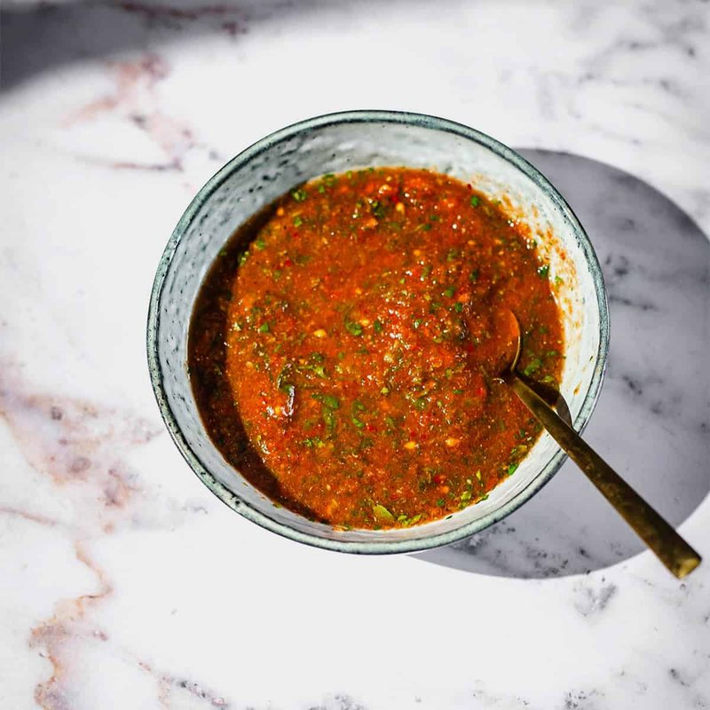

# Sahawiq

*Yemen's bright-green chilli relish: a coarse paste of fresh green chillies, garlic, coriander and parsley. Sits on every table from breakfast to dinner.*

**Serves:** 6 (small jar)

**Prep Time:** 10 minutes

**Cook Time:** 0 minutes

## Overview
Green chillies (the long Anaheim-style or Hatch; bird's-eye for serious heat), garlic, coriander, parsley, salt and a small amount of olive oil are pounded in a mortar (or pulsed in a small food processor) to a chunky bright-green paste. A pinch of ground cardamom and cumin lifts it slightly; lemon juice keeps the colour. Made fresh; eaten within 2-3 days.

## Ingredients

- 6 long green chillies (jalapeño, Anaheim or Hatch; deseed for milder)
- 6 garlic cloves
- 1 small bunch fresh coriander (60 g - stems and leaves)
- 1 small bunch fresh parsley (30 g - stems and leaves)
- ½ teaspoon salt
- ¼ teaspoon ground cardamom
- ¼ teaspoon ground cumin
- 1 tablespoon olive oil
- ½ lemon (juice)
- 1 tomato (small, deseeded, very finely chopped - optional, for the red Yemeni variant)

## Method

### Stage 1 - Prep
1. Strip the chilli stems. Halve lengthways; scrape out seeds for less heat.
1. Peel the garlic.
1. Wash and roughly chop the herbs.

### Stage 2 - Pound or pulse
1. **Mortar (traditional):** Pound garlic and salt to a paste. Add chillies and pound to a coarse green paste. Add herbs, cardamom, cumin; pound until rough but uniform.
1. **Food processor:** Pulse garlic and salt 5 times. Add chillies, herbs, cardamom and cumin; pulse to a chunky paste - don't run it smooth.

### Stage 3 - Finish
1. Stir in olive oil and lemon juice.
1. Stir in chopped tomato if making the red variant.
1. Taste; adjust salt and lemon.

### Stage 4 - Serve
1. Spoon into a small dish or jar.
1. Eat with everything Yemeni; thin a tablespoon with yogurt for a milder version.

## Notes
- **Heat control:** Bird's-eye chillies push this towards face-melting territory. Jalapeño is medium. Mix and adjust.
- **Coarse, not smooth:** The right texture is just past chopped - small bits visible. A smooth paste sacrifices the bright herbal character.
- **Red sahawiq:** A small tomato or 1 tablespoon tomato paste turns it red; flavour deepens but the freshness softens.

## Storage
- Refrigerate 2-3 days in a sealed jar with a thin film of olive oil on top.
- Doesn't freeze well - texture and colour go.
